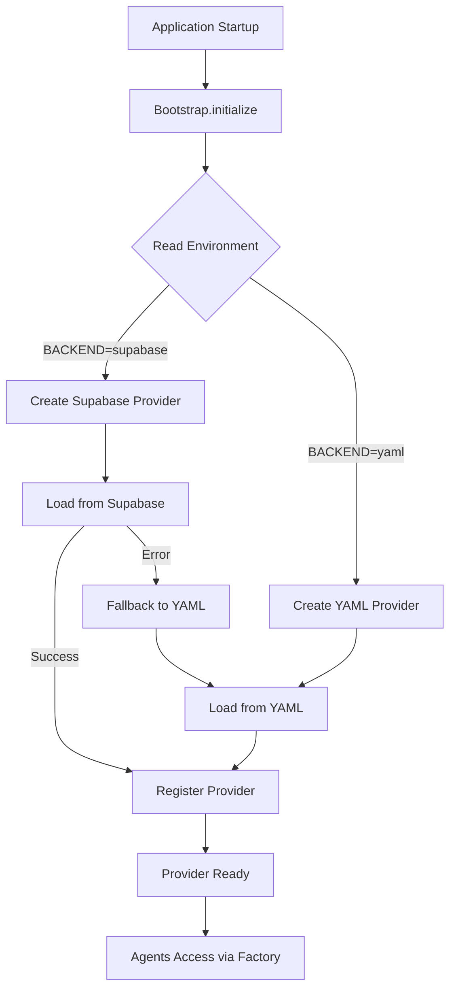
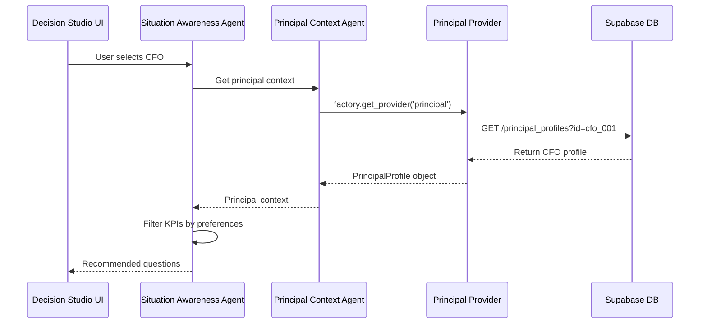
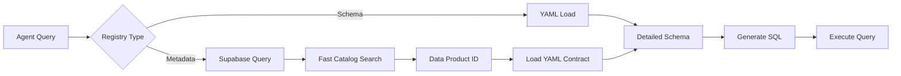

# Agent9 Architecture - PowerPoint Slide Content

**Purpose**: Slide-by-slide content for updating Agent9_Architecture.pptx with Supabase registry migration

**Date**: January 18, 2026

---

## Slide 1: Title Slide

**Title**: Agent9 Architecture Overview

**Subtitle**: Enterprise Decision Intelligence Platform with Supabase-Backed Registries

**Key Points**:
- Agentic AI system for executive decision support
- 5 core registries migrated to Supabase
- Hybrid architecture: Supabase + YAML
- Production-ready registry foundation

**Footer**: Last Updated: January 2026 | Phase 4 Complete

---

## Slide 2: System Overview

**Title**: Agent9 System Components

**Main Components**:

1. **Decision Studio UI** (React)
   - Principal selector
   - KPI dashboard
   - Situation awareness interface
   - Analysis results viewer

2. **Agent Layer** (Python)
   - Situation Awareness Agent
   - Deep Analysis Agent
   - Data Product Agent
   - Principal Context Agent
   - Data Governance Agent
   - LLM Service Agent
   - Solution Finder Agent

3. **Registry Layer** (Supabase + YAML)
   - Business Glossary
   - Principal Profiles
   - KPI Registry
   - Business Processes
   - Data Products

4. **Data Layer** (DuckDB + CSV)
   - FI Star Schema
   - HR Data
   - Sales Data

**Visual**: Box diagram showing layers stacked vertically with arrows indicating data flow

---

## Slide 3: Registry Architecture - Before Migration

**Title**: Registry Architecture (Legacy - YAML Only)

**Components**:
```
┌─────────────────────────────────────┐
│     Agent9 Application              │
├─────────────────────────────────────┤
│   Registry Providers (YAML-based)   │
│   - BusinessGlossaryProvider        │
│   - PrincipalProfileProvider        │
│   - KPIProvider                     │
│   - BusinessProcessProvider         │
│   - DataProductProvider             │
├─────────────────────────────────────┤
│   YAML Files (Filesystem)           │
│   - business_glossary.yaml          │
│   - principal_registry.yaml         │
│   - kpi_registry.yaml               │
│   - business_process_registry.yaml  │
│   - data_product_registry.yaml      │
└─────────────────────────────────────┘
```

**Limitations**:
- ❌ No centralized management
- ❌ No query capabilities
- ❌ No audit trail
- ❌ Difficult to scale
- ❌ No multi-user editing
- ❌ File-based versioning only

---

## Slide 4: Registry Architecture - After Migration

**Title**: Registry Architecture (Hybrid - Supabase + YAML)

**Components**:
```
┌─────────────────────────────────────────────────────┐
│          Agent9 Application                         │
├─────────────────────────────────────────────────────┤
│   Registry Bootstrap (Environment-based Selection)  │
│   - BUSINESS_GLOSSARY_BACKEND=supabase             │
│   - PRINCIPAL_PROFILE_BACKEND=supabase             │
│   - KPI_REGISTRY_BACKEND=supabase                  │
│   - BUSINESS_PROCESS_BACKEND=supabase              │
│   - DATA_PRODUCT_BACKEND=supabase                  │
├─────────────────────────────────────────────────────┤
│   Supabase Providers (with YAML fallback)          │
│   - SupabaseBusinessGlossaryProvider               │
│   - SupabasePrincipalProfileProvider               │
│   - SupabaseKPIProvider                            │
│   - SupabaseBusinessProcessProvider                │
│   - SupabaseDataProductProvider                    │
├──────────────────────┬──────────────────────────────┤
│   Supabase Database  │   YAML Files (Schemas)      │
│   (Registry Metadata)│   (Detailed Contracts)      │
│   - 11 glossary terms│   - fi_star_schema.yaml     │
│   - 4 profiles       │   - dp_*.yaml (contracts)   │
│   - 20 KPIs          │                             │
│   - 31 processes     │                             │
│   - 7 data products  │                             │
└──────────────────────┴──────────────────────────────┘
```

**Benefits**:
- ✅ Fast discovery queries
- ✅ Centralized management
- ✅ Environment-based toggles
- ✅ Graceful YAML fallback
- ✅ Scalable architecture
- ✅ Audit trail ready

---

## Slide 5: Hybrid Architecture Model

**Title**: Why Hybrid? Supabase + YAML

**Registry Metadata → Supabase**:
- Fast catalog queries
- Discovery and filtering
- Relationships and tags
- Lightweight metadata
- Example: "Find all Finance KPIs"

**Detailed Schemas → YAML**:
- Version controlled in Git
- Complex nested structures
- 638-line FI Star Schema
- Table/view definitions
- KPI calculations
- Example: Full data product contracts

**How They Connect**:
```
Supabase Record:
{
  "id": "dp_fi_20250516_001",
  "name": "FI Star Schema",
  "domain": "FI",
  "yaml_contract_path": "src/.../fi_star_schema.yaml" ← Pointer
}

YAML Contract:
- 13 tables
- 1 star view (135-line SQL)
- 17 KPIs with formulas
- Business process mappings
```

**Visual**: Two-column layout showing Supabase on left (fast queries) and YAML on right (detailed schemas) with arrow connecting them

---

## Slide 6: Registry Provider Pattern

**Title**: Registry Provider Architecture

**Pattern**:
```
1. Bootstrap reads environment variables
   ↓
2. Selects provider based on backend setting
   ↓
3. Initializes Supabase provider
   ↓
4. Loads data from Supabase REST API
   ↓
5. Falls back to YAML if Supabase unavailable
   ↓
6. Registers provider with factory
   ↓
7. Agents access via factory.get_provider()
```

**Code Example**:
```python
# Environment-based selection
backend = os.getenv('KPI_REGISTRY_BACKEND', 'yaml')

if backend == 'supabase':
    provider = SupabaseKPIProvider(
        supabase_url=os.getenv('SUPABASE_URL'),
        service_key=os.getenv('SUPABASE_SERVICE_ROLE_KEY'),
        table='kpis',
        source_path='fallback.yaml'  # Fallback
    )
else:
    provider = KPIProvider(source_path='kpi_registry.yaml')

await provider.load()
factory.register_provider('kpi', provider)
```

---

## Slide 7: Migration Statistics

**Title**: Phase 4 Migration - By The Numbers

**Migrations Created**: 5
- `0001_business_glossary.sql`
- `0002_principal_profiles.sql`
- `0003_kpis.sql`
- `0004_business_processes.sql`
- `0005_data_products.sql`

**Seeder Scripts**: 5
- All with `--dry-run` and `--truncate-first` flags
- Idempotent upsert via REST API
- YAML → Supabase transformation

**Providers Implemented**: 5
- All extend base YAML providers
- HTTP/REST API integration
- Graceful fallback to YAML

**Total Items Migrated**: 73
- 11 business glossary terms
- 4 principal profiles
- 20 KPIs
- 31 business processes
- 7 data products

**Implementation Time**: ~4 hours (including validation)

---

## Slide 8: Registry Details - Business Glossary

**Title**: Business Glossary Registry

**Purpose**: Financial term definitions for LLM context

**Schema**:
```sql
CREATE TABLE business_glossary_terms (
    id text PRIMARY KEY,
    term text NOT NULL,
    definition text,
    category text,
    tags text[],
    related_kpis text[],
    metadata jsonb,
    created_at timestamptz,
    updated_at timestamptz
);
```

**Sample Terms** (11 total):
- Gross Revenue
- Net Revenue
- Cost of Goods Sold
- Gross Margin
- Operating Income
- Net Income
- EBIT, EBITDA
- Depreciation
- Cash Flow from Operating Activities
- Free Cash Flow

**Usage**: LLM Service Agent uses for term disambiguation

---

## Slide 9: Registry Details - Principal Profiles

**Title**: Principal Profiles Registry

**Purpose**: Executive personas with KPI preferences

**Schema**:
```sql
CREATE TABLE principal_profiles (
    id text PRIMARY KEY,
    name text NOT NULL,
    title text,
    role text,
    department text,
    responsibilities text[],
    kpi_preferences text[],
    business_processes text[],
    metadata jsonb,
    created_at timestamptz,
    updated_at timestamptz
);
```

**Profiles** (4 total):
- **CFO** (`cfo_001`) - Finance focus
- **COO** (`coo_001`) - Operations focus
- **CSO** (`cso_001`) - Strategy focus
- **CEO** (`ceo_001`) - Enterprise oversight

**Usage**: Situation Awareness Agent personalizes questions

---

## Slide 10: Registry Details - KPI Registry

**Title**: KPI Registry

**Purpose**: KPI definitions with calculation logic

**Schema**:
```sql
CREATE TABLE kpis (
    id text PRIMARY KEY,
    name text NOT NULL,
    description text,
    calculation_logic text,
    unit text,
    data_product_id text,
    business_processes text[],
    tags text[],
    metadata jsonb,
    created_at timestamptz,
    updated_at timestamptz
);
```

**KPI Categories** (20 total):
- **Revenue**: Gross Revenue, Net Revenue, Sales Deductions
- **Margin**: Gross Margin, Operating Income, Net Income, EBIT
- **Expenses**: COGS, Payroll, Travel, Building, Office, Utilities
- **Cash Flow**: Operating Cash Flow, Free Cash Flow

**Usage**: Deep Analysis Agent generates SQL queries

---

## Slide 11: Registry Details - Business Processes

**Title**: Business Processes Registry

**Purpose**: Business process catalog with domain mapping

**Schema**:
```sql
CREATE TABLE business_processes (
    id text PRIMARY KEY,
    name text NOT NULL,
    domain text,
    description text,
    owner_role text,
    stakeholder_roles text[],
    tags text[],
    metadata jsonb,
    created_at timestamptz,
    updated_at timestamptz
);
```

**Domains** (31 total processes):
- **Finance** (21): Profitability Analysis, Revenue Growth, Expense Management, etc.
- **Strategy** (4): Market Share Analysis, EBITDA Growth, Capital Allocation, etc.
- **Operations** (6): Global Performance, Order-to-Cash, Inventory, etc.

**Usage**: Links KPIs to business context

---

## Slide 12: Registry Details - Data Products

**Title**: Data Products Registry

**Purpose**: Data product catalog with YAML contract pointers

**Schema**:
```sql
CREATE TABLE data_products (
    id text PRIMARY KEY,
    name text NOT NULL,
    domain text,
    description text,
    owner text,
    version text,
    yaml_contract_path text,  -- Pointer to YAML
    related_business_processes text[],
    tags text[],
    tables jsonb,
    views jsonb,
    metadata jsonb,
    reviewed boolean,
    created_at timestamptz,
    updated_at timestamptz
);
```

**Products** (7 total):
- **Finance** (2): FI Star Schema, GL Accounts
- **HR** (3): Headcount, Performance, Personal Data
- **Sales** (2): Sales Orders, Order Items

**Key Feature**: `yaml_contract_path` points to detailed 638-line schema

---

## Slide 13: Agent Integration

**Title**: How Agents Use Registries

**Agent Workflow**:
```
1. User selects principal (CFO)
   ↓
2. Principal Context Agent loads profile from registry
   ↓
3. Situation Awareness Agent queries KPI registry
   - Filters by principal's KPI preferences
   - Gets top 5 relevant KPIs
   ↓
4. Data Product Agent discovers data sources
   - Queries data_products registry
   - Loads YAML contract for FI Star Schema
   ↓
5. Deep Analysis Agent generates SQL
   - Uses KPI calculation logic from registry
   - Uses table schema from YAML contract
   ↓
6. Solution Finder Agent recommends actions
   - Uses business process context
   - Uses glossary terms for clarity
```

**Visual**: Flow diagram showing agent collaboration with registry queries highlighted

---

## Slide 14: Data Flow - Registry Query

**Title**: Registry Query Data Flow

**Example**: "What are the CFO's top KPIs?"

```
┌──────────────────────────────────────────┐
│  Decision Studio UI                      │
│  - User selects CFO principal            │
└────────────────┬─────────────────────────┘
                 ↓
┌──────────────────────────────────────────┐
│  Situation Awareness Agent               │
│  - Calls Principal Context Agent         │
└────────────────┬─────────────────────────┘
                 ↓
┌──────────────────────────────────────────┐
│  Principal Context Agent                 │
│  - factory.get_provider('principal')     │
└────────────────┬─────────────────────────┘
                 ↓
┌──────────────────────────────────────────┐
│  SupabasePrincipalProfileProvider        │
│  - GET /rest/v1/principal_profiles       │
│  - WHERE id = 'cfo_001'                  │
└────────────────┬─────────────────────────┘
                 ↓
┌──────────────────────────────────────────┐
│  Supabase Database                       │
│  - Returns CFO profile with KPI prefs    │
└────────────────┬─────────────────────────┘
                 ↓
┌──────────────────────────────────────────┐
│  KPI Registry Query                      │
│  - Filter KPIs by CFO preferences        │
│  - Return: Gross Revenue, Net Income,    │
│    Operating Income, Cash Flow, EBIT     │
└──────────────────────────────────────────┘
```

**Performance**: ~50ms per registry query (local Supabase)

---

## Slide 15: Environment Configuration

**Title**: Environment-Based Backend Selection

**Configuration**:
```bash
# Enable Supabase for all registries
BUSINESS_GLOSSARY_BACKEND=supabase
PRINCIPAL_PROFILE_BACKEND=supabase
KPI_REGISTRY_BACKEND=supabase
BUSINESS_PROCESS_BACKEND=supabase
DATA_PRODUCT_BACKEND=supabase

# Supabase connection
SUPABASE_URL=http://127.0.0.1:54321
SUPABASE_SERVICE_ROLE_KEY=<key>
SUPABASE_SCHEMA=public
```

**Flexibility**:
- Toggle individual registries independently
- Switch to YAML for testing/development
- Gradual rollout capability
- Easy rollback if needed

**Fallback**:
- Automatic YAML fallback on Supabase error
- Warning logged with error details
- Application continues to function

---

## Slide 16: Validation Results

**Title**: Phase 4 Validation - All Systems Go ✅

**Validation Completed**: January 18, 2026

**Tests Performed**:
1. ✅ Database reset and migrations applied
2. ✅ All 5 registries seeded (73 items)
3. ✅ Environment variables configured
4. ✅ All 5 providers loading from Supabase
5. ✅ Decision Studio UI functional
6. ✅ Agent queries working correctly
7. ✅ YAML fallback tested and working

**Issues Resolved**:
- ✅ Missing `httpx` import added
- ✅ Environment variable name fixed (5 locations)

**Performance**:
- Bootstrap time: ~330ms
- Registry queries: 45-95ms each
- UI load time: <2 seconds

**Status**: Production-ready ✅

---

## Slide 17: Migration Timeline

**Title**: Supabase Migration Journey

**Phase 1** (Completed):
- Business Glossary migration
- Pilot to de-risk approach
- Validated provider pattern

**Phase 2** (Completed):
- Principal Profiles migration
- Complex JSONB fields
- Array column handling

**Phase 3** (Completed):
- KPI Registry migration
- Calculation logic storage
- Business process relationships

**Phase 4** (Completed):
- Business Processes migration
- Data Products migration
- Full validation and testing

**Total Duration**: 4 weeks (design + implementation + validation)

**Next**: Phase 5 (Enterprise Hardening) - Optional

---

## Slide 18: Architecture Benefits

**Title**: Benefits of Supabase Migration

**Performance**:
- ⚡ Fast registry queries (<100ms)
- ⚡ Efficient filtering and search
- ⚡ Indexed lookups on key fields

**Scalability**:
- 📈 Handles 1000+ KPIs easily
- 📈 Multi-user concurrent access
- 📈 Horizontal scaling ready

**Maintainability**:
- 🔧 Centralized management
- 🔧 Environment-based configuration
- 🔧 Graceful fallback to YAML

**Developer Experience**:
- 👨‍💻 SQL migrations version controlled
- 👨‍💻 Seeder scripts idempotent
- 👨‍💻 Easy local development setup

**Future-Ready**:
- 🚀 RLS for multi-tenancy
- 🚀 Audit trail capability
- 🚀 Real-time subscriptions
- 🚀 GraphQL API option

---

## Slide 19: Technical Stack

**Title**: Agent9 Technology Stack

**Frontend**:
- React (Decision Studio UI)
- Vite (Build tool)
- TailwindCSS (Styling)

**Backend**:
- Python 3.11
- FastAPI (REST API)
- Pydantic (Data validation)

**Agents**:
- OpenAI GPT-4 (LLM)
- Custom agent framework
- Protocol-based communication

**Registries**:
- Supabase (PostgreSQL)
- YAML (Schema contracts)
- Environment-based toggles

**Data**:
- DuckDB (Analytics)
- CSV files (Source data)
- SAP sample datasets

**Infrastructure**:
- Local Supabase (Development)
- Docker (Containerization)
- Git (Version control)

---

## Slide 20: Future Enhancements (Phase 5)

**Title**: Phase 5 - Enterprise Hardening (Optional)

**Security**:
- Row-Level Security (RLS) policies
- Multi-tenant data isolation
- Role-based access control

**Audit & Compliance**:
- Audit trail tables
- Change tracking triggers
- Compliance reporting

**Data Integrity**:
- Foreign key constraints
- Referential integrity checks
- Data validation rules

**Integration**:
- HR system sync for principals
- Real-time updates via webhooks
- GraphQL API for external systems

**Operations**:
- Monitoring and alerting
- Backup and disaster recovery
- Performance optimization
- Production deployment

**Timeline**: 2-3 weeks (if needed)

---

## Slide 21: Deployment Architecture

**Title**: Production Deployment (Future)

**Local Development**:
```
┌─────────────────────────────────┐
│  Developer Machine              │
│  - Supabase CLI (local)         │
│  - PostgreSQL (Docker)          │
│  - Agent9 application           │
└─────────────────────────────────┘
```

**Production**:
```
┌─────────────────────────────────┐
│  Managed Supabase Cloud         │
│  - PostgreSQL (managed)         │
│  - Auto-scaling                 │
│  - Backups                      │
│  - Monitoring                   │
└──────────────┬──────────────────┘
               ↓
┌─────────────────────────────────┐
│  Agent9 Application (Cloud)     │
│  - FastAPI backend              │
│  - React frontend               │
│  - Agent services               │
└─────────────────────────────────┘
```

**Migration Path**:
1. Export local Supabase data
2. Create managed Supabase project
3. Run migrations on production
4. Seed production data
5. Update environment variables
6. Deploy application

---

## Slide 22: Key Takeaways

**Title**: Agent9 Registry Migration - Key Takeaways

**✅ Completed**:
- All 5 core registries migrated to Supabase
- 73 items successfully seeded
- Hybrid architecture (Supabase + YAML) validated
- Production-ready foundation established

**🎯 Architecture Highlights**:
- Environment-based backend selection
- Graceful YAML fallback
- Fast registry queries (<100ms)
- Scalable and maintainable

**📊 Impact**:
- Faster agent queries
- Centralized registry management
- Better developer experience
- Future-ready for enterprise features

**🚀 Next Steps**:
- Optional Phase 5 (Enterprise hardening)
- Production deployment planning
- Feature development on solid foundation

---

## Slide 23: Questions & Discussion

**Title**: Questions?

**Contact Information**:
- Documentation: `docs/registry/`
- Migration Plan: `docs/registry/supabase_migration_plan.md`
- Validation Summary: `docs/registry/PHASE_4_VALIDATION_SUMMARY.md`

**Key Resources**:
- Supabase migrations: `supabase/migrations/`
- Seeder scripts: `scripts/supabase_seed_*.py`
- Provider implementations: `src/registry/providers/`

**Demo**:
- Decision Studio UI: http://localhost:5173
- Backend API: http://localhost:8000/docs
- Supabase Studio: http://localhost:54323

---

## Appendix: Mermaid Diagrams

### Registry Provider Pattern Flow



### Agent-Registry Integration



### Hybrid Architecture Data Flow



---

**End of Slide Content**

**Usage Instructions**:
1. Copy each slide section into PowerPoint
2. Format with your preferred template
3. Add visual diagrams based on text descriptions
4. Convert Mermaid diagrams to images using https://mermaid.live
5. Adjust content to fit your presentation style
