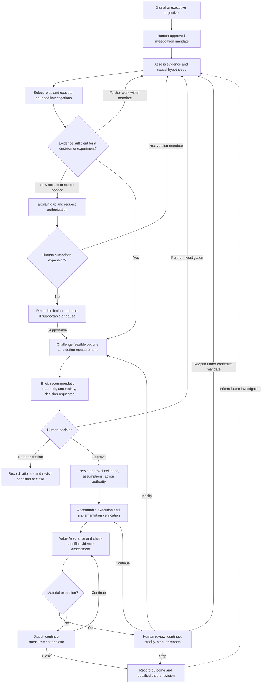

# Agent9-HERMES — Backlog Detail (open work)

**Generated:** 2026-09-17 — extracted verbatim from DEVELOPMENT_PLAN.md (5,734 lines) during the plan restructure.

Full detail for every **open** phase, verbatim. `DEVELOPMENT_PLAN.md` is the short index over this file — it carries verified status and the next moves; this carries the design reasoning. Status lines inside these sections predate the 2026-09-17 verification sweep and may be stale; **the plan's status table wins.**

---
### Pipeline status: fully operational end-to-end

```
run_enterprise_assessment.py
  → SA (detect KPI breaches, client-scoped)
  → DA (Is/Is Not root cause, benchmark segments)
  → kpi_assessments + assessment_runs (Supabase)
  → A9_PIB_Agent (compose + email)
  → Principal clicks email link
  → Decision Studio (Deep Analysis → Solution Finding → HITL → Value Assurance)
  → Portfolio (5-phase lifecycle tracking → verdict → ROI)
```

**14 agents operational.** Core loop: detect → diagnose → prescribe → decide → track → verify.

### What's working

| Capability | Status |
|-----------|--------|
| Enterprise KPI assessment (batch, client-scoped) | Production-ready |
| SA breach detection + opportunity signals | Production-ready |
| DA Is/Is Not root cause + change-point detection | Production-ready |
| DA benchmark segments (replication candidates) | Production-ready |
| Market context enrichment (Perplexity + Claude) | Production-ready |
| Multi-persona solution generation (3×Stage1 + synthesis) | Production-ready |
| HITL approval workflow | Production-ready |
| Value Assurance tracking (DiD attribution, verdict matrix) | Production-ready |
| VA 5-phase lifecycle (Approved→Implementing→Live→Measuring→Complete) | Production-ready |
| VA Portfolio dashboard (KPI-aware formatting, cost KPI sign flip) | Production-ready |
| White-paper report (Gartner-style cold-eyes document) | Production-ready |
| PIB email delivery (Jinja2, SMTP, Gmail App Password) | Production-ready |
| Single-use briefing tokens (deep link, delegate, request_info, approve) | Production-ready |
| Delegation flow (DelegatePage, audit trail in situation_actions) | Production-ready |
| Follow-up NL questions with inline data results | Production-ready |
| Data Product Onboarding (8-step orchestrated workflow) | Production-ready |
| Decision Studio UI (React/Vite/Tailwind, Swiss Style) | Production-ready |
| Supabase-backed registries (6 registries) | Production-ready |
| DuckDB + BigQuery + SQL Server + Snowflake + PostgreSQL data sources | Production-ready |
| Production deployment (Railway + Cloudflare Pages + Supabase Cloud) | Live (Cloudflare Pages since Apr 2026, replaces Vercel) |
| SF fast debate mode (2 calls dev / 4 calls production) | Production-ready |
| Opportunity framing — SF Council Debate + VA lifecycle (positive KPI) | Production-ready |
| KPI Accountability Registry — dimensional ownership, Supabase-backed, REST API, Registry Explorer tab, PIB filtering, SA filter | Production-ready (Phase 11A complete) |
| Unified situation stream — direction field replaces problem/opportunity binary; single grid | Production-ready (Phase 11C) |
| KPI Accountability Interview Agent (Phase 11B) — LLM-driven conversational interview; domain selection; live coverage tracker; Haiku per turn, Sonnet for coverage analysis; `ProposedAssignment` JSON output | Production-ready (Phase 11B complete) |
| DA market signal conflict detection (Phase 11F) — keyword scan of MA signals vs. DA `analysis_mode`; amber conflict badge + confidence % in Root Cause Analysis accordion | Production-ready (Phase 11F complete) |
| DA Mixed Analysis Mode (Phase 11G) — single IS/IS NOT view with problem (red) + opportunity (green) segments; mixed SCQA narrative; HITL resolution panel; SF `analysis_mode` propagation; 22 unit tests | Production-ready (Phase 11G complete) |
| DA Statistical Enrichment — partial (Phase 11H) — `effect_size_pct` (segment share of total gap), `is_outlier` flag (>mean+2σ), outlier segments forced to `control_group`; `replication_potential` now evidence-based; effect-size chips + Outlier badge in UI | Partial — effect size + outlier classification shipped; seasonal decomposition deferred |
| DA Segment Matrix (11I-A/B Addendum) — same-KPI cross-basis Is/Is-Not table (previous-period + plan-variance joined on shared dimensional rows); confirmed/basis_specific/secondary_only/healthy tier per segment; SF scoping prioritises confirmed tiers; replaces contradictory same-KPI problem+opportunity cards; 42 unit tests | Production-ready (Jul 2026) |
| Infra A4 — per-request registry refresh, client_id enforcement on all list endpoints, /admin/registry/reload, connection health dashboard | Production-ready |
| Infra B — connection profiles backend storage + credential encryption (AES-256 at rest) | Production-ready |
| Infra B — Supabase Auth dual-mode login (demo selector + email/password), backend JWT middleware | Production-ready |
| Capability-aware LLM layer (Phase 11O) — per-model capability map (temperature/effort/fallbacks), Sonnet 5 routing default for reasoning/synthesis/briefing, refusal handling, product system prompt decoupled from dev-era Cascade guardrails | Production-ready (Jul 2026) |
| DA tenant-scoped KPI resolution — `_lookup_kpi_scoped` strict isolation at all 3 DA lookup sites (contract path, plan dims, execute); no cross-tenant same-id fallback; 5 regression tests | Production-ready (Jul 2026) |

### What's not built yet

| Capability | Planned phase |
|-----------|--------------|
| ~~DGA mandatory wiring — test suite (happy path, init failure, view resolution)~~ | ✅ Phase 10B-DGA tests — complete (5 tests, May 2026) |
| KPI trend chart (monthly_values populated for all backends) | Phase 10D |
| ~~KPI accountability registry~~| ✅ Phase 11A — complete (registry, API, PIB filter, SA filter, 5 unit tests) |
| ~~LLM-assisted accountability import from HCM documents~~ | ✅ Phase 11B — complete (Jun 2026) |
| ~~Unified situation stream (merge problem + opportunity)~~ | ✅ Phase 11C — complete |
| Adaptive calibration loop (KPI Assistant → monitoring profiles) | Phase 11D |
| Audio briefings (TTS flash briefing) | Phase 11E |
| ~~DA market signal conflict detection (outperforming / confirming / missing tailwinds)~~ | ✅ Phase 11F — complete (Jun 2026) |
| ~~DA Mixed Analysis Mode — single IS/IS NOT view with both problem segments (red) and opportunity segments (green); mixed SCQA narrative; DA determines framing from segment variance, not SA~~ | ✅ Phase 11G — complete (Jun 2026) |
| DA Statistical Enrichment — effect size relative to segment weight, seasonal decomposition (structural vs cyclical), confidence scoring on IS/IS NOT items; replaces heuristic replication_potential with evidence-based scores (Analytical Intelligence Layer 1) | ⚠️ Phase 11H — partial (Jun 2026): effect size + outlier classification shipped; seasonal decomposition deferred |
| **Advanced Alert Intelligence** — SA: budget/plan variance, projected breach, acceleration, concentration risk; DA: cross-KPI compound patterns (KPI relationship registry); VA: plan trajectory + covenant severity; PIB: alert-type-differentiated briefings | **Phase 11I** — 11I-A/B/C complete (Jul 2026); 11I-D (PIB) remaining |
| **Solution Validity Monitoring** — recurring health checks on active VA solutions: control group stability (V1), market condition drift + strategic alignment drift (V2); health score HEALTHY/WATCH/DEGRADED/INVALID; PIB "Solutions Requiring Attention" + "Pending Confirmations" sections; Portfolio health badge with action protocol | **Phase 11J** |
| **Meridian Flow Systems synthetic dataset** — 79,200-row SAP CO-PA BigQuery dataset; 21 dimensions (including `order_type` at rank #1); FY2024+2025+2026 all 12 months; 4 drift scenarios for 11K–11N unit tests; `scripts/clients/meridian.py` seed script | **Pre-11K** |
| **Data Product Observability** — DGA auto-classifies each data product's refresh cadence (`real_time \| micro_batch \| daily_batch \| weekly_batch \| monthly_close`); continuously confirms cadence; detects pipeline stalls; `pipeline_status` on data product contract | **Phase 11K** |
| **EDA Dimensional Importance Profiling** — DGA runs variance decomposition + concentration ratio + cardinality across all dimensions at onboarding; writes `dimension_importance_profile` JSONB to Supabase; replaces arbitrary 5-dimension cap in background DA; refreshed on schedule matching data product cadence | **Phase 11L** |
| **Change Detection Agent + DA Background Execution Mode** — lightweight statistical agent detects dimensional drift against EDA baseline; triggers background DA on drift or SA breach; DA gains `execution_context: interactive \| scheduled`; scheduled mode removes dimension cap, parallelises all dimensions via `asyncio.gather`; results persisted to `da_background_runs` Supabase table; DA response gains `summary_view` (top 5 dims × 3 rows) for SF and PIB consumption | **Phase 11M** |
| **Event-Driven PIB + SA Card DA State** — PIB fires on DA completion when results are materially different from last run (no cron schedule anywhere); situation cards gain `da_state: not_run \| running \| precomputed \| stale` badge; DeepFocusView gains accordion + importance badges for many-dimension results; on-demand DA always available from SA card regardless of pre-computed state | **Phase 11N** |
| **Business Objectives Registry** — first-class registry entity for declared strategic objectives; objective → KPI driver mapping with weights; `objective_id` on situation cards; SA severity weighting | **Phase 12C** |
| **Strategic Performance Summary** — objective health score (CRITICAL/AT_RISK/ON_TRACK/AHEAD) per assessment run; PIB "Strategic Objectives" section; Portfolio Objectives tab in UI | **Phase 12D** |
| KPI Causal Intelligence — KPI interdependency map in DGA; cross-KPI conflict detection before solution approval; strategic alignment scoring against declared corporate priorities (Analytical Intelligence Layer 2) | Phase 2 (2027) |
| Business Optimization Agent — Phase B: portfolio conflict detection, sequencing, strategic alignment scoring; Phase C: fully autonomous objective pursuit, KPI trajectory forecasting, living Business Plan generation (Analytical Intelligence Layer 3) | Phase 3 (2028) |
| ~~Company Intelligence KPI Template Generator (org-first onboarding with benchmarks)~~ | ✅ Phase 12A — complete (June 2026) |
| **Company Intelligence Principal Templates** — MA agent researches a company's leadership team; admin reviews + commits as `status='template'` principals; email optional at commit; no decision-style inference (admin chooses after seeing SF in action) | **Phase 12E** |
| RACI Accountability Model (4-role R/A/C/I, KPI + Business-Process level, BP→KPI cascading; redefines the original 2-role/KPI-only design) | Phase 12B |
| Business Optimization workflow (top-down strategic) | Phase 12 |
| KPI Assistant UI | Phase 12 |
| Slack notifications | Phase 12 |
| Executive Briefing Quality + Principal-Adaptive Output | Phase 13 |
| ~~**Uniform Time Dimension Layer**~~ — `TimeDimensionSpec` typed contract on every data product; single `TimeFilter` utility replaces 4 fragmented DPA mechanisms; 78 unit tests; all backends | ✅ Phase 10F — complete (May 2026). **Bug fix Jul 2026:** `*-to-date` previous-period comparisons (YTD/QTD/MTD) were comparing a partial current window against the *full* prior period instead of the same partial window one year back; DA's dimensional previous-query call sites were also double-applying the year shift (2 years back instead of 1). Both fixed in `_fyp_previous`/`_date_previous` and the 6 affected DA call sites — see 11I-A/B Addendum below. |
| **Time Dimension Mapping Wizard** — during onboarding schema inspection (step 2), auto-detect date columns and fragments (year, period, timestamp, etc.) per dialect; propose `display_expr` / `sort_expr` for `TimeDimensionSpec`; user confirms or edits; no developer seed changes required for new clients | Phase 12 |
| **Data Product Schema Sync / Drift Detection** — store `schema_snapshot` + `last_synced_at` on `DataProduct`; "Re-sync" button in Admin Console re-inspects live source, diffs against snapshot, flags affected KPIs, surfaces reconciliation UI; triggers: manual + pre-assessment auto-detect; impacted KPI SQL flagged before next assessment runs | Infra A5 |
| Platform Admin & Client Onboarding (4-step guided flow) | Infra A2 |
| Usage monitoring (events, quotas, alerts) | Infra A3 |
| Admin Console — Workflow history, error log, token cost, registry editor, LLM config | Infra A5 — the **error log / token cost** portions are now designed in `docs/architecture/audit_event_system_design.md`; do not redesign separately |
| ~~Registry client-isolation enforcement~~ | ✅ Infra A4 — complete (per-request refresh, strict client_id filter, reload endpoint, health dashboard) |
| ~~Connection Profiles backend storage + credential encryption~~ | ✅ Infra B — complete |
| ~~Authentication (Supabase Auth)~~ | ✅ Infra B — complete (dual-mode login + JWT middleware) |
| Azure OpenAI provider + LLM audit export | Infra B2 |
| ~~Database-level multi-tenant isolation~~ | ✅ Infra B3 — complete and verified live in production (RLS via `a9_tenant_scope` role on 12 tables, `tenant_scope()` transaction helper, provider `get_by_client()`, DGA gate in DPA `execute_sql`, composite-delete fix) |
| **SOC 2 Controls Foundation** — audit event log, sign-in audit, principal archive lifecycle, briefing provenance footer, Sentry availability monitoring | **Infra C** (Q4 2026 — before first security review). The **audit event log** portion is now designed in `docs/architecture/audit_event_system_design.md`, which deliberately scopes itself narrower than this line (SF events + a generic error sink first; sign-in audit and archive lifecycle left for their own design) |

### Known tech debt (remaining)

| Item | Notes |
|------|-------|
| `situations` table partially redundant with `kpi_assessments` | Deprecation deferred — used by VA pipeline. Consolidate in Phase 11A. (11A shipped; consolidation still pending.) |
| ~~`kpisScanned={14}` hardcoded in `DecisionStudio.tsx`~~ | ✅ Wired in Phase 11C |
| ~~Separate `OpportunitySignal` / `Situation` models~~ | ✅ Unified in Phase 11C |
| `run_enterprise_assessment.py` has no scheduler | CLI only — event-driven scheduling designed in Phases 11K–11N; replaces cron with data-change detection |
| ~~SA/PCA/DPA agents cache registry data at startup~~ | ✅ **Resolved May 2026 (Infra A4-a Approach A)** — per-request refresh added to `detect_situations`, `process_nl_query`, `get_kpi_definitions`, `get_principal_context_by_id`, `get_principal_context`, `get_data_product`, `generate_sql_for_kpi`. Regression test: `tests/unit/test_a9_registry_live_reload.py` (7 tests). Optional Approach B refactor (true per-request locals) deferred. |
| ~~Settings tab bar horizontal density~~ | ✅ **STALE — corrected 2026-08-22.** The left-hand hierarchical nav refactor this line called for already shipped as `decision-studio-ui/src/components/SettingsLayout.tsx` (304 lines, two-pane `<aside className="w-56">` + grouped nav); no horizontal tab strip remains in `RegistryExplorer.tsx`. The 5-group taxonomy suggested here (Workspace / Data / Decision Registry / People / Governance) was **never built** — shipped maintenance nav uses Registry / Intelligence / Ownership / Workspace, governance mode uses Strategic / Registry / Assessment. Remaining work (make it collapsible, extend app-wide, reconcile the three competing taxonomies) is now owned by `docs/architecture/collapsible_left_nav_design.md`. |
| ~~UI defects found driving the live app (2026-08-22)~~ | ✅ **All 7 fixed — closed 2026-08-27, re-verified against live source 2026-08-29.** This row was stale: it described the original findings but was never updated when `docs/architecture/ui_refinement_plan.md` §5/§8.5 tracked all of them to "Done." Re-checked directly against current code, not just the doc's claim: `/portfolio` now falls back to the session's stored principal and shows a friendly message only if truly none exists (`Portfolio.tsx:415-433`); `Test Probe`/`Test Title` no longer exists anywhere in `src/` or `scripts/`; `ANALYZE →`'s label is unconditionally visible, only the decorative gradient scrim stays hover-only (`KPITile.tsx`); the stray-`0` guard is `Boolean()`-wrapped (`ProblemRefinementChat.tsx`); the sparkline stroke color is driven by `chartTrendIsGood`, agreeing with severity instead of fighting it (`KPITile.tsx:140`); `DivergingBarChart.tsx` has an explicit fix for the raw `CUSTOMER_REGION`-style column-name truncation; and `KPITile.tsx`'s fabricated-sparkline fallback is deleted (`sparkline`'s own comment: "Real measured points only. No series, no chart."). Full original detail in `docs/architecture/ui_refinement_plan.md` §8 (superseded by §5's tier table). |
| **Workflow re-run guards** | Two cheap fixes, separable from `docs/architecture/refinement_iteration_and_session_persistence_design.md`. (1) `handleDeepAnalysis` (`useDecisionStudio.ts:313-342`) has no cache check — reselecting the same situation in the same session re-runs Deep Analysis from scratch. (2) `CouncilDebatePage.runDebate()` (`:232-237`) unconditionally deletes every `solutions_*`/`briefing_*`/`solution_request_*` localStorage key and re-runs both Stage 1 and synthesis (~5.5 min of real LLM spend, measured 2026-08-22) with no confirmation and no partial-retry path. At minimum, stop deleting what cannot be restored. |
| **SA severity calibration — 14 of 15 KPIs flagged CRITICAL** | Observed live 2026-08-22 (lubricants, CEO principal): status strip read `15 KPIs evaluated · 15 findings · 14 critical · 1 opportunity`. Every KPI produced a finding, so the "N KPIs within normal range" collapse never engages and red carries no information. Related and probably the same root cause: Net Revenue at `+3.3%` is CRITICAL while Product Sales Revenue at `+3.3%` is HIGH, with no visible reason — Net Revenue's driver is a plan variance plus a 3-month decline, but the number displayed on the tile is YoY growth. **The number shown is not the number that triggered the alert.** Not a UI fix: this is threshold calibration plus a tile data contract that must surface the triggering comparison. |
| **DA prose is polarity-unaware for inverse KPIs** | Observed live 2026-08-22: DA rendered "Raw Materials Cost is **over-performing** vs. yoy" for a cost up 22.3% and flagged CRITICAL. "Over-performing" reads as good news; the narrative contradicts the severity badge on the same screen. |
| **SF output quality — convergence, undifferentiated options, ID leakage** | All three observed in one live run 2026-08-22 (`decision-studio-ui/scratchpad/sf_run2/`). (1) The three council personas produced near-verbatim restatements of one hypothesis, all marked "High conviction", yet render as three independent columns — reproducing `persona_council_experiments.md`'s convergence finding on screen. Open product question: should the UI *say* the council converged rather than implying corroboration? (2) `opt_1` and `opt_2` were modelled at an identical `$3.8M–$5.2M` recovery range while differing sharply on time (0–90 days vs 12+ months) and reversibility (high vs low) — opt_2 is strictly dominated, invisible in a table. (3) Internal option IDs leak into executive prose: the decision ask rendered as "…cost-and-pricing diagnostic **under opt_1**", and `immediate_actions[*].why_it_matters` carries `opt_2`'s and `opt_3`'s IDs too. |
| **UI refinement plan** — compliance audit against the already-established design language (`ui_brand_guidelines.md`/`DESIGN_SYSTEM.md`), not a redesign | Design note complete, fixes not yet built: `docs/architecture/ui_refinement_plan.md`. Confirms real compliance (no drill-down/filter controls in any visualization, Answer-first SCQA shipped) and catalogs open gaps: hardcoded severity colors in 15+ files instead of `severity-*` tokens (Tier 1), no client indicator in `AppHeader` (Tier 2), open — not yet decided — question on Variance Breakdown disclosure depth (Tier 3). |
| ~~Registry provider-resolution startup race — cross-tenant leak~~ | ✅ Fixed Aug 2026. `A9_Principal_Context_Agent.connect()` and `registry.py`'s `get_registry_factory()` each ran independent fallback logic instead of routing through `RegistryBootstrap.initialize()`; whichever ran first at process startup determined which provider class (correct `DatabaseRegistryProvider` vs. a flat, non-tenant-aware fallback) won the shared factory slot for the process lifetime. Same bug shape found and fixed in two more places on audit: `A9_Data_Product_Agent._resolve_attribute_name` (bypassed the factory entirely for glossary lookups, always read a YAML file) and `A9_Data_Governance_Agent.map_business_process` (flat `BusinessProcessProvider()` fallback, now self-heals via `RegistryBootstrap.initialize()` first). Distinct from Infra B3's DB-level RLS below — this is application-layer provider wiring, which RLS structurally cannot see. Documented in `A9_Principal_Context_Agent_card.md`, `A9_Data_Product_Agent_card.md`, `A9_Data_Governance_Agent_card.md`. |
| ~~Live UI bugs found testing the causal-graph framing gate~~ | ✅ Fixed Aug 2026. `DeepFocusView` didn't auto-launch analysis on navigating to a situation (new guarded `useEffect`); `ProblemRefinementChat`'s framing-gate footer clipped and hid the submit button below the fold, which then read as permanently greyed out (flex/overflow fix in `ProblemRefinementChat.tsx` + `FramingGateCard.tsx`). |

---

## Architecture decisions (non-negotiable)

- **SA = sensor** — detects KPI movements, no problem/opportunity labeling
- **DA = analyst + framer** — determines analysis_mode from segment variance structure, not SA. Mixed mode (both problem and opportunity segments present) is the normal enterprise state; pure problem / pure opportunity are edge cases.
- **Unit of decision is the segment, not the KPI headline** — DA's IS/IS NOT produces dimensional coordinates; SF targets solutions at those coordinates; VA validates recovery at segment level before aggregating to KPI
- **Assessment runs are client-scoped** — one enterprise scan per client, all principals read from it
- **KPI accountability is dimensional** — principals own KPIs at their scope of control (enterprise, region, LOB); same KPI can belong to multiple principals at different scopes
- **Accountability is a routing/escalation axis, not a visibility gate** — RACI role (Responsible/Accountable/Consulted/Informed) determines *how* a KPI surfaces (actively, included, digest-only), never whether it's hidden outright; an unassigned KPI/business-process is visible to everyone by default (fail-open), never silently excluded
- **No snooze/hide preference layer** — correct signal routing eliminates noise at source
- **LLM-assisted accountability import** — HCM documents are the source of truth; LLM extracts, human confirms (same pattern as KPI Assistant)
- **Brand: "Decision Studio"** — Swiss Style, monochrome dominance, semantic color only, "Quiet Expert" voice
- **Domains:** decision-studios.com (brand) + trydecisionstudio.com (demo/trial)

Full accountability model: `docs/architecture/kpi_accountability_model.md` (original 2-role, KPI-only
design) and `docs/architecture/raci_accountability_model.md` (4-role RACI, KPI + Business-Process
level, redefines Phase 12B)

---

### Data Connectivity Tiers — The Three-Level Integration Model

**Status:** Strategic framework — governs all Phase 10C, 10D, and 11F decisions.

Agent9 connects to customer data warehouses at three progressive levels of integration depth. Each tier is independently deployable. Higher tiers are added on top of lower ones — they don't replace them.

```
┌───────────────────────────────────────────────────────────────────┐
│  Tier 3 — Vendor Agent                                            │
│  Customer has Cortex Analyst or Databricks Genie                  │
│  Agent9 sends a question → vendor AI handles NL-to-SQL, joins,   │
│  semantic resolution → Agent9 frames the result analytically      │
│  DGA routes: "which vendor semantic layer answers this question?"  │
├───────────────────────────────────────────────────────────────────┤
│  Tier 2 — Vendor MCP Server                                       │
│  Vendor hosts the MCP endpoint. Agent9 generates SQL from its     │
│  own data contracts, sends it via MCP EXECUTE_SQL, gets results.  │
│  Credentials never in Agent9 code — env var name only.            │
│  Snowflake Cortex MCP, Databricks MCP, SAP BDC MCP, Postgres MCP │
├───────────────────────────────────────────────────────────────────┤
│  Tier 1 — Native Plug-in                                          │
│  Agent9 owns the connection via direct SDK. SQL is generated by   │
│  DPA from Agent9 data contracts. Agent9 manages auth + execution. │
│  BigQuery (current), Snowflake SDK, Databricks SQL connector       │
└───────────────────────────────────────────────────────────────────┘
           ↓ Always present as fallback regardless of tier ↓
┌───────────────────────────────────────────────────────────────────┐
│  Tier 0 — Embedded (local/demo only)                              │
│  DuckDB in-process. No network. Used for dev and bicycle demo.    │
└───────────────────────────────────────────────────────────────────┘
```

#### When Each Tier Applies

| Tier | Customer Profile | Agent9 Role | SQL Owner |
|------|-----------------|-------------|-----------|
| **0 — Embedded** | Local dev / demo | Everything | Agent9 DPA |
| **1 — Native Plug-in** | Has warehouse, no MCP | Full control, direct SDK | Agent9 DPA |
| **2 — Vendor MCP** | Vendor has MCP server | Send SQL, get results | Agent9 DPA |
| **3 — Vendor Agent** | Has Cortex Analyst / Genie | Send question, frame result | Vendor AI |

#### Design Rules (Non-Negotiable)

- **SA and DA always use Tier 1 or 2** — deterministic, repeated KPI queries must not depend on vendor AI. Monitoring cannot be non-deterministic.
- **Tier 3 is for ad-hoc follow-up only** — complex NL questions from principals that exceed Agent9's regex NLP. Never for core pipeline queries.
- **DGA is the router** — determines which tier and which data product answers a given question. Vendors don't know which data product to query; the DGA does.
- **Tier 2 transport is neutral** — Agent9-generated SQL runs unchanged on any warehouse via MCP. No SQL translation.
- **Fallback chain:** Tier 3 unavailable → Tier 2 → Tier 1 → Tier 0. Each tier degrades gracefully.

#### Phase Mapping

| Phase | Tier | What Gets Built |
|-------|------|-----------------|
| **10C** ✅ | Tier 1 | SqlServerManager + SnowflakeManager + DatabricksManager direct SDK connectors — complete |
| **10D** | Tier 2 | MCP client + vendor MCP endpoint wiring; replaces direct SDK via decorator pattern |
| **11F** | Tier 3 | DGA routing to Cortex Analyst / Genie for complex NL follow-up |

**Reference:** `docs/architecture/data_connectivity_strategy.md`

---

### Phase 10D: MCP Abstraction Layer

> ⚠️ **Number collision — see the completed *Solution Finder Performance Tuning* Phase 10D above.**
> The four `PHASE_10D_*.md` documents, `data_connectivity_strategy.md`, the Data Product and LLM
> Service PRDs, and the connectivity-tier strategy docs all mean *this* one.

**Goal:** Transition from direct SDK to vendor-managed MCP servers when available. Decorator pattern allows swapping connection method without changing application code.

**Why separate from 10C:** Direct SDK works immediately with trial accounts (Phase 10C). Vendor MCP servers mature over time. Splitting phases allows Phase 10C to ship while infrastructure evolves.

| Deliverable | Description |
|------------|-------------|
| MCP client utility | HTTP client for MCP execute-sql calls with auth header injection |
| Manager MCP wrappers | Decorator pattern — same DatabaseManager interface, `connect()` routes to MCP endpoint |
| Connection profile schema | Add connectivity_type (direct_sdk/mcp_server), mcp_endpoint, mcp_auth_type fields |
| Factory MCP detection | DatabaseManagerFactory reads connectivity_type and instantiates correct wrapper |
| Migration guide | Document upgrade path from direct SDK to MCP (zero application code changes) |

**Prerequisite:** Vendor MCP servers released and stable (Snowflake Cortex MCP, Databricks SQL MCP). Phase 10D gates on vendor deliverables, not Agent9 development.

---

### Phase 10E: Native AI Capabilities (Snowflake Cortex, Databricks Mosaic)

**Goal:** Leverage platform-native LLM and AI features for enhanced analysis within customer data warehouses. Optional, deployed only when customers have platform upgrades.

**Why separate:** Non-critical enhancements. Require explicit platform upgrades (Cortex license, Mosaic subscription). Keep core connectivity (10C) and infrastructure (10D) clean.

**Capabilities to explore:**
- **Snowflake Cortex** — native SQL functions: `COMPLETE()` (LLM calls), `EXTRACT_ANSWER()`, vector embeddings, semantic search
- **Databricks Mosaic AI** — managed LLM service (Claude, GPT, Llama), fine-tuning, inference optimization

| Deliverable | Description |
|------------|-------------|
| Capability inventory | Document Cortex, Mosaic, UC AI maturity levels, licensing, performance |
| QueryDialect robustness | Ensure QueryDialect can parse customer views with Cortex functions without breaking |
| In-warehouse enrichment guide | Document patterns for customers to embed Cortex/Mosaic calls in curated views |
| Integration points (Phase 11+) | Document for future: in-SQL explanations, semantic drill-down, outcome prediction |
| Tests | Verify QueryDialect handles Cortex/Mosaic functions. Integration tests verify execution. |

**Design principle:** Customer-controlled enhancements. Customers enrich their curated views with Cortex/Mosaic calls at their discretion. Decision Studio executes enriched views without modification.

**Future (Phase 11+):** In-SQL explanation generation ("why is this KPI down?"), semantic drill-down suggestions, anomaly context discovery — all powered by Cortex/Mosaic, all staying within customer's warehouse.

---

### Phase 11J: Solution Validity Monitoring

**Goal:** Recurring automated health checks on active VA-tracked solutions — detecting when the diagnostic foundation, market context, or declared assumptions have shifted enough that the solution's basis is no longer valid. Gives the CFO confidence that ROI attribution is trustworthy months after approval, without requiring manual reassessment.

**ICP case:** Mid-market CFOs approving operational changes based on AI recommendations are making board-defensible bets with 6–18 month measurement horizons. A control group that recovers on its own, or a market shift that reverses the original diagnosis, produces false attribution that surfaces at the worst possible time. This feature turns "we approved it six months ago" into "the system confirmed last week that the diagnostic basis is still intact."

**Pre-mortem (2026-05-29):** Full pre-mortem conducted before implementation. Key findings:
- F1 (control group not persisted) and F2 (no VA→DA linkage) **retracted** — Phase 7C already stores `control_group_segments` in `AcceptedSolution` and persists to Supabase via `va_solutions_store.py`. No `da_run_id` needed; segments are copied by value at HITL Gate 2 approval.
- F3 (unstructured assumptions) **confirmed** — `key_assumptions: List[str]` has no typed structure or `validated_by` field. Must be fixed before building the feature.
- **Cross-session vulnerability** confirmed — `_workflow_store` is in-memory only. A Railway restart between the DA run and HITL approval produces a VA record with `control_group_segments=None`. Requires a guard (P2 below). Permanent fix deferred to Infra A5 (persist `_workflow_store` to Supabase).
- O1 (no action protocol on DEGRADED) **acknowledged** — resolved in 11J-C with "Re-run Analysis" CTA.

---

#### Prerequisites (build before 11J-A)

##### P1: Structured Assumption Model on SF Output

> **Absorbed into Phase 15 Stage B (2026-07-21).** This typed assumption model is now the *canonical* SF assumption object, defined once as part of the unified `SFResponse` schema alongside `DecisionAsk`/`ImmediateAction` and extended with `grounded_vs_inferred` + `provenance` (Phase 15's "bets on" list and calibrated confidence are the same object — do not build a second one). Build it in Phase 15 Stage B, not separately here. Phase 11J retains only its monitoring/drift work (P2 onward), which *consumes* this schema. The model below stays as the reference spec.

Replace `key_assumptions: List[str]` in `StrategySnapshot` with a typed model:

```python
class SolutionAssumption(BaseModel):
    assumption: str
    validated_by: Literal["sa_assessment", "ma_query", "human_confirmation"]
    validated_at: Optional[str] = None  # ISO datetime; None = not yet confirmed
    revalidation_days: Optional[int] = None  # for human_confirmation: days before re-confirmation needed
```

| Deliverable | Description |
|---|---|
| `SolutionAssumption` Pydantic model | New model in `value_assurance_models.py`. Strict validator: `validated_by` is required — rejects plain strings. |
| `StrategySnapshot.key_assumptions` | Change type from `List[str]` to `List[SolutionAssumption]`. |
| SF synthesis prompt update | Instruct LLM to classify each assumption: `sa_assessment` (verifiable from KPI data), `ma_query` (requires market intelligence), `human_confirmation` (requires a human decision). |
| Legacy coercion on read | On deserialisation from Supabase JSONB: if an element is a plain string, coerce to `SolutionAssumption(assumption=str, validated_by="human_confirmation")`. No destructive migration needed. |
| Unit tests | 3 — structured assumption round-trips through SF → VA; legacy string coerces correctly on read; validator rejects entry missing `validated_by`. |

##### P2: Cross-Session Guard at VA Registration

| Deliverable | Description |
|---|---|
| `validity_monitoring_available: bool` | New field on `AcceptedSolution` (default `False`). Set to `True` at registration only when `control_group_segments` is not `None`. |
| Registration warning | When `control_group_segments=None`, log `WARNING` with `solution_id` + `kpi_id`. Registration proceeds normally — this is not an error. |
| Supabase migration | `ADD COLUMN validity_monitoring_available BOOLEAN DEFAULT FALSE` on `value_assurance_solutions`. |
| Gate in 11J-A | `assess_solution_health()` skips solutions where `validity_monitoring_available=False` and records `health_score="UNKNOWN"` with reason `"control_group_not_captured"`. |
| Unit tests | 2 — `validity_monitoring_available=True` when segments present at registration; `validity_monitoring_available=False` + warning logged when segments absent. |

**Note:** When Infra A5 ships "Persist `_workflow_store` to Supabase," the cross-session gap is eliminated. At that point, remove the `validity_monitoring_available` gate and always populate segments from the durable workflow store.

---

#### 11J-A: VA `assess_solution_health()` — V1 Control Group Stability

**Trigger conditions:**
- Called by `run_enterprise_assessment.py` after the SA scan for each client
- Applies to all `AcceptedSolution` records where `validity_monitoring_available=True` AND `phase` IN (`APPROVED`, `IMPLEMENTING`, `LIVE`, `MEASURING`)
- **Implementation window guard:** skip solutions where `(now - approved_at).days < validity_check_delay_days` (default 60). Prevents false DEGRADED signals before the solution has had time to act. Configurable on `monitoring_profile`.

**V1 health checks:**

*Check 1 — Basis check:* Is the primary KPI still in an adverse state?
- Retrieve the KPI's most recent situation from the `situations` Supabase table (latest entry for `kpi_id` + `client_id`)
- If the KPI has recovered above its warning threshold while the solution is still in APPROVED or IMPLEMENTING phase (not yet LIVE), the recovery occurred without the solution's intervention — the basis for the solution may be self-resolving
- `basis_valid = True` if KPI is still below warning threshold (problem persists); `False` if it has recovered pre-LIVE

*Check 2 — Control group drift check:* Are the IS NOT segments still distinguishable from the IS segments?
- Read `control_group_segments` (stored `BenchmarkSegment` dicts) from `AcceptedSolution`
- For each stored control segment: re-query DPA to get the current value for that dimension combination (DPA `execute_sql` with appropriate WHERE clause for the segment's dimension + value)
- Compare `current_value` vs `segment_value_at_approval` (stored in the segment dict)
- Drift threshold: segment has "drifted" when `|current - baseline| / |baseline| > 0.20` (20%, configurable)
- `control_stable = True` if fewer than 50% of segments have drifted; `False` otherwise

**Health score matrix:**

| basis_valid | control_stable | health_score |
|---|---|---|
| True | True | HEALTHY |
| True | False | WATCH |
| False | True | WATCH |
| False | False | DEGRADED |
| DPA error / segments unavailable | — | UNKNOWN |

`INVALID` reserved for when the data product is no longer accessible or the solution is in a terminal state.

**Output and storage:**

```python
class SolutionHealthReport(BaseModel):
    solution_id: str
    kpi_id: str
    client_id: str
    assessed_at: str                    # ISO datetime
    health_score: Literal["HEALTHY", "WATCH", "DEGRADED", "INVALID", "UNKNOWN"]
    basis_check_valid: bool
    control_group_stable: bool
    segments_checked: int
    segments_drifted: int
    assumption_statuses: List[dict]     # per-assumption validated_by + validated_at
    narrative: str                      # 1-2 sentence plain-English summary
    recommended_action: Optional[str]   # "Re-run Analysis", "Confirm market assumptions", etc.
```

| Deliverable | Description |
|---|---|
| `solution_health_reports` Supabase table | Composite PK `(solution_id, assessed_at)`. Retain last 6 reports per solution (delete oldest on insert when count exceeds 6). |
| `latest_health_score` on `AcceptedSolution` | Denormalised field updated on every health report write — avoids JOIN on Portfolio list query. Supabase migration: `ADD COLUMN latest_health_score VARCHAR(16)`. |
| `VA.assess_solution_health(solution_id)` | New entrypoint. Returns `SolutionHealthReport`. |
| Unit tests | 6 — HEALTHY (both checks pass); WATCH (basis valid, control drifted); DEGRADED (both fail); UNKNOWN (DPA query error); skipped when `validity_monitoring_available=False`; skipped when inside `validity_check_delay_days` window. |

---

#### 11J-B: Assessment Pipeline Integration + PIB Surfacing

**`run_enterprise_assessment.py` integration:**

After completing the SA → DA → SF scan for a client, add a validity monitoring pass:

```python
active_solutions = await va.list_solutions(
    client_id=client_id,
    phase=["APPROVED", "IMPLEMENTING", "LIVE", "MEASURING"]
)
health_reports = []
for solution in active_solutions:
    if solution.validity_monitoring_available:
        report = await va.assess_solution_health(solution.solution_id)
        health_reports.append(report)
```

Health reports included in the `AssessmentResult` payload alongside situation cards.

**PIB sections added:**

| Section | Trigger | Content |
|---|---|---|
| **"Solutions Requiring Attention"** | At least one solution with `health_score` DEGRADED or WATCH | One row per solution: title, KPI, health score badge, `narrative` sentence, `recommended_action` link. Ordered: DEGRADED first, then WATCH. |
| **"Pending Confirmations"** | At least one `SolutionAssumption` with `validated_by="human_confirmation"` and `validated_at=None` or past `revalidation_days` | Bulleted list: assumption text + solution title + PIB single-use confirmation token. Framing: "The following assumptions on active solutions require your confirmation before the next assessment." |

- Jinja2 template: new conditional `solutions_requiring_attention` and `pending_confirmations` sections in `pib_email_template.html`.
- Unit tests: 3 — PIB includes DEGRADED solutions in attention section; section omitted when all HEALTHY; pending confirmations section renders with token links when unconfirmed assumptions exist.

---

#### 11J-C: VA Portfolio Health Badge + Action Protocol

| Deliverable | Description |
|---|---|
| Health score badge | Small pill on each Portfolio row: green HEALTHY, amber WATCH, red DEGRADED, grey UNKNOWN. Rendered alongside the existing verdict badge. |
| Tooltip | Hover: last assessed date + `narrative` from most recent report. |
| "Needs Attention" filter | Portfolio filter dropdown: "All" \| "Needs Attention" (WATCH + DEGRADED). Useful when 10+ solutions tracked. |
| Validity history tab | In solution detail drawer: new "Validity History" tab showing last 6 `SolutionHealthReport` entries as a timeline (date + health_score + narrative). |
| "Re-run Analysis" CTA | On DEGRADED solutions: CTA button that pre-fills the DA workflow with the original `situation_id` and `kpi_id`. Resolves pre-mortem O1 (no action protocol on DEGRADED). |
| Unit tests | 2 backend tests — `list_solutions` returns `latest_health_score`; detail endpoint returns last 6 health reports ordered by `assessed_at` desc. |

---

#### 11J-D: V2 Expansions (post-pilot validation only)

Do not build until V1 has run through at least one full pilot cycle and health score distribution is observable. Two checks held back because their thresholds require real calibration data.

| Check | What it validates | Data source | Notes |
|---|---|---|---|
| **Market Condition Drift** | Have MA signals that underpinned the solution shifted materially? | Re-query MA agent with original market query context; LLM compares response to `ma_market_signals` stored in `AcceptedSolution` at approval | Adds an MA agent call per solution — cost and latency implications |
| **Strategic Alignment Drift** | Has the principal's priority set changed since approval? | Compare `StrategySnapshot.principal_priorities` vs current `PrincipalContext.business_processes` from registry | `assess_strategy_alignment()` already implemented in VA — wire into `assess_solution_health()` as an additional verdict contributor |

---

**Phase 11J dependency graph:**

```
P1 (SolutionAssumption typed model) ───────────────→ 11J-A (assumption_statuses in health report)
                                                   → 11J-B (pending_confirmations PIB section)
P2 (validity_monitoring_available guard) ──────────→ 11J-A (skip gate for solutions without segments)
11I-B (kpi_relationships) ─────────────────────────→ optional: compound pattern in 11J-D
11J-A (assess_solution_health + Supabase tables) ──→ 11J-B (assessment pipeline integration)
                                                   → 11J-C (portfolio badge reads latest_health_score)
11J-B (PIB sections) ──────────────────────────────→ 11J-C (portfolio action triggers DA re-run)
Infra A5 (_workflow_store → Supabase) ─────────────→ removes P2 guard (permanent cross-session fix)
```

**Build order:** P1 → P2 → 11J-A → 11J-B → 11J-C → 11J-D (post-pilot only)

**Files to read before implementing:**
- `src/agents/models/value_assurance_models.py` — `StrategySnapshot`, `AcceptedSolution`, `RegisterSolutionRequest`
- `src/agents/new/a9_value_assurance_agent.py` — `register_solution()`, `assess_strategy_alignment()` (already implemented — wire into 11J-D)
- `src/database/va_solutions_store.py` — Supabase persistence layer for `AcceptedSolution`
- `src/agents/new/a9_solution_finder_agent.py:797` — synthesis prompt `key_assumptions` output (P1 prompt update target)
- `src/api/routes/workflows.py:715–757` — HITL Gate 2 approval block (P2 guard insertion point)

---

---

### Pre-11K: Meridian Synthetic Test Dataset

**Goal:** Build and seed the Meridian Flow Systems BigQuery dataset before implementing Phases 11K–11N. All four phases are designed around this dataset — cadence views, EDA profiles, drift signals, and pre-computed DA results are parameterised to its specific dimension structure. Unit tests for 11K–11N assert against its cardinalities and rankings.

**Why this must precede 11K:** The EDA ranking tests assert `order_type` at rank #1 with a 23pp CM I spread. The cadence sensing tests assert against the three BigQuery views (`copa_fresh`, `copa_nightly`, `copa_stale`). The change detection tests assert against `copa_baseline` and `copa_drifted` with four controlled perturbations. None of these can be unit-tested without the dataset.

**Spec:** `docs/testing/copa_synthetic_data_spec.md` — full schema, dimension profiles, row volume, scenario designs, seed script requirements, and validation queries.

**Client:** `meridian` — Meridian Flow Systems, industrial pump and flow control equipment manufacturer, $165M revenue, SAP S/4HANA CO-PA → BigQuery.

**Key design decisions:**
- `order_type` added as 21st analytical dimension — catalog standard / engineered-to-order / aftermarket parts / service contract
- `order_type` ranks #1 in EDA importance (23pp CM I spread: 32% catalog → 55% aftermarket parts)
- 79,200 rows: FY2024 + FY2025 + FY2026 all 12 months — full FY2026 ensures demo stability year-round
- FY2026 H1 story: ETO project slippage → catalog order mix shift drives CM I −2.6pp (three situation cards fire)
- FY2026 H2 story: ETO backlog converts, partial recovery — powers the VA trajectory chart
- Four drift scenarios in `copa_baseline`/`copa_drifted`: new_member (DIGITAL_NATIVE_OEM), distribution_shift (industry), volume_anomaly (P12 ×2.4), variance_spike (payment_terms CoV doubles)

| Deliverable | Description |
|---|---|
| `scripts/clients/meridian.py` | Seed script: creates BQ dataset, loads 79,200 rows with fixed `random.seed(42)`, creates cadence views and scenario tables, registers Supabase records (data product, 5 KPIs, 4 BPs, 2 principals) |
| BQ dataset `agent9-465818.meridian_copa` | Table `copa_line_items` (34 cols, 79,200 rows), views `copa_fresh/nightly/stale`, tables `copa_baseline/copa_drifted` |
| Supabase registry records | Data product `meridian_copa`, KPIs `net_revenue / cm_i_pct / cm_ii_pct / sales_deduction_rate / freight_cost_pct`, principals `meridian_cfo / meridian_coo` |
| `tests/fixtures/da_background_runs_seed.json` | Pre-computed DA result for Scenario D — Scenario D UI path tests (11N) depend on this |
| Validation queries | All pass: 79,200 row count, order_type=4 / customer_group=5 / industry=7 / customer_id≈820, CM waterfall consistency, concentration ratios |

**Test file scaffolding (create empty files for 11K–11N):**
```
tests/unit/test_phase_11k_cadence_sensing.py
tests/unit/test_phase_11l_eda_profiling.py
tests/unit/test_phase_11m_change_detection.py
tests/unit/test_phase_11n_da_state.py
```

**Scope:** M (seed script ~400 lines; schema is specified, no design work required)

---

### Phase 11K: DGA Data Product Observability

**Goal:** DGA automatically classifies each data product's refresh cadence and detects pipeline stalls — eliminating manual schedule configuration and enabling the change detection agent in Phase 11M.

**Why this matters:** The enterprise assessment pipeline cannot self-pace without knowing how often each data product refreshes. A daily_batch dataset sampled every 15 minutes wastes compute and produces false drift signals. A real-time feed sampled once daily misses intraday crises. Cadence must be learned from the data, not declared by configuration — and it must be continuously re-confirmed because ETL processes change.

| Deliverable | Description |
|---|---|
| `classify_refresh_cadence(data_product_id, client_id)` on DGA | Probes `MAX(time_col)` twice at a configurable interval via DPA execution; classifies pattern as `real_time \| micro_batch \| daily_batch \| weekly_batch \| monthly_close` from delta magnitude and time-of-day clustering. DGA generates the probe specification; DPA executes — boundary preserved. |
| `check_pipeline_health(data_product_id, client_id)` on DGA | Compares `NOW() - MAX(time_col)` against expected cadence interval × 1.5 tolerance. Returns `healthy \| stale \| unknown`. |
| `DataProductObservabilityRequest / Response` Pydantic models | New models in `src/agents/models/data_governance_models.py`. |
| Supabase migration | `20260610_data_product_observability.sql` — add `refresh_cadence`, `cadence_confirmed_at`, `last_refresh_detected_at`, `pipeline_status` to `data_products` table. |
| `DataProduct` model update | Add the four observability fields; all optional (null = not yet profiled). |
| `pipeline_failure` situation card | When `check_pipeline_health` returns `stale`, SA emits a structural alert card with `alert_type = "pipeline_failure"`. Highest priority in PIB section ordering (above covenant breaches). |
| `run_enterprise_assessment.py` integration | Call `DGA.check_pipeline_health()` per unique `data_product_id` before the KPI scan loop. Skip KPI assessment for stale data products and include the pipeline alert in the assessment results. |
| Manual override | `PATCH /api/v1/registry/data-products/{id}` accepts `refresh_cadence` field for explicit admin override. Overridden cadence is not auto-reclassified unless admin resets it. |
| Unit tests | 4 — health = stale when `NOW() - MAX > cadence × 1.5`; health = healthy within tolerance; pipeline_failure card emitted on stale; KPI assessment skipped when data product stale. |

**Key implementation decision — DGA boundary:** The DGA card prohibits DGA from querying data directly. `classify_refresh_cadence` and `check_pipeline_health` must generate a probe specification (table name, time column, threshold) and delegate execution to DPA via the orchestrator. DGA evaluates the result; DPA runs the SQL.

**Dependencies:** None — independent of other 11x phases. Produces `pipeline_status` and `refresh_cadence` consumed by Phase 11M.

**Scope:** M

---

### Phase 11L: EDA Dimensional Importance Profiling

**Goal:** During data product onboarding, DGA runs statistical EDA across all dimensions and writes a ranked `dimension_importance_profile` to Supabase — replacing the arbitrary 5-dimension config cap with data-driven dimension selection.

**Why this matters:** The current `max_dimensions = 5` config was set for interactive latency reasons, not analytical ones. A logistics data product may have 30+ meaningful dimensions; a financial model may have 6. The EDA profile lets DA process as many dimensions as carry signal — no more, no fewer — and does so in ranked order so background runs always lead with the strongest drivers.

**Note — critical filesystem bug fixed here:** The existing `compute_and_persist_top_dimensions()` on DGA writes to a local YAML file (`kpi_enrichment.yaml`). This file does not survive Railway redeploys. Phase 11L redirects all output to Supabase JSONB as the authoritative store.

```python
class DimensionImportanceEntry(BaseModel):
    dimension: str
    concentration_ratio: float   # top-3 group share / total
    cardinality: int             # unique member count
    variance_score: float        # coefficient of variation across groups
    importance_rank: int

class DimensionImportanceProfile(BaseModel):
    data_product_id: str
    client_id: str
    computed_at: str
    dimensions: List[DimensionImportanceEntry]
    total_variance_explained: float
```

| Deliverable | Description |
|---|---|
| `DimensionImportanceProfile` Pydantic model | New model in `src/agents/models/data_governance_models.py`. |
| `compute_and_persist_top_dimensions()` refactored | Extends existing method: adds `variance_score` (std dev of group KPI values / mean) and `cardinality` (`COUNT(DISTINCT dim_col)`) alongside existing concentration ratio. Writes `DimensionImportanceProfile` to Supabase `data_products.dimension_importance_profile` JSONB. Local YAML write retained as dev convenience only. |
| Supabase migration | `20260611_dimension_importance_profile.sql` — add `dimension_importance_profile JSONB` to `data_products` table; add `dimension_importance_profile JSONB` to `kpis` table (per-KPI override wins over data product default). |
| Onboarding step 9 | Data product onboarding 8-step workflow gains a step 9: "Compute EDA dimension profile." Triggered automatically after schema inspection completes. |
| `POST /api/v1/registry/data-products/{id}/compute-dimension-profile` | Triggers an async EDA run. Can be called manually to refresh a stale profile. |
| `GET /api/v1/registry/data-products/{id}/dimension-profile` | Returns the stored profile with `computed_at` timestamp. |
| DA `_dims_from_contract()` Priority 0 lookup | Before the existing contract YAML fallback chain, check for `dimension_importance_profile` on the data product registry record. When present, use its ranked `dimensions` list — no count cap applied in scheduled execution mode (see Phase 11M). In interactive mode, the `max_dimensions` config still caps the list. |
| Profile refresh schedule | `run_enterprise_assessment.py` calls `POST /compute-dimension-profile` for each data product whose profile is older than `refresh_cadence × 7` (weekly refresh for daily_batch, monthly for monthly_close). |
| Unit tests | 5 — profile written to Supabase not filesystem; DA Priority 0 lookup uses profile when present; DA falls back to contract YAML when profile absent; per-KPI profile overrides data product profile; onboarding step 9 fires after step 2. |

**Dependencies:** Phase 11K helpful (cadence drives profile refresh schedule) but not blocking. Phase 11L can ship independently.

**Scope:** M

---

### Phase 11M: Change Detection Agent + DA Background Execution Mode

**Goal:** A lightweight statistical agent detects significant dimensional drift against the EDA baseline and triggers background DA; DA gains uncapped parallel async execution in scheduled mode; the 5-dimension interactive cap is preserved; DA response gains a `summary_view` sized for SF and PIB consumption.

**Why this matters:** This is the core of the event-driven pipeline. The system stops polling on a fixed schedule and starts responding to actual data changes. DA stops being limited to 5 dimensions in background mode — it processes all dimensions in parallel, produces a full result, and a sized summary for downstream consumers. SF receives only the ranked diagnostic signal it needs, not the full dimensional table.

#### 11M-A: Dimensional Limit Removal

The `max_dimensions = 5` config is the interactive latency constraint. It is explicitly preserved for interactive mode and removed for scheduled mode:

| Mode | Dimension handling |
|---|---|
| `execution_context = "interactive"` | `max_dimensions` config applies (default 5). Current behaviour unchanged. |
| `execution_context = "scheduled"` | `max_dimensions` is overridden to `len(profile.dimensions)` from the EDA importance profile. If no profile exists, all dimensions from the contract schema are used with no cap. |

**Fallback when no EDA profile exists in scheduled mode:** Use `_dims_from_contract()` with no limit against the raw contract `dimension_semantics` list. Log a warning recommending onboarding step 9 be run. Do not silently fall back to the 5-dimension default — that would defeat the purpose of background mode.

#### 11M-B: DA `summary_view` — Tiered Output for Downstream Consumers

Each DA run produces two outputs. Both are stored in `da_background_runs.da_result`:

```python
class DeepAnalysisResponse(BaseModel):
    # ... existing fields ...
    summary_view: Optional[DASummaryView] = None   # NEW — always populated when execution_context="scheduled"

class DASummaryView(BaseModel):
    top_dimensions: List[str]           # top 5 by EDA importance rank
    is_items: List[dict]                # top 3 problem rows across all dimensions
    is_not_items: List[dict]            # top 3 healthy/benchmark rows
    mixed_framing: bool
    generated_at: str
```

**Consumer sizing:**

| Consumer | Receives | Why |
|---|---|---|
| SF Stage 1 + Synthesis | `summary_view` (top 5 dims × top 3 rows = ~15 cells) | LLM quality degrades with excess context; SF needs the strongest diagnostic signal, not the full table |
| PIB email | `summary_view.is_items[:3]` | Existing 10B spec: top 3 IS driver rows per situation block |
| Council Debate UI (pre-computed path) | Full `kt_is_is_not` | Interactive exploration — user chooses what to expand |
| SA card badge | `summary_view.top_dimensions[:2]` | KPI tile subtitle spec: top 2 dimension drivers |

**SF prompt update:** SF synthesis and Stage 1 prompts currently accept the full `deep_analysis_context`. When `summary_view` is present, pass `summary_view` as the DA context instead of the full `kt_is_is_not`. The existing `da_summary` field already provides a trimmed context for synthesis (Phase 10D) — `summary_view` replaces and formalises that pattern.

#### 11M-C: Change Detection Agent

**New agent:** `A9_Change_Detection_Agent` — a lightweight peer of SA, not embedded within it. Separate agent card required per protocol.

**Detection signals:**

| Signal | Detection method | Trigger threshold |
|---|---|---|
| New dimension members | `SET(current_members) - SET(baseline_members)` for top-N dimensions | Any new member in a top-5 dimension |
| Distribution shift | `\|concentration_ratio_current - concentration_ratio_baseline\| / baseline > 0.20` | 20% shift in top-3 group share |
| Volume anomaly | Total KPI value vs rolling mean | > 2σ from rolling 6-period mean |
| Variance spike | Any dimension's `variance_score` doubles from baseline | 2× baseline coefficient of variation |

```python
class ChangeSignal(BaseModel):
    dimension: str
    signal_type: Literal["new_member", "distribution_shift", "volume_anomaly", "variance_spike"]
    magnitude: float
    details: str

class ChangeDetectionResult(BaseModel):
    data_product_id: str
    client_id: str
    assessed_at: str
    signals: List[ChangeSignal]
    trigger_da: bool
    trigger_reason: Optional[str]
    affected_kpi_ids: List[str]
```

**Cadence matching:** CDA only runs for data products where `pipeline_status == "healthy"` (Phase 11K). Sampling frequency matches `refresh_cadence` — no point running CDA on a monthly_close dataset at daily cadence.

#### 11M-D: DA Async Parallel Execution

The sequential for-loop at line 1143 of `a9_deep_analysis_agent.py` processes dimensions one at a time. At 20 dimensions × ~200ms SQL round-trip = 8–16 seconds minimum in scheduled mode. This is not acceptable for a background pipeline that is supposed to run unnoticed.

**Fix:** Extract the per-dimension processing block into a `_process_dimension(dim)` coroutine. In scheduled mode, replace the sequential loop with `asyncio.gather(*[_process_dimension(dim) for dim in all_dims])`. Dimensions have no cross-dependencies — they are structurally independent GROUP BY queries.

#### 11M-E: `da_background_runs` Supabase Table

```sql
CREATE TABLE da_background_runs (
    id UUID PRIMARY KEY DEFAULT gen_random_uuid(),
    kpi_id TEXT NOT NULL,
    client_id TEXT NOT NULL,
    trigger_type TEXT NOT NULL,  -- "change_detection" | "sa_breach" | "manual"
    trigger_signal JSONB,
    execution_context TEXT NOT NULL DEFAULT 'scheduled',
    status TEXT NOT NULL DEFAULT 'queued',  -- queued | running | complete | failed
    da_result JSONB,             -- full DeepAnalysisResponse
    queued_at TIMESTAMPTZ NOT NULL DEFAULT NOW(),
    started_at TIMESTAMPTZ,
    completed_at TIMESTAMPTZ,
    error_message TEXT
);
```

Note: `da_background_runs` stores `(kpi_id, client_id)` as the primary coordination keys — not a foreign key to `kpi_assessments` — because background DA runs are triggered independently of assessment cycles.

| Additional deliverable | Description |
|---|---|
| `DeepAnalysisRequest` update | Add `execution_context: Literal["interactive", "scheduled"] = "interactive"` and `da_run_id: Optional[str]` |
| `run_enterprise_assessment.py` integration | After SA loop: invoke CDA per data product. If `trigger_da=True`, enqueue background DA to `da_background_runs` via `asyncio.create_task()`. |
| Unit tests | 8 — dim limit removed in scheduled mode; dim limit preserved in interactive mode; `asyncio.gather` used in scheduled mode (mock verify); summary_view top-5 × top-3 correct; SF receives summary_view not full kt; CDA triggers DA on distribution_shift signal; CDA suppresses trigger when `pipeline_status = stale`; no-profile fallback logs warning and uses full contract dimension list. |

**Dependencies:** Phase 11L (EDA profiles) must precede — CDA needs the baseline. Phase 11K (cadence) strongly recommended.

**Scope:** XL

---

### Phase 11N: Event-Driven PIB + SA Card DA State + UI Dimensional Accordion

**Goal:** PIB fires on DA completion events (not cron); situation cards show DA pre-computation state with an as-of timestamp; DeepFocusView renders many-dimension results with an accordion pattern; principals can always re-trigger on-demand DA from the SA card.

**Why this matters:** This phase closes the loop on the agentic pipeline. No fixed schedule exists anywhere. PIB only fires when analysis is materially new. The UI handles the full dimensional depth that scheduled DA now produces. The interactive path remains first-class — not as the default, but as the always-available override.

#### 11N-A: DA State on Situation Cards

```python
da_state: Literal["not_run", "running", "precomputed", "stale"] = "not_run"
# precomputed: background DA result available and fresh (within 1× cadence window)
# stale: result exists but older than 1× cadence window
# not_run: no background DA triggered for this situation
da_completed_at: Optional[str] = None
```

Supabase migration `20260612_da_state_on_assessments.sql`:
```sql
ALTER TABLE kpi_assessments
  ADD COLUMN IF NOT EXISTS da_state TEXT DEFAULT 'not_run'
      CHECK (da_state IN ('not_run', 'running', 'precomputed', 'stale')),
  ADD COLUMN IF NOT EXISTS da_completed_at TIMESTAMPTZ;
```

When a `da_background_runs` row transitions to `status = "complete"`, the assessment engine updates `kpi_assessments.da_state = "precomputed"` and `da_completed_at = NOW()` for the matching `(kpi_id, client_id)`.

#### 11N-B: Event-Driven PIB Trigger

PIB currently fires unconditionally after the SA loop in `run_enterprise_assessment.py`. Replace with a materiality-gated trigger:

```python
def _da_results_materially_differ(prev: dict, curr: dict) -> bool:
    # Compare top-3 (dimension, key) pairs in where_is
    # If 2+ have changed → material; trigger PIB
    prev_keys = {(e["dimension"], e["key"]) for e in
                 (prev.get("kt_is_is_not") or {}).get("where_is", [])[:3]}
    curr_keys = {(e["dimension"], e["key"]) for e in
                 (curr.get("kt_is_is_not") or {}).get("where_is", [])[:3]}
    return len(prev_keys.symmetric_difference(curr_keys)) >= 2
```

When a background DA run completes, `_maybe_trigger_pib(client_id, kpi_id)` is called. It compares the new `da_result` against the previous entry in `da_background_runs` for the same `(kpi_id, client_id)`. If materially different → PIB fires for all principals accountable for the KPI. If not → no briefing (avoids noise).

**PIB compose path for DA-completion events:** PIB's existing `_compose()` loads `get_latest_run()` from `assessment_runs`. A DA-completion-triggered PIB uses a new `trigger_type = "da_completion"` path that reads the DA result directly from `da_background_runs` rather than re-loading the full assessment run. All downstream PIB machinery (token generation, Jinja2 rendering, SMTP) is reused unchanged.

#### 11N-C: New API Endpoint — Pre-Computed DA Result

```
GET /api/v1/deep-analysis/background/{kpi_id}?client_id=X
```

Returns the latest `da_background_runs` entry for a KPI where `status = "complete"`. The frontend calls this endpoint when `da_state = "precomputed"` to load the Council Debate view without triggering a new DA run.

#### 11N-D: DeepFocusView — Accordion for Many-Dimension Results

The Council Debate Is/Is Not exhibit is designed around 5 dimensions. At 20–50 dimensions it becomes unworkable as a flat table.

| Deliverable | Description |
|---|---|
| Headline view | Top 3–5 dimensions by EDA importance rank always expanded. Dimension header shows importance rank badge (e.g., "#1 Driver") and variance contribution percentage. |
| Accordion — remaining dimensions | Dimensions ranked 6+ collapsed by default. "Show all N dimensions" expand control. |
| Importance rank badge | Small tag on each dimension header: `#1 · 34% variance` — sourced from `summary_view.top_dimensions` and the EDA profile. |
| Filter / search | Text input to filter visible dimensions by name — essential for logistics models with 30+ dimensions. |
| Pre-computed state loading | When `da_state = "precomputed"`, the "Run Analysis" button becomes "View Analysis". Clicking it calls `GET /deep-analysis/background/{kpi_id}` and populates the exhibit directly without triggering a new DA run. |
| Re-trigger CTA | "Refresh Analysis" always available regardless of `da_state`. Triggers on-demand interactive DA via existing `/deep-analysis/run` endpoint. Used when the principal suspects the pre-computed result is stale relative to recent events. |
| SA card badge | Situation card shows `da_state` badge: "Analysis ready · 2 hours ago" (precomputed), "Analysis running…" (running), "Analysis outdated · 14 hours" (stale), no badge (not_run). |

| Additional deliverables | Description |
|---|---|
| `GET /assessments/{run_id}/situations` update | Include `da_state` and `da_completed_at` per situation in response. |
| PIB email update | When composing from a DA-completion event: show `da_completed_at` timestamp in the briefing footer ("Analysis completed: 06:14 UTC"). Principals can see how fresh the analysis is relative to the situation timestamp. |
| Unit tests | 6 — `da_state = precomputed` after background DA completes; `da_state = stale` when `da_completed_at < NOW() - cadence`; PIB fires when DA results material; PIB suppressed when DA results unchanged; `GET /deep-analysis/background/{kpi_id}` returns latest complete run; PIB skips brief when `pipeline_status = stale`. |

**Phase 11N dependency graph:**
```
Phase 11M (da_background_runs + execution_context) ──→ 11N-A (da_state transitions)
                                                      → 11N-B (materiality check reads da_background_runs)
                                                      → 11N-C (new endpoint reads da_background_runs)
Phase 11K (pipeline_status) ─────────────────────────→ 11N-B (PIB suppressed when pipeline stale)
Phase 11L (EDA profile) ─────────────────────────────→ 11N-D (importance rank badges in accordion)
```

**Dependencies:** Phase 11M must precede. Phase 11K strongly recommended. Phase 11L needed for importance badges in the UI.

**Scope:** L

---

**Phase 11K–11N dependency chain:**

```
11K (cadence sensing + pipeline health)
  └── 11L (EDA profiling — can also ship independently)
        └── 11M (change detection + background DA + dimensional limit removal + summary_view)
              └── 11N (event-driven PIB + SA card state + accordion UI)
```

**Architectural decisions recorded:**
- Interactive DA always uses `max_dimensions` cap — latency constraint is real
- Scheduled DA has no dimension cap — EDA profile provides the ranked list; contract schema is the fallback when no profile
- SF receives `summary_view` (top 5 dims × top 3 rows), not full `kt_is_is_not`
- No fixed PIB cron schedule — PIB fires on DA completion events gated by materiality check
- Interactive DA path from SA card is first-class and always available — not a fallback
- Pipeline failure (`stale` data product) suppresses both DA and PIB — analysis on stale data is not delivered

**Sequencing decision (2026-07-02) — Harden before expanding:**

Pre-11K through 11N are deferred until the existing pipeline survives a complete end-to-end demo without breakage. The rationale:

1. The 5-dimension cap has not been raised as a prospect objection. Finance model ICPs (CFO-owned CO-PA data) naturally have 5–12 meaningful dimensions — the current cap is representative, not limiting, for the confirmed target audience.
2. Three higher-priority gaps exist that break the stated commercial moat (SA→DA→SF→VA) before dimensional depth becomes relevant:
   - **SF→VA wiring incomplete** — `kpi_id` and impact bounds are missing from the HITL approval payload in `workflows.py`. Solution handoff to VA does not work end-to-end.
   - **VA persistence is in-memory** — accepted solutions do not survive a Railway restart. VA trajectory chart cannot be demonstrated credibly.
   - **Phase 11I incomplete** — alert intelligence is the active phase; finish what is in flight before adding phases.
3. 11K–11N is 4 phases (XL/L/M/M scope) built on infrastructure that doesn't exist yet. The architectural boundaries it discovers (BQ parallel query limits, asyncio.gather under load, Supabase JSONB sizing) are only testable after the Meridian seed script exists.

**Revised build order before 11K–11N:**
1. Fix SF→VA HITL wiring (`workflows.py` — kpi_id + impact bounds in approval payload)
2. Persist VA solutions to Supabase (replace in-memory store)
3. Ship Phase 11I (Alert Intelligence) — complete the active phase
4. Build `scripts/clients/meridian.py` seed script as a standalone task — this is the only Pre-11K deliverable worth building now; it stress-tests BQ onboarding and provides a richer demo dataset regardless of whether 11K–11N ships
5. Implement 11K–11N when a prospect conversation confirms dimensional depth as a requirement, or when a specific SAP CO-PA / operational data model demo is scheduled

---

### Phase 12: Platform Completeness + Business Objectives Foundation

**Goal:** Close remaining platform gaps (KPI Assistant UI, Slack, onboarding) and lay the data model foundation for the Business Optimization Agent outer loop. Sub-phases 12A–12E are the sequenced delivery plan.

| Sub-phase | Deliverable | Description |
|----------|------------|-------------|
| **12A** ✅ | Company Intelligence KPI Template Generator | Org-first onboarding: MA agent researches company → generates benchmark-anchored KPI templates (June 2026) |
| **12E** | Company Intelligence Principal Templates | MA agent researches a company's leadership team → admin commits as `status='template'` principals; email optional at commit; promotion to active gated on email entry |
| **12B** | Org-First Accountability Onboarding | Process template → principal suggestion → one-step accountability confirm |
| **12C** | Business Objectives Registry | `business_objectives` + `objective_kpi_drivers` tables; CRUD API + UI; `objective_id` on situation cards; SA severity enrichment |
| **12D** | Objective Health Score + Strategic Performance Summary | Composite objective health per assessment run; PIB "Strategic Objectives" section; Portfolio Objectives tab |
| — | KPI Assistant UI | React panel for the existing API-only KPI suggestion workflow |
| — | Slack notifications | PIB summary to Slack channel alongside email |

**Business Optimization Agent — full PRD:** `docs/prd/agents/a9_business_optimization_agent_prd.md`

**Phase B/C (2027–2028):** Portfolio conflict detection, strategic alignment scoring, sequencing, KPI trajectory forecasting, and fully autonomous objective pursuit are Phase B/C work — dependent on Phase A trust being established with pilot clients. See PRD for phasing rationale and trust curve.

**Reference:** `workflow_definitions/business_optimization.yaml`, `workflow_definitions/innovation_driver.yaml`

---

### Phase 12E: Company Intelligence-Driven Principal Templates

**Status:** Scoped 2026-06-04. Ready to build immediately after Phase 12A end-to-end validation passes. Estimated effort: ~9 hours focused work.

**Goal:** Given a company name, research its leadership team from public sources (10-K, proxy statements, investor relations, board pages) and generate template principal profiles ready for admin review. Admin confirms identities, enters emails (which are never inferred), and promotes individuals to active. Closes the "every principal is pre-loaded before first scan" gap in the registry-first onboarding flow — the sister phase to 12A.

**Positioning:** Replaces the blank-slate principal entry experience. Today, adding a CFO means typing their name, role, decision style, and assignments by hand for every client. Phase 12E pulls verifiable public information automatically and asks the admin to **confirm rather than create**. Stronger demo moment than KPI research alone because the demo audience IS the C-level exec — they see themselves in the system before they finish their coffee.

**Scope decisions adopted 2026-06-04:**
- **Decision 1 (no style inference):** MA agent does NOT infer `decision_style` or `communication_style`. Admin enters these fields manually after the principal has used Solution Finder and seen the different style outputs. Rationale: decision style hasn't been proven to meaningfully differentiate output for users; let them discover preference through SF rather than pre-commit based on LLM hypothesis.
- **Decision 2 (email optional at commit):** `email` column allows NULL on `principal_profiles`. PIB silently skips template principals or any principal with NULL email. Promotion to `status='active'` is gated on email entry.
- **Decision 3 (sequence):** Build immediately after Phase 12A end-to-end validation. Practice a complete 5-day onboarding run with a realistic company once 12E ships, to confirm the full registry-first onboarding flow is doable in 5 days.

**Pre-mortem mitigations (P1–P4):**

| ID | Risk | Mitigation |
|---|---|---|
| **P1** | Wrong CFO name presented to a prospect — embarrassing in front of named individuals | Per-principal source URL displayed in UI; confidence threshold ≥0.8 required for auto-accept (vs 0.6 for KPIs) |
| **P2** | Person left the company 6 months ago | "As of [source publication date]" stamp on every research record; admin can flag stale records for re-research |
| **P4** | GDPR/CCPA — even public info has consent dimensions | Store only public information; one-click delete from registry; never enrich beyond commercially-available sources; no photo/avatar enrichment |
| **P6** | Email pattern guessing — hard-blocked at every layer | `email` column allows NULL; UI does not offer guess buttons; PIB hard-skips NULL-email principals; LLM prompt explicitly forbids email generation |
| **P7** | Org chart inference from indirect signals | `reports_to` only populated when explicitly stated in a public source; otherwise NULL |

(P3 and P5 from initial draft removed — they covered decision-style inference risks, which Decision 1 eliminates.)

**User flow:**
1. Admin enters company name + role filter (default: CEO, CFO, COO, CTO, CHRO, CMO, CIO, CRO)
2. MA agent runs 4 targeted Perplexity searches in parallel:
   - Leadership listing — `{company} executive officers 10-K 2024 2025`
   - Proxy detail — `{company} DEF 14A proxy statement compensation`
   - IR / board page — `{company} board of directors investor relations leadership`
   - Strategic priorities by exec — `{company} CFO COO priorities investor day 2024 2025`
3. Sonnet synthesises into structured `CompanyPrincipalProfile` (name, role, tenure, source URLs, confidence — no inferred styles)
4. Admin reviews table:
   - Per row: accept/reject toggle
   - Email field is optional at commit; required at "Mark Active"
   - Decision style + communication style fields are NOT populated by research
5. Commit → writes to `principal_profiles` with `status='template'`
6. Promotion to `status='active'` requires explicit admin action AFTER email is entered

| Deliverable | Description |
|---|---|
| Supabase migration | Add `status TEXT DEFAULT 'active'`, `research_sources TEXT[]`, `confidence FLOAT`, and source URL column to `principal_profiles`; allow `email IS NULL` for templates |
| `TemplatePrincipal` Pydantic model | name, role, role_category, tenure_years, source_urls, confidence (no inferred style fields) |
| `CompanyPrincipalProfile` Pydantic model | company_name, template_principals, research_sources, generated_at, degraded |
| MA agent `research_company_principals()` | 4 parallel Perplexity searches + Sonnet synthesis → CompanyPrincipalProfile; mirrors 12A pattern |
| `POST /api/v1/templates/research-principals` | Takes `company_name`, `client_id`, optional `roles_filter` → returns `CompanyPrincipalProfile` |
| `POST /api/v1/templates/commit-principals` | Accepts principals with admin overrides → writes to `principal_profiles` with `status='template'` |
| `PATCH /api/v1/registry/principals/{id}/promote` | Promotes template to active after email is entered; rejects if email is NULL |
| Principal Intelligence tab in Admin Console | 4-state UI (input → researching → review → committed) mirroring KPI Intelligence; no style dropdowns; email field marked optional at commit, required at promote |
| PIB guard | Skip principals where `status='template' OR email IS NULL` — no briefings to non-active or contact-less principals |
| Login guard | Filter principal selector by `status='active' AND email IS NOT NULL`; templates only appear in Settings |
| SA / PCA guards | `get_principal_context` excludes `status='template'`; returns clean 404 if a template is referenced by id |
| Unit tests | MA round-trip; Perplexity-disabled degraded fallback; commit writes correct status; promote endpoint rejects on NULL email; PIB skips templates; login filter excludes templates |

**Out of scope:**
- HCM integration (Workday, BambooHR, ADP, etc.) — deferred to Phase 12F (concept)
- Email pattern guessing — NEVER, even with admin override
- Automatic `business_processes` assignment — Phase 12B's process templates feed this
- `kpi_line_preference` / `altitude` inference — admin sets manually based on principal preference
- Photo / avatar enrichment — privacy, out of scope
- Real-time leadership change monitoring — deferred to Phase 12J (concept)
- Decision style / communication style inference — explicitly rejected per Decision 1

**Success criteria:**
- Given a publicly traded company name, the system generates ≥4 C-level template principals with verified name, role, and tenure traceable to a public source URL.
- Admin completes the flow (review + commit) in under 5 minutes.
- PIB, login, and SA all correctly exclude template principals.
- Promotion to active is hard-gated on email entry (manually verified by attempting promote without email and confirming the 400 response).
- Multi-tenant isolation: client A's templates are never visible to client B.

**Prerequisite:** Phase 12A shipped (June 2026 — provides MA agent extension pattern, UI pattern, and `status='template'` precedent in code).

**Specific risks vs Phase 12A:**
- **Reputational** — Wrong CFO name in a demo damages trust more than a wrong KPI benchmark. The confidence threshold for auto-accept is tuned higher (0.8 vs 0.6).
- **Legal** — Public info ≠ unrestricted use. Consult counsel before shipping with paying customers; the M6-equivalent citation guardrail is stricter for individuals.
- **Currency** — Leadership changes faster than KPI definitions. The "as of date" stamp on every record is critical to manage user expectations.

---

### Phase 12B: RACI Accountability Model

**Redefined 2026-07-25** — this phase's original design (single `accountable` role, KPI-only,
inferred purely from business-process template selection) is superseded. Live testing exposed why:
onboarding `brookshire_brothers`, a KPI-only strict-accountability model silently hid 5 real,
correctly-configured KPIs from every principal (see incident writeup in the new doc below), and a
follow-on design conversation concluded that ownership-gated visibility itself fights the theory
layer's cross-KPI correlation value proposition and the realistic ICP workflow (FP&A analyst
steward → VP → executive, not exec-navigates-everything).

**Full design:** `docs/architecture/raci_accountability_model.md` — 4-role RACI
(Responsible/Accountable/Consulted/Informed) applied at both KPI and Business-Process level, with
BP-level assignments cascading to KPIs by default; ownership becomes a routing/escalation axis, not
a hard visibility gate (graduated R/A/C/I visibility replaces binary include/exclude); generalizes
`kpi_accountability` to a `subject_type`/`subject_id` shape rather than duplicating it per subject
type. See that document for the full data model, governance rules, and phase deliverables table.

**Prerequisite:** Phase 12A (template KPIs in registry) + Phase 11A (kpi_accountability table) + **Phase 12F (business process templates — shipped July 2026; RACI's BP-level assignments assume real `business_processes` rows exist, which nothing created before 12F)**.

---

### Phase 12C: Business Objectives Registry

**Goal:** Add Business Objectives as a first-class registry entity — the data foundation for the Business Optimization Agent's outer loop. Principals declare strategic objectives linked to KPI drivers. The system begins tracking progress without requiring any autonomous agent behaviour yet. This is the data model layer that all subsequent BO Agent phases depend on.

**Strategic context:** See `docs/prd/agents/a9_business_optimization_agent_prd.md` Phase A capabilities. This phase is the prerequisite for Phase 12D (objective health score) and the longer-term Phase B/C portfolio optimisation work. Without `business_objectives` as a first-class entity, the system has no way to steer the inner loop toward declared goals.

**Trust curve:** Phase 12C delivers visible value to principals immediately (objectives visible in the dashboard, situation cards annotated with which objective they affect) without requiring any autonomous AI decision-making.

##### Data Models

```python
class BusinessObjective(BaseModel):
    id: str                          # Natural semantic ID: "ebitda_margin_improvement"
    client_id: str                   # Strict tenant isolation
    name: str                        # "Improve EBITDA Margin to 15% by Q4 2026"
    description: Optional[str]
    target_value: float              # 15.0
    target_unit: str                 # "%" | "$M" | "days" etc.
    target_date: str                 # ISO date: "2026-12-31"
    owner_principal_id: str          # Who is accountable for this objective
    status: Literal["active", "paused", "achieved", "cancelled"] = "active"
    created_at: str

class ObjectiveKPIDriver(BaseModel):
    objective_id: str
    kpi_id: str
    client_id: str
    weight: float                    # 0.0–1.0; weights across all drivers for one objective must sum to 1.0
    contribution_direction: Literal["higher_is_better", "lower_is_better"]
```

| Deliverable | Description |
|---|---|
| `business_objectives` Supabase table | Composite PK `(client_id, id)`. Standard columns per model above. |
| `objective_kpi_drivers` Supabase table | Composite PK `(client_id, objective_id, kpi_id)`. FK to `business_objectives` and `kpis`. |
| `BusinessObjectivesProvider` | Supabase-backed, strict `client_id` scoping. Methods: `get_all(client_id)`, `get_by_id(objective_id, client_id)`, `get_drivers(objective_id, client_id)`, `upsert`, `delete`. |
| REST API — Objectives | `GET/POST/PUT/DELETE /api/v1/registry/business-objectives/` — standard CRUD with `client_id` query param. |
| REST API — Drivers | `GET/POST/DELETE /api/v1/registry/business-objectives/{id}/drivers/` — manage KPI driver mappings per objective. Driver weight validation: server-side check that `sum(weights) == 1.0` per objective before accepting. |
| Registry Explorer UI | New "Objectives" tab: list view with name, target, target date, owner, status, and driver count. Edit form with driver mapping table (KPI selector + weight slider + direction toggle). |
| `objective_id` on `SituationCard` | Add nullable `objective_id: Optional[str]` to `SituationCard`. SA assessment: after computing all situations, join each KPI against `objective_kpi_drivers` to populate `objective_id`. If a KPI drives multiple objectives, use the highest-weight objective. |
| SA severity enrichment | When `objective_id` is populated on a situation card, multiply the situation's computed severity score by `(1 + driver_weight)` — a KPI breach that is a high-weight driver of an active objective surfaces higher in the assessment results. Does not change threshold logic; only affects sort order and PIB priority. |
| Unit tests | 6 — CRUD round-trip; `client_id` isolation (Lubricants cannot see Hess objectives); driver weights rejected when sum ≠ 1.0; `objective_id` populated on situation card when KPI is a driver; `objective_id` is null when KPI has no declared objective; SA severity boost applied when `objective_id` present. |

**Prerequisite:** Phase 11A (`kpi_accountability` table already exists — same schema pattern). No dependency on Phase 12A or 12B.

---

### Phase 12D: Objective Health Score + Strategic Performance Summary

**Goal:** Compute a composite health score per objective at each enterprise assessment run, surface objective progress in the PIB, and add a Portfolio Objectives view to the dashboard. This completes the Phase A outer loop: principals can now see, in every briefing and in the main dashboard, whether the company is on track to hit its declared strategic goals — not just whether individual KPIs are breaching.

**Positioning:** This is the "Strategic Performance Summary" that differentiates Decision Studio from EPM tools (Anaplan, Workday Adaptive) which show plan vs. actuals but cannot autonomously diagnose why objectives are off-track or what to do about them. The objective health score connects individual KPI situations to strategic intent.

##### Objective Health Score Computation

| Concept | Detail |
|---|---|
| **Driver KPI status → score** | KPI in critical breach: `0.0`; warning breach: `0.5`; on-track: `1.0`; ahead of target: `1.25` (capped). Status read from SA assessment results for the current run. |
| **Composite score** | `composite = sum(driver.weight × kpi_score for driver in objective.drivers)`. Range: 0.0–1.25. |
| **Health thresholds** | CRITICAL (< 0.3), AT_RISK (0.3–0.6), ON_TRACK (0.6–0.9), AHEAD (≥ 0.9). |
| **Days to target** | For CRITICAL/AT_RISK: linear projection from current composite trend. If slope is positive: `days = (target_composite - current_composite) / slope`; if slope ≤ 0: `"Not on current trajectory"`. |
| **Trajectory direction** | Compare current composite to prior assessment: improving / stable / deteriorating. |
| **LLM narrative** | One-sentence Haiku-generated narrative per objective: "EBITDA Margin — primary driver (Gross Profit Margin) is in warning; two solutions active and on track." |

```python
class ObjectiveHealthScore(BaseModel):
    objective_id: str
    client_id: str
    assessed_at: str                      # ISO datetime
    health_score: Literal["CRITICAL", "AT_RISK", "ON_TRACK", "AHEAD"]
    composite_kpi_score: float            # 0.0–1.25
    driver_scores: Dict[str, float]       # kpi_id → individual score
    days_to_target: Optional[int]         # None when not on trajectory
    trajectory_direction: Literal["improving", "stable", "deteriorating"]
    active_solutions_count: int           # VA solutions contributing to this objective's KPIs
    narrative: str                        # LLM-generated 1-sentence summary
```

| Deliverable | Description |
|---|---|
| `VA.compute_objective_health(objective_id, client_id, assessment_results)` | New method. Takes the SA assessment results dict (already computed) + objective drivers from registry → returns `ObjectiveHealthScore`. No additional SQL queries — uses in-memory SA results. |
| `objective_health_scores` Supabase table | Persists one row per `(objective_id, assessed_at)`. Retain last 12 scores per objective for trend computation. |
| `latest_objective_health` on `business_objectives` | Denormalised `health_score VARCHAR(16)` updated on each assessment write — avoids JOIN on Portfolio Objectives list query. |
| `run_enterprise_assessment.py` integration | After SA scan and before PIB generation: compute `ObjectiveHealthScore` for all `status="active"` objectives of the client. Pass scores into PIB payload. |
| PIB — "Strategic Objectives" section | New optional PIB section. Trigger: at least one active objective exists. Content: card per objective showing name, target, health badge (CRITICAL/AT_RISK/ON_TRACK/AHEAD), composite score, days to target, active solutions count, narrative. Ordered: CRITICAL first, then AT_RISK, then ON_TRACK, then AHEAD. |
| Portfolio Objectives tab in UI | New tab in the main Decision Studio dashboard. Card grid: one card per active objective. Each card: name, owner, target + deadline, health badge, composite score sparkline (last 6 assessments), KPI driver pills (colour-coded by status), active solutions count. Click → objective detail drawer: full driver breakdown, health history, linked situations, linked VA solutions. |
| VA solution → objective contribution | `AcceptedSolution` gets optional `objective_ids: List[str]` — populated at registration when the solution's `kpi_id` is a driver of active objectives. Objective health score counts only solutions where `objective_ids` includes the objective being scored. |
| Unit tests | 7 — AHEAD when all drivers on-track; CRITICAL when primary driver in breach; composite weighted correctly across mixed driver statuses; days_to_target computed from positive trajectory; days_to_target returns null when trajectory is flat; PIB section renders when active objectives exist; PIB section omitted when no active objectives. |

**Phase 12D dependency graph:**

```
Phase 12C (business_objectives + objective_kpi_drivers) ──→ 12D (health score + PIB section)
Phase 11J (solution_health_reports) ───────────────────────→ 12D (active_solutions_count per objective)
SA assessment results (already computed per run) ──────────→ 12D (driver kpi scores — no extra queries)
```

**Build order:** Phase 12C must ship first. Phase 12D builds entirely on the objectives registry and the already-computed SA assessment results — no new data queries at health score time.

**Files to read before implementing:**
- `docs/prd/agents/a9_business_optimization_agent_prd.md` — full Phase A capability spec
- `src/agents/models/situation_awareness_models.py` — `SituationCard` model (add `objective_id`)
- `src/agents/new/a9_situation_awareness_agent.py` — `detect_situations()` return path (inject `objective_id`)
- `src/agents/new/a9_value_assurance_agent.py` — `register_solution()` (inject `objective_ids`)
- `scripts/run_enterprise_assessment.py` — insertion point for objective health computation

---

### Phase 13: Executive Briefing Quality + Principal-Adaptive Output

> **Status reconciled at Phase 15 close (2026-08-16).** Cat 2 shipped as Phase 15 Stages A–B and
> Cat 4 as Stage C. **Cat 3 — the briefing UI — is what returns here from Phase 15 Stage G**, which
> was always scoped as "Phase 13 Cat 3 + Cat 4 + Phase 15". Two entries were describing the same
> unbuilt UI from opposite directions; this is now the single owner.
>
> ✅ **Cat 3 BUILT 2026-08-16.** See the Cat 3 table and the build notes below it. Remaining in this
> phase: Cat 4's one UI item (role-adaptive collapse depth), deliberately deferred.
>
> ✅ **The M3 / Phase 18 conflict is settled — Phase 18's position wins, on the briefing surface.**
> M3 (May 2026) said keep firm names as internal reasoning anchors and strip them from display only;
> Phase 18 (Aug 2026) said firm identity should stop being a product feature at all. Decided in
> favour of Phase 18 for this page specifically, on the ground that the briefing is the artifact an
> executive exports to PDF and forwards — the worst place to carry a real firm's legal name over
> analysis that firm did not produce. M3's *substantive* point is kept: the persona id remains the
> reasoning anchor inside the prompt, and the display label now names the analytical tradition the
> persona encodes ("Portfolio & unit economics") rather than blanking it out. Generation is
> unchanged. Scope is the briefing only — the persona picker, council presets, `CouncilDebate.tsx`
> and `DeepFocusView.tsx` remain Phase 18 Category C.
>
> M1 below is also the invariant Phase 15 Stage J cites; it originates here.

**Goal:** Elevate the Executive Briefing from "impressively close to MBB quality" to genuinely boardroom-ready: fix structural bugs, remove consultant jargon from display, restructure for a 2-minute CFO read, and adapt depth and tone by principal role.

**Pre-mortem mitigations (2026-05-30) — built in by design:**

- **M1 (multi-principal consistency):** All principals receive identical core facts and recommendation. Role adaptation controls entry point and depth only — never the conclusion. A full-view toggle is always available regardless of principal type. CFO and COO reading the same briefing independently must reach the same recommendation.
- **M2 (decision ask reliability):** `ImmediateAction` and `DecisionAsk` are defined as Pydantic fields in the SF synthesis response model before any UI is built. LLM compliance tested on ≥20 synthetic briefings. Decision ask capped at 25 words; hedge words (`consider`, `potentially`, `might`) rejected at schema validation. Do not build the UI component until schema compliance is confirmed.
- **M3 (firm name stripping):** Firm names (McKinsey, BCG, Bain) kept as internal reasoning anchors — they drive the debate structure. Stripped from top-level recommendation and options narrative only. Available in "View methodology" expand panel for transparency. Do not couple display fix to generation architecture.
- **M4 (CoI qualitative fallback):** Cost of Inaction is always shown — never blank. When `confidence = low` or calculation is unreliable, replace with: *"30-day projection: insufficient data for a reliable estimate — monitor [metric] weekly."* Never suppress; never show percentages above 1000%.
- **M5 (actions checklist schema first):** `ImmediateAction` Pydantic model (`action_text, owner, due_by, why_it_matters`) defined and schema-tested before the checklist UI component is written. If the LLM produces inconsistent action counts or missing owners, fix the prompt before touching the UI.
- **M6 (ROI range provenance):** Every ROI range links to a visible Assumptions panel showing key drivers (e.g., "Assumes 40–60% recovery of $132.7M DIY channel gap; excludes C&I Division"). A number without assumptions is not shown. This also resolves the CFO challenge scenario from the premortem.
- **M7 (data quality pressure):** Phase 13 is the forcing function for SA/DA data quality fixes. Better formatting makes weak underlying data more visible, not less. SA/DA fixes and Phase 13 UI changes should ship together.

#### Category 1 — Known bugs ✅ Complete (Jun 2026)

| Deliverable | File | Status |
|------------|------|--------|
| ~~Fix Cost of Inaction~~ | `ExecutiveBriefing.tsx` | ✅ `monthlyRate` capped at ±100%/yr; prevents astronomical projections from raw-dollar `percent_change` |
| ~~Fix duplicate recommendation~~ | `ExecutiveBriefing.tsx` | ✅ Duplicate rationale removed from Hero Card; shown once in Next Steps accordion |
| ~~Fix "Source: llm_knowledge"~~ | `ExecutiveBriefing.tsx` | ✅ `llm_knowledge` → "AI Knowledge Base"; `perplexity` → "Real-time Web Search" |

#### Category 2 — SF agent prompt rules

> **Umbrella design (Jul 2026):** `docs/architecture/llm_prompt_redesign_da_sf.md` — structured outputs (API-guaranteed schemas replacing the hand-built JSON template + ~12 format MUST-rules), a principal/business context contract injected at BOTH SF stages with explicit consumption instructions, strict-tenancy business context (no generic fallback), refinement-interviewer value-of-information rules, and token-cap fixes (synthesis 16384→20000, QA 800→1200). The deliverables below are subsumed by / sequenced within that design. Evidence base: Phase 11O A/B rounds + HITL replay A/B.

> **Reconciliation (2026-07-21):** This category is **Stages A–C** of the unified SF build spine in **Phase 15**. Its structured-output migration and `SFResponse` schema are the single foundation that also carries Phase 11J P1's typed `SolutionAssumption` and Phase 15's "bets on" + calibrated-confidence fields — **one schema, one M2/M5 compliance gate**, not three rewrites. The `key_assumptions` field below becomes the typed `List[SolutionAssumption]` (see Phase 15 Stage B). Build order and gates: see Phase 15.

> 🔴 **CORRECTION (2026-08-16): the first deliverable below was NEVER BUILT, despite this category
> being recorded as shipped via Phase 15 Stages A–B.** Stages A–B were the structured-output schema;
> the firm-name prompt rule was not part of them and no equivalent instruction exists anywhere in
> `a9_solution_finder_agent.py`. Caught by a live e2e run, not by review: the briefing rendered
> *"This is **Bain's** Full Potential Transformation applied as a multi-year margin-architecture
> reset"* straight out of `options_ranked[2].description`, with `opt1.rationale` and the
> recommendation rationale both citing *"McKinsey's MECE cost-driver framing"* and `opt2.rationale`
> opening *"BCG's Growth-Share/Experience-Curve lens argues…"*.
>
> The prompt does not merely fail to forbid this — it **invites** it. Line ~1352 builds
> `framework_lines` from each persona's name plus the fallback text *"Apply signature frameworks and
> expertise"*, so the model is told to apply a named firm's signature method and then writes that
> sentence.
>
> **Consequence for Phase 18:** Category C is NOT closed by Cat 3's UI de-branding. Removing the
> chrome while the generated prose still names firms moves the exposure from a label the UI controls
> into free text nobody screens. A prior run of the same pipeline rendered clean, so this is
> intermittent — which makes it worse to rely on, not better.

| Deliverable | File | Description |
|------------|------|-------------|
| 🔴 **Strip firm names from display narrative — NOT BUILT** | `a9_solution_finder_agent.py` synthesis prompt | "BCG's Growth-Share Matrix" → "portfolio segmentation by volume and margin". Firm names retained as internal reasoning; available in "View methodology" panel. **Verified absent 2026-08-16 and observed leaking to a rendered briefing.** The `live-briefing-cat3*` specs' firm-name sweep is the regression test |
| Cap ROI precision | SF synthesis prompt | Round ranges in output: "+$45M–$78M" not "+$45.0M to +$78.0M" |
| Cap paragraph length | SF synthesis prompt | Max 3 sentences per on-screen section; multi-clause sentences split |
| `DecisionAsk` structured output | `a9_solution_finder_agent.py` + `SFResponse` model | New field: `decision_ask: DecisionAsk` with `{decision_text (≤25 words), decision_owner, deadline, approval_type}`. Validated before display. |
| `ImmediateAction` structured output | `a9_solution_finder_agent.py` + `SFResponse` model | Replace prose action list with `List[ImmediateAction]`: `{action_text, owner, due_by_days, why_it_matters}`. Test LLM compliance on 20+ synthetic runs before building checklist UI. |
| Assumptions panel per ROI range | SF synthesis prompt + `SFResponse` model | Each option includes `List[str] key_assumptions` — 3–5 bullet drivers. Rendered as expandable panel in UI. |

#### Category 3 — Executive Briefing UI restructure ✅ Built 2026-08-16

| Deliverable | File | Status |
|------------|------|--------|
| Top block above the fold | new `components/briefing/DecisionAskBlock.tsx` | ✅ Situation (≤3 bullets: problem + top 2 variance contributors with their dimension labels) + `DecisionAsk` + recommended path + impact range. Screen-only — print already opens with its own Flash Briefing |
| CoI above recommendation | `ExecutiveBriefing.tsx` | ✅ **was already satisfied** — the banner has sat above the hero card since Cat 1. No change needed |
| Options tight table + drill-down | new `components/briefing/OptionDetailDrawer.tsx` | ✅ Narrative (arguments for/against, stakeholder perspectives, prerequisites, triggers) moved behind "View full analysis" into a right-hand drawer; Esc + backdrop close. **Print keeps the narrative inline** — there is no drawer to open on paper |
| Immediate Actions checklist | new `components/briefing/ImmediateActionsChecklist.tsx` | ✅ Owner chip + deadline badge + "why it matters". A missing owner renders visibly as *unassigned* rather than being filled in — M5 puts that fix in the prompt, not the component |
| Risk block: top 3 + expand | `ExecutiveBriefing.tsx` | ✅ Top 3 + "See all N risks". **`stop/go` condition per risk NOT built — no field backs it** (see notes) |
| Assumptions panel per option | new `components/briefing/AssumptionsPanel.tsx` | ✅ grounded/inferred split, confidence, `validated_by`, provenance. Collapsed on screen, **always expanded in print** — M6 has to hold on the copy that gets forwarded and challenged |
| Status Quo column in options table | `ExecutiveBriefing.tsx` | ✅ Option 0 derived by `deriveStatusQuo()` from the same `kpiData` slice the CoI banner projects from. Leads the table as the reference column, and is **excluded from `axisDiscrimination`** (see notes) |
| Audit metadata footer | `ExecutiveBriefing.tsx` | ✅ KPI · Data (source system + resolved window + version, from `MeasurementContext`) · Council (de-branded) · Model · Confidence · Generated. **Every field read from the payload** — the spec's example line named a specific model version and data window; hardcoding either would make the audit strip assert something no run established |

**The finding that set the build order.** The schema fields were being *produced and then dropped one
`map()` short of the screen*, not missing from the backend. The synthesis JSON template already
requests `decision_ask` and `immediate_actions`
(`a9_solution_finder_agent.py:1638-1646`) and `_parse_decision_ask`/`_parse_immediate_actions` read
them back on the **shared** path — so none of this waited on the `use_structured_output` flip.
`workflows.py:380` `model_dump()`s the whole response. But `buildExecutiveBriefing` never carried
`decision_ask` or `immediate_actions`, and its per-option map dropped `key_assumptions` and
`flagged_side_effects`. That plumbing was step 0; every component was blocked on it.

**Evidence the fields are actually populated, not just typed:** `decision_quality.py`'s
`l6_commitment` passes only when `decision_ask.decision_text` **and** `decision_owner` **and** a
non-empty `immediate_actions` are all present — and Phase 15 closed at **13/13** on link 6. Stage E's
`flagged_side_effects` now render on the option card (count) and in the drawer (full list); they had
been parsed, typed and carried through the API without ever reaching a screen.

**Three spec deviations, each deliberate:**
1. **No `stop/go` condition per risk.** Nothing in the payload carries one. Risks are assembled from
   `blind_spots` and `unresolved_tensions`, whose mitigations are already keyword-derived in
   `briefingUtils`; generating a stop/go gate on top of that would be a fabricated control sitting in
   the section a reader trusts most. The recommended option's `implementation_triggers` are the real
   article and already render in the drawer.
2. **No "role in sequence" column.** Same reason — no per-option field expresses it. The table keeps
   Strategy / Est. ROI / Investment / Timeline / Reversibility / Risk, all payload-backed.
3. **Option 0 is excluded from the `axisDiscrimination` calculation.** Its values differ from every
   proposal almost by construction ($0 investment, a negative return), so folding it in would turn
   "all three proposals score the same here" into a cheerful "3 of 4 distinct" and suppress the exact
   finding that annotation was built (Aug 2026, off live briefings) to make.

**Also fixed in passing:** the hero card's duplicate recommendation title and owner/deadline row
(both now live in the block above it — the same duplication Cat 1 removed once already); the
hardcoded "Three strategic pathways" intro, which said three regardless of how many the run produced;
and a `print:`-variant trap — the Export button rasterises the live DOM through html2pdf and sees no
print media, so collapsed risk rows needed an explicit `.risk-overflow-row` rule in the
pdf-export-mode stylesheet or the PDF would have silently shipped a shorter risk list than the screen.

**Not built, and why:** Cat 4's role-adaptive collapse depth. It adds a principal-dependent render
path that cannot be confirmed in the same walkthrough as everything above, and Cat 4's substantive
half (prompt-side adaptation) already shipped in Stage C.

#### Category 4 — Principal-adaptive output

| Deliverable | File | Description |
|------------|------|-------------|
| Principal context in synthesis prompt | `a9_solution_finder_agent.py` synthesis prompt | Uses `principal_context.role`, `decision_authority`, `time_horizon` to vary evidence density and recommendation framing. C-level: decision-first, 5–8 bullets, business risk language. Director/manager: diagnostic depth, implementation tasks. |
| Role-adaptive depth in UI | `ExecutiveBriefingPage.tsx` | Detail sections collapsed by default for C-level (`principal_type = "individual"` + senior title); expanded for analyst/manager. Full-view toggle always accessible (M1). |
| Risk language by role | SF synthesis prompt | C-level: business risk + decision risk. Principal/manager: operational + analytical risk. Never hide uncertainty from any role. |

**Build order:** Category 1 bugs → Category 2 SF prompt + schema definitions → Category 2 schema compliance testing → Category 3 UI → Category 4 principal adaptation.

**Prerequisite:** `ImmediateAction` and `DecisionAsk` Pydantic models schema-tested before any Category 3 UI work begins.

**Remaining in Phase 13:** Cat 4's role-adaptive UI depth (collapse-by-default for C-level with an
always-available full-view toggle, M1). Everything else in the phase is closed.

**Verification state (2026-08-16).** `npm run build` passes; the 94-test mocked e2e suite
(`briefing-*`, `debate-moderator-render`) passes unchanged, so the DOM restructure broke no existing
assertion. Two LIVE runs were driven end to end against lubricants / `cfo_001` on BigQuery:

| | control (`live-briefing-cat3.spec.ts`) | refinement arm (`live-briefing-cat3-refined.spec.ts`) |
|---|---|---|
| refinement interview | skipped | conducted — 9 refine calls, 6 topics, 2 constraints captured |
| decision ask | present, 16 words | present, 16 words |
| immediate actions | 4 payload / 4 rendered | 4 / 4 |
| assumptions panels | 3 / 3 | 3 / 3 |
| critic side-effect chips | 3 / 3 | 3 / 3 |
| Option 0 column | present | present |
| firm names on page | none | 🔴 **"Bain" leaked** (see Cat 2 correction) |
| result | **passed** | **failed** on the firm-name sweep only |

Every payload-vs-DOM count matched in both arms — the four fields that were being dropped now reach
the screen, on real output. Stage E's critic findings rendered for the first time since they shipped
in July.

**Still not verified:** the two export paths (Print and html2pdf Export) against a collapsed risk
section, and an absent-`decision_ask` run (both live runs produced one, so the honest-absence path
has still never rendered). Neither is reachable from an automated run without fabricating input.

**Decision Quality (`scripts/score_dq_run.py`, new — wraps `decision_quality.score_run`):**

| link | control | refinement arm |
|---|---|---|
| L1 frame *(advisory screen)* | **FAIL** | **FAIL** — identical detail text |
| L2 alternatives | PASS (cost_audit, pricing_corridor) | PASS (pricing_corridor, volume_for_margin) |
| L3 information | PASS | PASS |
| L4 tradeoffs *(advisory screen)* | PASS | PASS |
| L5 reasoning | not-checked (no DA captured) | PASS |
| L6 commitment | PASS | PASS |
| chain | FAIL, capped by frame | FAIL, capped by frame |

**The refinement interview did not move link 1.** Both arms fail it with the same finding — *"every
option recovers the breached KPI within its existing structure"* — even though the interview ran
properly and fed two real constraints into Stage 1. This is evidence for, not against, Phase 15's
decision to hand frame to **Phase 19** rather than expect the existing refinement step to fix it: the
one framing intervention the product ships today does not widen the frame.

Read the 80% → 83% difference as instrumentation, not improvement: the control simply did not capture
a DA payload, so its L5 was not-checked. Caveats that matter: **n=1 per arm**, the interview was
answered by clicking the first suggested response each turn (a scripted respondent, not a person),
and L1/L4 are advisory term screens the rubric records at a 71% false-positive rate — they want human
adjudication, which is why the scorer prints their matched terms and does not gate on them.

---

### Phase 17: Theory Layer Visualization — the Value Driver Tree as a causal object

> **STATUS 2026-08-31 — T1–T4 all BUILT, exhibit prototyped dev-only, density gate still unpassed.**
> Branch `phase17-theory-layer`, 6 commits, 1562 unit tests passing. Every data-model prerequisite
> below now exists and was verified against live BigQuery/Supabase, not just unit-tested:
>
> | # | Prereq | Status | Where |
> |---|---|---|---|
> | **T1** | `measure_semantics` (Phase 16 step 2) **+** `additive_across_dimensions` | ✅ both done — the second half shipped 2026-08-30 with the KPI Semantic Contract §3 fields and `additivity_validator.py` | `src/registry/models/kpi.py`, migration `20260830160000` |
> | **T2** | KPI decomposition — arithmetic parentage | ✅ `kpi_decompositions` + provider + `src/analysis/decomposition.py` (`evaluate_tree`, `roll_up_scope`, `check_tree_reconciles`, `variance_bridge`) | migration `20260830170000` |
> | **T3** | Assumption grading write-back | ✅ `_grade_assumptions_from_verdict` in VA; solution-level verdict cascaded, honest scope documented | `a9_value_assurance_agent.py` |
> | **T4** | Port model | ✅ `ports` table + `Port` + provider; lubricants' base-oil port seeded | migration `20260830180000` |
>
> **Two corrections to this section's own framing, from design notes written after it:**
> 1. **Not a fixed four-panel layout.** `kpi_relationship_basis_design.md` §5 (2026-08-21) rejected
>    the grid — it "recreates exactly that failure at the panel level." The exhibit is a
>    *conditional stack* (Spine → Edges → Ports, each rendering only with real content).
> 2. **"Assumptions" is not a section.** Same §5: "Assumptions was never a fourth section to begin
>    with" — a held/broken verdict is a **marker on an edge**, not a panel. So the deliverable is
>    three conditional sections plus a per-card verdict badge, not four sections.
>
> **Also built, beyond the four prereqs:** the density-gate write-back infrastructure (VA confirms a
> specific `kpi_relationships` edge as `intervention_tested` when a VALIDATED verdict traces to the
> mechanism claimed at approval — never speculatively), and `basis`
> (`accounting_identity | causal_estimate`), which makes "certain vs. asserted" a recorded fact
> rather than an inference.
>
> **What remains, and it is not code:** the density gate. Lubricants stands at **0 tested / 3
> asserted / 2 template** causal claims (plus 4 arithmetic identities, counted separately so
> arithmetic can never inflate "confirmed"). Per the Delivery Rule below, the exhibit stays
> dev-only until confirmed edges outnumber unconfirmed ones — and that bar clears through
> accumulated VA verdicts over real use, never by seeding. Registry data changes are also **not yet
> synced to production** (`onboard_client.py --env production`).

**The deliverable is one exhibit with four sections:**

| # | Section | Content |
|---|---|---|
| 1 | **Core Spine** | DuPont-style financial layout — the arithmetic skeleton |
| 2 | **External Ports** | Where outside forces enter: commodities, interest rates |
| 3 | **Causal Edges** | Cross-branch links *active in this situation* |
| 4 | **Assumptions** | Markers showing which theories are holding or breaking |

**Framing, from `theory_layer_design.md` §2.4:** *"Every driver tree bottoms out in accounting atoms; causality keeps going. This is the known limitation of the Value Driver Tree as an arithmetic skeleton — the theory layer is what annotates it into a causal object."* The spine is the skeleton; sections 2–4 are the annotation. That is the whole point of the exhibit, and it is why a spine-only version is not a partial delivery of it.

---

#### Readiness, audited 2026-08-10 — two of four are data models that do not exist

| Section | Needs | State |
|---|---|---|
| **Causal Edges** | `KPIRelationship` | **Mechanism READY.** Already carries `mechanism`, `lag_periods`, `conflict_direction`, `relationship_type`, and `causal_rung` — Pearl's ladder: `correlational` \| `intervention_hypothesized` \| `intervention_tested`. That field alone gives the confirmed-vs-assumed encoding. **Gated on content density, not build.** |
| **Assumptions** | a graded outcome per assumption | **HALF built.** `SolutionAssumption` carries `validated_by`, `grounded`, `confidence`, `provenance` — *what was assumed*. There is **no** graded/outcome/verdict field anywhere in `src/`. "Holding or breaking" is unrenderable today. |
| **Core Spine** | KPI arithmetic decomposition | **NOT built as a generic cross-KPI model — narrower than that for the FI subset specifically (found 2026-08-21).** No `parent_kpi` / `contributes_to` / driver-tree model exists, and `kpi_relationships` conflates identity edges with causal ones today (see `docs/architecture/kpi_relationship_basis_design.md`). But every FI KPI's `sql_query`/`filters` already encodes real `account_type`/`account_category` membership that sums correctly in SQL — an informal decomposition already live, not hypothetical. Formalising a `basis: accounting_identity` field on the edges that sit inside that structure is a much smaller lift than inventing a generic decomposition model from scratch. Does not touch the Assumptions or Port model gaps below. |
| **External Ports** | a structured port model | **NOT built.** Market signals exist as *prose* from the MA agent. `theory_layer_design.md` §2.3 enumerates the ports — input costs, demand volume, price realization, capital cost, talent supply, regulatory constraint — each with a characteristic **lag** and **buffer**. None of that is modelled. |

**So "when do we add the visualization" is mostly the wrong question.** Rendering is the last stretch; the spine and the ports are the work.

---

#### Dependency chain (shortest path first)

| # | Prerequisite | Why it must precede the exhibit |
|---|---|---|
| **T1** | **Phase 16 step 2** (`measure_semantics`, data-product-level sign convention, ✅ done) **+ `additive_across_dimensions`** (KPI-level — declared, not yet built anywhere; confirmed absent from every PRD, the design doc, and a direct code search, 2026-08-30). Note: `KPI.not_sliceable_by` (a *different*, KPI × dimension property — which cuts are meaningful at all, not whether segment values sum) is already built and live for all three real clients (`src/registry/models/kpi.py`, enforced in `a9_deep_analysis_agent.py`) — do not conflate the two when picking this back up | Without it the spine can silently mis-add. That is the −53pp header bug rendered as a tree, and **a wrong number in a diagram is harder to challenge than one in a table** — the picture carries authority the arithmetic has not earned. Hard prerequisite. Corrected 2026-08-30: these are two different fields at two different grains (data product vs. KPI). |
| **T2** | **KPI decomposition model** — arithmetic parentage | New. Useful well beyond this exhibit: it is also what would let impact claims roll up correctly, and what a `scope_eligible` check would lean on. |
| **T3** | **Assumption grading (step 2)** — the write-back that marks an assumption held or broken | The holding/breaking marker *is* section 4. Without it that panel is a list, not a verdict. Already designed and gated on VA outcome data (see the assumption-grading notes). |
| **T4** | **Port model** — external drivers with lag and buffer | Conceptually the smallest of the four, but nothing exists. Turns MA prose into structured entries the exhibit can attach to a branch. |

**Density gate for section 3:** a causal map with one confirmed edge and three template priors does not demonstrate a theory layer — it advertises that there is not one yet. Suggested bar: **confirmed (`intervention_tested`) edges outnumber template/unconfirmed ones for that client.** Lubricants currently has ≈1 confirmed edge. Reach the bar through the accretion paths already designed (SA HITL comment mining, SF rejections, VA verdicts) rather than by building the viewer and hoping it fills.

---

#### Delivery rule

**Do not ship a partial four-panel layout.** Three empty panels beside one populated one reads as a product that does not work — worse than not showing the exhibit at all. Either all four sections carry content for the client being demonstrated, or the exhibit stays off.

This is a real risk with this particular feature: **it demos beautifully and gates poorly.** The pull to build the spine early — because a DuPont tree is easy and looks impressive — is exactly what would produce an empty causal map in front of someone.

---

#### Interim, available now and honest

**Provenance styling on the exhibits that already exist.** `causal_rung` and the confirmed/template distinction are already reaching briefings as text — a live production briefing carried *"causal: gross_margin_pct ↔ COGS (confirmed provenance, high confidence)"* alongside *"premium_mix_pct → gross_margin_pct (template provenance, moderate confidence)"*, and the risk register flagged that the unconfirmed template edge drove 30–50% of every option's projected recovery.

That distinction — **what we know versus what we assumed** — is the differentiating idea, and it needs neither the spine, the ports, nor the grading. Making it visual on the moderator verdicts and the assumptions panel is cheap, ships now, and does not promise a causal map that is not populated.

---

#### What a MATURE decomposition model does for Solution Finding

The decomposition model is filed under Phase 17 because the VDT needs it, but its larger value is to SF. A tree that accretes lags, elasticities and realisation rates from actual use changes what SF can do:

1. **Impact stops being asserted and becomes computed.** Today a `recovery_range` is a guess sized against the observed decline — the A/B measured the shape of it: **the LOW bound was identical (18.5) across every option in 11 of 18 runs**, i.e. the model anchors to a fraction of the loss rather than computing anything. With parentage, the LLM proposes the *operational* change ("3–5% list increase on ~35–45% of volume") and the system computes the KPI effect. Same move as the ROLLUP fix: the number requiring arithmetic is computed, not narrated. It also repairs the moderator's weakest check, which verifies an option against its own stated inputs rather than against the data.

2. **The option space becomes bounded by reachability.** The tree names which leaves feed the breached KPI. An option touching none of them is not a weak solution — it is structurally not a solution to *that* problem, and nothing checks this today.

3. **Accretion adds transfer functions.** The static tree says margin depends on base-oil cost. It cannot say **lag** (how long before the parent moves), **elasticity** (how much per unit), **realisation rate** ("we captured 60% of list the last two times"), or **controllability** ("we have never moved base-oil cost inside a quarter"). VA verdicts accrete exactly these, converting a decomposition into a **lever map with observed transfer functions** — what a long consulting relationship builds and a first engagement lacks.

4. **Scope translation comes free.** Parentage carries weight, so "+2.8pp on Engine Oils" becomes "+0.9pp enterprise at 32% revenue share" automatically, stated at both levels. This is the ambiguity the v3 production briefing had to flag in its own risk register.

5. **Structural option diversity — possibly a better mechanism than persona differentiation.** ⚠️ **Scope interaction with Stage I.** Stage I exists because three MBB personas converge on one hypothesis. But enumerating the leaves under a breached KPI and requiring options to span *different branches* (one cost-side, one price-side, one mix-side) produces diversity **by construction**, without depending on personas differing at all. On the evidence gathered so far — same-discipline personas converge, cross-discipline ones diverge — branch coverage may be the more reliable forcing function, and it is cheaper. **Evaluate this before Stage I is scoped**, not after: it could reduce Stage I's scope substantially, or replace part of it.

6. **VA can grade the MECHANISM, not only the outcome.** Today VA asks "did margin recover?". With decomposition it can ask "did COGS actually fall?" separately — distinguishing *the lever worked but was offset* from *the lever did not work*. Those are indistinguishable today, which makes every verdict noisy and the learning weak. This is what actually closes the accretion loop; without it VA returns roughly one bit per solution.

7. **It compounds, and does not transfer.** Each engagement adds observed elasticities and lags to that client's tree. It improves with use and cannot be copied by a competitor — the concrete mechanism behind "year two beats year one", which the pricing/NRR work assumes but does not currently supply.

**Three limits, stated so they are not discovered later:**
- **Arithmetic decomposition is not causal explanation.** `theory_layer_design.md` §2.4 is explicit: every driver tree bottoms out in accounting atoms and causality keeps going. `gross_profit = revenue + cogs` says nothing about *why* COGS rose.
- **Few observations make weak elasticities**, and the provenance ladder must apply here too. A *computed* impact carries more authority than a guessed one, so a badly-grounded elasticity is more dangerous than a badly-grounded guess.
- **Bounding the option space excludes the reframe.** Sometimes the right answer is not a leaf on the tree — it is that the tree is the wrong tree.

#### RESOLVED 2026-08-31: the theory layer feeds SF by COMPUTING, not by prompting

The obvious next move after T1–T4 looked like threading the four pillars into the SF synthesis
prompt. **Rejected, on this repo's own evidence.**

`persona_council_experiments.md` §7b already ran nearly that experiment — six real SF runs, deeper
causal context — and measured **no effect on what the options act on**. Its explanation is the
load-bearing part: the direct edge's `mechanism` prose already narrates what the deeper context
would contribute. *"Graph depth and mechanism prose are substitutes."* The one real improvement it
did find was different in kind: market signals **corrected a specific wrong fact** (a base-oil
surcharge indexed to WTI crude became "Group I/II spot, 30-day lookback").

That yields the discriminator applied here: **context carrying a concept the model already has
changes nothing; context correcting a fact it gets wrong helps.** Scored against it, three of the
four candidate sections predict no effect — Ports worst of all, since §7b found base oil already
reaches the model through four channels, one of which "cannot be closed." Only the arithmetic /
`additive_across_dimensions` facts target a documented wrong output (segment margins summed into an
enterprise figure).

And even that one is the weak form of the fix. This section's own thesis is *"impact stops being
asserted and becomes computed"* — **instructing a model not to sum percentages is strictly worse
than not asking it for that number at all.** So the successor work is not prompt engineering:

> **Stage 2b — computed impact.** SF proposes the *operational* change ("3–5% list increase on
> ~35–45% of volume"); `evaluate_tree` / `roll_up_scope` (`src/analysis/decomposition.py`, built in
> T2) compute the KPI effect. Removes the failure mode instead of instructing against it, and is
> what the decomposition model was built for.

**This does NOT apply to the briefing output — asked and answered separately (2026-08-31).**
Input shapes what gets recommended; output makes risk legible. Those are different jobs, and §7b
measured only the first. If anything the output case is *stronger* without input grounding: SF
generating blind to which edges are confirmed may lean hard on an untested one **and not know it**,
leaving the briefing as the only place that surfaces. The precedent is live — a production briefing
flagged that an unconfirmed template edge drove **30–50% of every option's projected recovery**,
which is actionable whatever the model saw at generation time. Two fixes rather than removal:
strip internal vocabulary from executive prose (`causal_rung`, "template provenance", raw KPI ids —
the ID-leakage defect already logged in Wave 2), and gate disclosure on **materiality** so badges
don't become wallpaper.

---

#### Acceptance demo: cold KPI vs matured KPI — does grounding produce more trustable proposals?

The demo that proves the thesis, and the missing demonstration behind the pricing/NRR claim that **year two beats year one**. Accretion is invisible by nature; this makes it visible.

**Run it as a real experiment BEFORE it is ever a demo.** If the matured arm is not better, that is the most valuable thing this could tell us and we want to know privately. The Stage A structured-output A/B is the precedent — a tie, honestly recorded, was a useful result.

##### Design

**Same KPI, two grounding states — NOT two KPIs.** Two different KPIs differ in data quality, decomposability and problem type, so any difference would be unattributable: we would be doing to ourselves exactly what the two-baseline briefing did to its reader. Run one KPI twice, with the theory layer suppressed and then live, so grounding is a **feature flag** rather than a change of subject. `problem_profile` is available if the result later needs generalising across problem types.

| arm | state |
|---|---|
| **cold** | no decomposition, no confirmed edges, no graded assumptions, no confirmed constraints |
| **matured** | arithmetic parentage available, causal edges at `intervention_tested`, assumptions graded against outcomes, constraints confirmed through HITL |

##### The trap: the cold arm will look fine

⚠️ **This is the most likely way the demo fails.** Ungrounded runs today already produce three well-formed options with scope stated, typed recovery ranges and plausible prose — measured conformance was **9/9 on every axis** in both arms of the Stage A A/B. A naive side-by-side shows two arms that read about equally well, and the exhibit falls flat.

**The difference is not how the recommendation READS. It is what can be CHECKED.**

| | cold | matured |
|---|---|---|
| impact | asserted; nobody can tell whether it is achievable | **computed** from the client's own arithmetic |
| causal claim | plausible mechanism, unverifiable | edge confirmed by DiD on their data |
| assumptions | listed | graded — this one held, that one broke |
| constraints | inferred from prose | confirmed by their team |

The exhibit must therefore make **verifiability** visible, not merely place two narratives side by side. Otherwise the demo undersells the thing it exists to prove.

##### Scoring — instruments, not eyeballs

"Trustable" is not eyeballable, and a demo scored by the demoer proves what the demoer wants. Score with the deterministic instruments already built: groundedness G1–G6, scope conformance, mechanism fingerprint, the narrative validator, and — once T2 lands — whether impact was **computed or asserted**.

**Pre-register the KPI and the claims before running.** Choosing the KPI where accretion happened to help most is cherry-picking with extra steps.

##### Lead time — start accreting now, not at demo time

The matured arm needs genuinely accreted content: confirmed edges, graded assumptions, observed elasticities. That does **not** arrive with the feature; it arrives with *use*, and with VA verdicts in particular.

So begin accreting on the Lubricants scenario from the moment the mechanisms exist — running the HITL loop for real and letting confirmations accumulate, so there is genuine theory to show when the time comes.

**The line that keeps it honest, and also what makes it persuasive:** a confirmed edge must be confirmed by **actual DiD**, never by someone typing it in. An `intervention_tested` badge means something precisely because it cannot be granted by hand. Hand-seeding the matured arm would produce a demo that wins the room and cannot survive a pilot.

---

#### Sequencing against the rest of the plan

After **Phase 16** (T1 is a hard prerequisite) and alongside or after **assumption grading step 2** (T3). T2 and T4 are new models that can be built in parallel once T1 lands. Section 3 can be prototyped against Lubricants at any point to prove the rendering, but must not ship until the density gate passes.

#### RESOLVED: derive the structure, author the presentation

The Core Spine's **graph** — what decomposes into what — is **derived** from the decomposition model. Its **layout** — which branches to show, collapse, emphasise, and in what order — is **authored**. Facts are derived; judgement is declared and labelled as judgement. Same separation as `comparison_basis`, `measure_semantics`, and confirmed-vs-template provenance.

**Why structure must be derived:**
- **The arithmetic already exists.** `gross_margin_pct` is `100 * SUM(rev + cogs) / SUM(rev)`; the decomposition is sitting in the KPI definition. Authoring restates a fact written down elsewhere, and a restated fact drifts — the failure mode Phase 16 exists to close.
- **A stale diagram is worse than a stale table.** Change a KPI formula and an authored tree goes quietly wrong. A picture carries more authority than a row of numbers: people argue with a table and believe a diagram.
- **Derived structure is testable.** Assert that children reconcile to their parent — if `gross_profit`'s children do not sum to `gross_profit`, either the tree or the KPI is wrong, and it surfaces at build time rather than in front of a CFO. An authored tree is an assertion with nothing to check it against.
- **It generalises.** A new client gets a tree from onboarding. Authoring adds a manual step, and Phase 16 established the wizard does not reliably collect the semantics it already needs.

**What authoring genuinely buys, and is therefore kept for presentation:** DuPont's canonical shape is what a CFO recognises; emphasis is editorial (collapse SG&A to one node, explode COGS into five); and not every KPI belongs on a spine.

**Storage consequence for T2** — this is the decision's practical output:
| layer | holds | required? |
|---|---|---|
| decomposition model | arithmetic parentage only: parent, children, operation | yes |
| presentation layer | collapse / emphasis / order / exclusions, per client | optional |

Absent a presentation layer you get a plain derived tree — **correct by default, pretty by choice.**

**The failure mode this design forbids: authoring the STRUCTURE.** A hand-drawn "gross margin comes from these three things" that disagrees with the KPI formula produces a diagram contradicting the numbers printed beside it — the two-baseline briefing in picture form, and harder to catch because nobody re-derives a tree by eye.

**The argument that settles it:** the decomposition model earns its keep beyond this exhibit. Arithmetic parentage is what tells you what a segment-level recovery claim does to the enterprise KPI — groundedness check **G3 done properly rather than heuristically** — and it is what `scope_eligible` would lean on. Derivation is not merely cheaper; **it unlocks checks authoring cannot provide.** Authoring buys appearance and nothing else, and that asymmetry decides it.

---

### Phase 18: Council Roster De-branding + Lens Council as a First-Class UI Citizen

> **Numbering note:** Phase 14+ below is the reserved unscheduled Future bucket; 15–17 are taken.
> This takes the next free number, 18.

**Goal:** retire consulting-firm identity as a *product feature*, and make the Lens Council
(`commercial` / `operational` / `structural`) render as well as MBB does instead of degrading to grey
fallbacks.

**Two independent drivers — either alone justifies the work.**
1. **The lens roster already exists and is second-class in the UI.** `lens_council` is in
   `consulting_personas_registry.yaml` with full framework/bias definitions, and E1/E2 ran on it. But
   every UI affordance is keyed to firm ids, so a lens run falls through to `{ id, label: id, color:
   'text-slate-400' }` — grey text, the generic `default` thought script, no specialty framing.
2. **Firm identity is currently a product feature, not a citation.** See the categories below.

#### Three categories of firm-name usage — only one is a problem

| # | Category | Sites | Disposition |
|---|---|---|---|
| **A** | **Attributed citation of published research** — McKinsey's 2025 *State of AI* survey, linked to mckinsey.com | `LandingPageAlternate.tsx:259-265`, `InsightsBIModernization.tsx:562-606` | ✅ **Keep.** Normal sourced citation, correctly attributed and linked |
| **B** | **Comparative marketing claims** — "the kind of structured analysis a McKinsey engagement delivers"; "on McKinsey, BCG, and Bain analytical traditions" | `LandingPage.tsx:270,635`, `HowItWorks.tsx:639,694` | ⚠️ **Judgment call, not engineering.** Positioning copy asserting equivalence to named competitors' services. Owner decision, listed for completeness |
| **C** | 🔴 **Firm identity used as product functionality** — a user *selects* "McKinsey" as an advisor and receives output attributed to "McKinsey & Company" | below | **This is the phase** |

**Category C inventory:**
- `uiConstants.ts:45-47` — persona picker entries `{ id: "mckinsey", label: "McKinsey", type: "firm" }`,
  each with an approximation of the real firm's brand colour (blue / green / red)
- `uiConstants.ts:37,39` — council presets described as "McKinsey, BCG, Bain" and "Accenture, Deloitte, BCG"
- `ExecutiveBriefing.tsx:457-460` — full legal names in the briefing itself — **CHROME cleared
  2026-08-16, CONTENT still leaking.** Phase 13 Cat 3 removed `FIRM_DISPLAY_NAMES`/`FIRM_STYLES`;
  names now come from `utils/personaLabels.ts` (the analytical tradition, not the firm), colours are
  assigned by position from a neutral palette, and the audit footer no longer title-cases raw ids
  onto the exported PDF as "Mckinsey · Bcg · Bain". **But the de-branding is incomplete, because the
  MODEL writes firm names into option prose and that prose renders verbatim** — see the Cat 2 gap
  below. An earlier revision of this line claimed the item was cleared outright; that was wrong.
- `CouncilDebatePage.tsx:11` — per-firm styling keyed by id
- `CouncilDebate.tsx` — **fabricated dialogue naming real firms**: *"Reviewing BCG proposal: does the
  experience curve logic hold at this volume?"*, *"Stress-testing Bain's implementation timeline…"*,
  *"McKinsey option: strong diagnosis, but who owns the execution?"* Severity qualifier: this block
  renders only pre-results (`!stageOneHypotheses || phase < 2`), so it is a **loading animation**, not
  fabricated analysis presented as output. Still invented quotes attributed to named real firms
- `ProblemRefinementChat.tsx:29` — maps a principal's `decision_style: "analytical"` to a badge
  reading **"McKinsey"**, so a person's decision style renders as a consulting firm

*Not a legal opinion — recorded as a commercial/diligence exposure that exists in shipped code today
and is independent of how the lens-vs-MBB analytical comparison resolves.*

#### 🔴 The functional blocker, found while inventorying

`DeepFocusView.tsx:968` and `:1072` hardcode `['mckinsey', 'bcg', 'bain']` as the fallback roster:

```ts
selectedPersonas: refinementResult?.recommended_council_members?.map(m => m.persona_id)
                  ?? ['mckinsey', 'bcg', 'bain'],
```

**Changing the backend default roster does not change what the UI requests.** Any roster swap that
does not touch these two lines will silently keep running MBB whenever the refinement result carries
no recommended council — which is exactly the arms-A0/B0 case where refinement never ran. This is a
functional defect, not styling, and it is the single highest-priority line item here.

#### Scope

| Item | Work | Size |
|---|---|---|
| **1** | Remove the hardcoded MBB fallback in `DeepFocusView.tsx` (×2) — default must come from the registry preset, not a literal | S |
| **2** | Make persona display data-driven — label, colour and description resolved from the persona registry rather than `uiConstants.ts` literals and `FIRM_NAMES` maps in two components | M |
| **3** | Per-lens thought scripts + colours so `commercial`/`operational`/`structural` do not render grey with generic text | M |
| **4** | Retire the fabricated firm dialogue in `CouncilDebate.tsx`; replace with lens-appropriate progress text that does not impersonate anyone | S |
| **5** | `ProblemRefinementChat.tsx:29` — `decision_style` badge shows the style ("Analytical"), not a firm | S — ✅ **DONE 2026-08-16** |
| **6** | `ExecutiveBriefing.tsx` — persona attribution and colours from the registry; no legal entity names in output | M — ⚠️ **CHROME DONE 2026-08-16, content not** |
| **7** | Decide the fate of the branded personas themselves: retire from the registry, or keep selectable and unadvertised | Decision |
| **8** | 🔴 **NEW** — `a9_deep_analysis_agent._recommend_diverse_council` hardcodes `PARTNER_RULES`: eight real firms with full legal names, keyword affinities and role mappings. This is a **backend** source of firm identity the original inventory missed | M |
| **9** | 🔴 **NEW** — Cat 2 prompt rule: stop the model writing firm names into option prose | S — ✅ **DONE 2026-08-16** |

#### Inventory correction (2026-08-16) — firm identity is FIVE layers, not one

The original inventory above is UI-only, which made the problem look like a labelling exercise. Found
by walking the live app during Phase 13 Cat 3:

| # | layer | site | state |
|---|---|---|---|
| 1 | **Council recommender** | `a9_deep_analysis_agent.py` `_recommend_diverse_council` → `PARTNER_RULES` | untouched — produces the *"AI Recommends — Boston Consulting Group · PwC Strategy& · Accenture · KPMG Advisory"* panel, with "Matched: market, competitive" rationales |
| 2 | **Persona registry** | `consulting_personas_registry.yaml` — 8 firm personas by legal name + the `mbb_council` / `big4_council` presets | untouched |
| 3 | **UI chrome** | briefing, refinement badge | ✅ done (items 5, 6-chrome) |
| 3b | **UI chrome** | persona picker, presets, `CouncilDebate.tsx` fabricated dialogue, `DeepFocusView` fallback roster | untouched (items 1–4) |
| 4 | **SF prompt** | council profiles name each firm and instruct "apply signature frameworks" | ✅ constrained by item 9 — names still reach the prompt as reasoning anchors, but output text is now forbidden to carry them |
| 5 | **Model output** | firm names written into `options_ranked[].description` / `.rationale` | ✅ addressed by item 9, **unverified** — see below |

**The lesson worth keeping: de-branding one layer makes the others more visible, not less.** Cat 3
cleaned the briefing chrome and the very next walkthrough surfaced a firm badge in the refinement
panel and a firm roster in the council picker. To a user there is no "scoped surface" — a partially
de-branded product reads as a bug, not as staged work. Either finish the sweep or leave it whole.

**Item 9 shipped without a verification run, deliberately and on the record.** The prompt constraint
is in place and 66 SF unit tests pass, but no live synthesis has been run against it. The leak is
intermittent (one clean run, one leaking, same pipeline), so a single green run would not have proved
anything anyway — absence of a run at least does not manufacture confidence. The firm-name sweep in
`live-briefing-cat3.spec.ts` / `live-briefing-cat3-refined.spec.ts` is the standing regression test;
the next live run either shows it holding or does not.

#### The substitute already exists

`consulting_personas_registry.yaml:350` — `lens_council`, *"Commercial / Operational / Structural —
method-defined, not firm-branded"*, with three fully-defined personas (`commercial`, `operational`,
`structural`) at lines 258 / 289 / 319. Item 7 is therefore not "design a replacement"; it is "decide
whether to make the existing replacement the default", and that decision is gated on the analytical
comparison being readable — see Not in scope, below, and `decision_quality_rubric.md` §9.

#### 🔴 The lens roster is DOMAIN-SCOPED and expected to grow (owner, 2026-08-16)

**There are three lenses because the launch domain is Finance KPIs.** Commercial / Operational /
Structural is a decomposition of *"margin fell"*, and the registry definitions say so outright —
Price-Volume-Mix, Customer Profitability, Cost-to-Serve, Overhead Absorption, Portfolio
Participation, Structural-Decline-vs-Cyclical-Dip. **Organizational and other lenses are expected
later, as the domains they serve are onboarded.** The set is a launch-domain roster, not a claim
about how many perspectives exist.

**This corrects how the coverage assessment below should be read.** Capital & liquidity, risk /
compliance / contractual, and competitive response are not holes in a roster that should have been
complete — they are lenses that arrive with their domains. The assessment's own conclusion ("coverage
is relative to the problem class, and there is no universal set") was right; what it lacked was the
consequence, which is that the roster is *designed* to be extended rather than merely *observed* to
be incomplete.

**Design consequence for item 7, and it is a real one.** The firm roster was universal by pretence —
any firm will advise on any problem, so a global default council was coherent even though it was
meaningless. A lens roster is honest by construction: a lens is *defined by the analytical territory
it covers*, so a global default is incoherent the moment a second domain exists. Swapping
`mbb_council` → `lens_council` is therefore **not a like-for-like substitution**. It needs a
selection mechanism keyed to the problem's domain — most naturally the KPI's data product or business
process, both already on the registry record. Item 7 should be re-scoped to include that resolver,
otherwise the first non-finance KPI gets a finance council and nothing in the system notices.

⚠️ **Naming collision to settle before Phase 18 writes more "lens" text.** "Lens" already means
something else here: `principal_perspective_weighting_design.md` §2 defines **five comparison lenses**
(Plan / Trend / Peer / Value-gap / Bridge) — *appraisal* lenses controlling which comparison a
principal's role weights. The council lenses are *analytical-territory* lenses. Two unrelated
concepts, one word, and the same document set. Pick distinct names now; renaming after both are
built across prompts, registry ids and UI copy costs far more.

#### Not in scope
- Category A citations (keep) and Category B marketing copy (owner call, not engineering).
- Whether the lens roster is analytically *better* than MBB. **Unresolved** — E1/E2 both hit 3/3
  distinct lever families, but so did five of six pre-fix MBB arms, and the control C1 is n=1 and the
  worst run in the corpus. See `decision_quality_rubric.md` §9.

#### Sequencing
**Item 1 is independent and should not wait** — it is a live defect regardless of which roster wins.
Items 2–6 are worth doing on the de-branding driver alone and do not depend on the analytical
comparison. **Item 7 does depend on it**, and on the control replication that makes §9 readable.

#### Do the three lenses cover the important perspectives? (assessed 2026-08-16)

**For a margin problem on a P&L data product, close to complete** — Commercial takes the revenue side,
Operational the cost side, Structural the participation question. That is a clean decomposition of
"margin fell."

**But coverage is relative to the problem class, and there is no universal set.** Asking whether three
lenses cover everything presumes a complete roster exists; it does not. What is absent, and when it
would bite:

| absent perspective | bites when |
|---|---|
| **Capital & liquidity** — working capital, cash conversion, capex | a cash problem, which is not a P&L problem — none of the three reach it |
| **Risk / compliance / contractual** | the register *records* the anchor price-lock; no lens *reasons* about what an action would breach |
| **Competitive response** | Commercial reaches for repricing without modelling what the competitor does next |
| **Organisational capability** | "can we actually execute this" — Bain's classic angle, dropped in the lens roster |

🔴 **A lens without data is theatre, and that is the binding constraint.** `dp_lubricants_financials`
is a pure general ledger: one signed `amount` column over five dimensions, entirely P&L. No balance
sheet, no volume, no headcount. A capital lens would have nothing to reason over and would produce
confident prose about working capital it cannot see — the same failure class as the −457% margin
incident. **Lens coverage is therefore gated on the operational data layers deferred 2026-08-16
(volume/units discussion), not on roster design.**

**The routing mechanism already exists.** Stage I B-1 routes *interview topics* by problem shape and
`_recommend_diverse_council` already does keyword/role matching for councils. The answerable question
is not "do three lenses cover everything" but **"does the routing pick the right lenses for this
problem"** — incremental, and requiring no universal roster.

🔴 **Design contradiction worth naming.** The Structural lens is built to question the frame — its
approach is literally *"questions the frame before optimizing inside it"* and its stated strength is
*"names when a KPI-recovery frame may be the wrong frame."* But DA **authors** the frame in SCQA
before any council runs (`problem_framing_design.md` §1b). The one lens designed to challenge the
frame is handed a frame already committed to prose and shipped downstream. **This is not a roster gap
— it is the framing work, and closing it would unlock a capability the roster already has.**

**What the evidence supports.** E1 and E2 each produced **3/3 distinct lever families**, so the three
lenses are non-redundant on this problem — the necessary condition, and precisely what MBB failed
(McKinsey/BCG topic Jaccard 1.00). E2's structural option proposed SKU exit/de-emphasis, the first
sign that lens does its job. n=2 against an unreadable control, so encouraging rather than established.

**Recommendation: do not add lenses now.** Revisit routing when a second problem shape gives something
to route *to*, and revisit capital/risk lenses when the data exists to support them. A fourth lens
today is a voice with nothing to read.

#### Open decisions
1. Are branded personas **removed** from the registry, or kept selectable but not surfaced? Removal is
   cleaner; keeping them preserves the A/B corpus's reproducibility.
2. Does the lens council become the **default preset**, before the comparison is settled? Defaulting to
   an unproven roster on de-branding grounds is defensible, but it should be a stated choice rather
   than a side effect of item 1.
3. Does the briefing name a lens at all? Attributing an option to "Commercial Lens" is honest; it may
   also be noise an executive does not need.

---

### Phase 20: Causal-neighbourhood evidence + Market Analysis field wiring (in progress, 2026-08-19)

Live use of Phase 19 surfaced that `FramingAlternative` carries only relationship metadata for each
causal neighbour — never its own current value or trend — and that `FramingGateCard`'s narrow Action
Center column can't legibly host the richer evidence a framing decision actually needs. Full decision
record: `docs/architecture/problem_framing_design.md` §14 (9 decisions — neighbour evidence depth,
ranking criteria, the top-3 cap + disclosure, no new graph viz, MA field wiring scope, trend-chart
design, the evidence/decision panel split, evidence-before-prompt timing). Build sequence:

✅ **Backend**: `_fetch_neighbour_snapshot()` + `_fetch_neighbour_monthly_trend()` (BigQuery-only this
pass) + `_fetch_neighbour_evidence()` (DA) — one non-dimensional rollup query per neighbour, reusing
DA's own DPA-calling pattern (not a new SA RPC); concurrent across alternatives (bounded
`asyncio.Semaphore(6)`), non-fatal per neighbour (`return_exceptions=True`). Ranking (hop-tier first,
then `|percent_change|`) + top-5 list cap + `additional_causal_measures_count` disclosure wired into
`_build_framing_prompt`. New `NeighbourSnapshot` model; `FramingAlternative.neighbour_snapshot`,
`FramingPrompt.primary_snapshot`/`.additional_causal_measures_count`. 50 new/extended unit tests in
`test_da_framing_prompt.py` (ranking order, cap+disclosure, non-fatal degradation, market-signal
alternative never counted against the cap) — 1332 passing, no regressions.
✅ **Backend**: `workflows.py` MA field wiring — `synthesis`/`confidence`/`sources_queried` (already
computed by MA, previously dropped at the `market_signals`/`market_conflict` assembly point) now reach
`da_output.market_synthesis`. No new LLM/API call.
✅ **Frontend**: `CausalTrendChart.tsx` promoted from its throwaway prototype route (removed, along with
`ChartPrototype.tsx`) into the real component tree. New `CausalNeighbourhoodEvidence.tsx` (the LEFT-panel
evidence — chart + detailed per-alternative cards) rendered in a new "Causal Neighbourhood" accordion in
`DeepFocusView.tsx` that auto-expands the moment the framing gate activates (decision 9). `FramingGateCard.tsx`
slimmed to a compact color-dot + short-label list (decision 8) — mechanism/hop/confidence/provenance detail
moved to the evidence section. New `utils/causalColors.ts` (shared color/label assignment — the connective
tissue between the two panels) and `utils/causalTrendSeries.ts` (raw monthly_values → indexed % change,
each series baselined to its own first available point). `market_synthesis` surfaced in the Market
Intelligence accordion. `tsc --noEmit` and `npm run build` both clean.
🟡 **Live verification**: in progress (see this session's own live-verification discipline — code-complete
and unit-tested is not the same claim as "verified live").
Card update + commit: pending completion of live verification.

---

### Phase 14+: Future (not scheduled)

| Initiative | When |
|-----------|------|
| **Strategic causal graph** — `docs/architecture/strategic_causal_graph_design.md` (design note, not built). DQ link 1 (frame) failed 3/3 live runs 2026-08-19 because the causal graph is operational-only; a principal can never be offered a strategic/portfolio alternative at the framing gate. Highest-value consequence: converts L1 from a 71%-false-positive text screen into a real check. | After demo cycle — lock the open decisions in that doc first (node model, provenance vocabulary, per-client curation), ideally after confirming L1's failure rate beyond n=3 |
| **Per-KPI time dimension selection** — `docs/architecture/data_product_time_dimension_planning.md` (design note, not built; interim mitigation already shipped on `dp_lubricants_sales`). `_resolve_time_spec` picks one `primary` time dimension per data product with no per-KPI override; found live, 90.2% of Sales Order Items had `delivery_date` in a different fiscal month than their revenue's recognition period (5.5–8.9% swing on period-sliced KPIs). Narrow, additive fix (KPI-level `time_dimension_ref` + a `key` slug per time-dimension entry) — deliberately deferred because it touches the core DPA SQL-generation path. | Fast-follow, not pre-demo |
| **DQ L1 framing signal** — `docs/architecture/dq_l1_framing_signal_design.md` (design note, half the held-out validation done, half structurally blocked as of 2026-08-22). `score_run()` never reads the framing gate's persisted decision; L1 infers "frame examined" from vocabulary-scanning SF prose instead. The obvious fix (score off `framing_choice` directly) is a real trap — conflates "objective examined" with "solutions structurally widened." `solutions_widened` scored clean against the old 13-run corpus (13/13, 2 PASS / 11 FAIL) since it needs no framing record. `objective_examined`'s divergence test can't run yet — every real framing-gate run in existence was produced by this session's own testing, so none are independent; needs real accumulated usage over time before it's testable at all. | Blocked on accumulated independent usage, not scheduled |
| **Reframe re-launch + framing lineage** — `docs/architecture/reframe_relaunch_and_lineage_design.md`. Found live 2026-08-22: reframing a KPI doesn't re-run DA — `generate_scqa_for_frame` reconstructs KT/change-points from the *original* KPI's `da_output`, only the narrative text changes. **Shipped same day:** the disclosure banner Phase 19 spec'd but never built; the VA-registration `kpi_id` bug (always the situation's original KPI, never the framing decision's chosen one) fixed via `_resolve_va_kpi_id_and_framing()`; new `FramingSnapshot`/`target_metric` capture on `AcceptedSolution` (migration `20260822_va_solutions_framing_snapshot.sql`, applied and verified live); 6 new regression tests, 1352 total passing. **Not built:** the new-window/URL-param entry point so a reframe gets its own DA/KT/MA instead of re-narrated evidence; `reframed_from_id` lineage linking successive framing decisions into one chain. | New-window relaunch + lineage: one coherent piece of work, not scheduled |
| **Causal edge magnitude** — `docs/architecture/causal_edge_direction_and_magnitude_design.md`. The **direction** half shipped 2026-08-20: `causal_direction` field + migration, lubricants' 6 edges backfilled, `_build_framing_prompt`'s hop-2+ path-validity filter (SA's undirected BFS untouched), 5 new regression tests — verified live, COGS/Premium Mix % no longer offered for Net Revenue, the 11F `base_oil_cost→cogs→gross_margin_pct` chain preserved. Hess/bicycle/apex_lubricants' edges still default to `causal_direction="unknown"` (safe, just unreviewed) — not yet backfilled. Remaining: `magnitude_category`/`magnitude_coefficient` (mirrors `confidence`'s categorical-not-a-float discipline; a real coefficient still requires `provenance="va_validated"`, same guardrail as `intervention_tested`) — blocked on a Granger implementation that doesn't exist. | Magnitude/curve: deferred. Other-clients' direction backfill: fast-follow |
| **Decision Framer / Decision Maker personas** — `docs/architecture/decision_framer_and_decision_maker_personas_design.md` (design note, not built). Every principal today runs the identical `DashboardView → DeepFocusView → refinement → debate → briefing` pipeline; `DecisionStudio.tsx:63-136` has zero role-based branching and `PrincipalProfile` has no field distinguishing a steward who frames problems from an executive who signs off. As framing depth grew (framing gate, multi-hop reframing) the premise that an executive personally drives it stopped holding — independently pre-derived in `raci_accountability_model.md`'s "designed for the wrong persona". Proposes a first-class `workflow_role` enum (explicitly NOT another `metadata` string — see the `decision_style` failure mode), defaulting to `framer` so the migration is non-breaking. Must preserve M1 (identical facts and recommendation for every principal); the split is a workflow-stage axis, not a content axis. | Three open questions need sign-off first (per-situation vs. profile attribute; whether the Decision Maker landing view is new build or PIB; which field drives briefing disclosure) |
| **Executive Briefing redesign** — `docs/architecture/executive_briefing_redesign.md` (design note + published mockup, not built). Grounded in a full live SF run 2026-08-22. The briefing's own `unresolved_tensions[0]` said two of its three options rest on contradictory hypotheses — "both cannot be the dominant driver" — and that sat in a collapsed section at the bottom of a 10-accordion page. That contradiction *is* the decision. Also found: opt_1 and opt_2 modelled at an identical recovery range (opt_2 strictly dominated, invisible in a table); `under opt_1` rendered in the decision ask the CFO reads; Cost of Inaction leading with a projected *level* (`$-74.0M`) beside the actual 30-day erosion (`$-618K`), an order of magnitude apart in the most prominent block on the page; an 86-word opening sentence; and the page rendering inside a fixed-height inner scroll pane so it cannot be captured whole (verify Print/Export before relying on it as the meeting artifact). Design is **one document, two default disclosure states** — satisfying M1 rather than fighting it. The framer layer needs no new backend fields: `moderator_grades` already carries constraint survival, causal grounding with lag, and arithmetic consistency. | Pairs with the personas doc; supersedes Phase 13 Cat 4's deferred "role-adaptive collapse depth" item |
| **Collapsible left navigation** — `docs/architecture/collapsible_left_nav_design.md` (design note, not built). Navigation is fragmented per-page with no shared mechanism: `AppHeader` (rendered only on `/dashboard`) has two icon links, `/context` and `/portfolio` are dead ends to each other, and `SettingsLayout`'s shipped sidebar is Settings-only and not collapsible. Scope is small — 4–6 authenticated sections, not 15. Needs a width-collapse (icon rail) pattern that has no precedent in the codebase, and is the natural place to finally document breakpoint conventions, of which `DESIGN_SYSTEM.md` currently has none. Also owns reconciling the three competing Settings nav taxonomies. | Smallest and most contained of the current UI threads — good candidate to build first |
| **Refinement iteration + session persistence** — `docs/architecture/refinement_iteration_and_session_persistence_design.md` (design note, not built). Three needs at one seam: pause/resume an interrupted interview (the refine endpoint is stateless by explicit design, so a refresh loses the whole transcript); a deliberate **second refinement round** after seeing the solution set; and not silently destroying prior work. Live bug documented: re-opening refinement for an already-solved situation deletes every `solutions_*`/`briefing_*` localStorage key and re-runs both Stage 1 and synthesis with no confirmation and no partial-retry path. Proposes `RefinementRound` with `iterated_from_id`, deliberately mirroring `reframed_from_id` in `reframe_relaunch_and_lineage_design.md` — same lineage mechanism, different axis (same objective vs. different objective); they must compose, not compete. | Two cheap guard-fixes are separable and already filed in tech debt above |
| **Audit event system** — `docs/architecture/audit_event_system_design.md` (design note, not built). Supersedes the error-log/audit-log portions of Infra A5 and Infra C above. Nothing today persists backend errors or agent audit signals: no table in any of 34 migrations, no endpoint, no UI, and logs go to stdout only (`A9_SharedLogger` is named as the target in both CLAUDE.md files and does not exist). SF's `audit_log` is a request-scoped local variable discarded when the response completes — a real run on 2026-08-22 emitted six genuinely useful operational events and threw all of them away. Proposes an RLS-scoped `audit_events` table, a typed write path piloted on SF, an admin query API reusing the existing `X-Admin-Key` gate, and a diagnostics page. Would also unblock `dq_l1_framing_signal_design.md`, which is explicitly stalled on "real accumulated usage over time". | Retention policy and the Sentry overlap need deciding before the migration |
| **Design-doc → PRD linkage reminder** — tooling, not a design doc. Found 2026-08-30: `docs/architecture/` now holds 37 design docs against 31 files in `docs/prd/agents/` — the design-doc genre has outgrown the PRD genre it was meant to feed. Two of the largest, most build-ready DA-touching docs (`problem_framing_design.md`, `kpi_semantic_contract.md`) have zero mention in `a9_deep_analysis_agent_prd.md` or `a9_solution_finder_agent_prd.md`, despite that exact PRD already modelling the right fix in §9.9 ("Known Defect — Dimension Selection Is Hardcoded", dated, with a `Tracking: DEVELOPMENT_PLAN.md → Phase 15 → Stage I` pointer) and §10 ("Deferred Analysis Capabilities", `When relevant: Phase 13+`). The gap isn't format — it's that nothing prompts writing the stub when a new design doc lands. Build a non-blocking pre-push reminder, `scripts/design_doc_prd_lint.py`, wired into `.pre-commit-config.yaml` at `stages: [push]` next to the existing `registry-sync-reminder` (same file, same non-blocking `return 0` shape — see `scripts/registry_sync_lint.py`): when a file under `docs/architecture/*.md` is added or changed in the files about to be pushed, grep it for `A9_<Agent>` / `a9_<agent>_agent` mentions to guess which PRD(s) it touches, then check whether that design doc's filename already appears anywhere in each candidate PRD; print a reminder naming the doc and the PRD(s) missing a stub, in the same `§9.9`-style shape (one line, dated, `Tracking:` pointer) the DA PRD already uses. Reminder only — ownership of a cross-cutting doc is sometimes genuinely ambiguous, so this warns rather than blocks, same posture as `registry-sync-reminder` and unlike the blocking `prd-content-lint` commit-stage checks it sits beside. Backfill: run it once by hand against the current 37 design docs to seed missing stubs into the PRDs it flags, rather than starting the reminder from a fully-red backlog. | Fast-follow — small, self-contained, no dependencies; the concrete trigger was this session's Phase 21 mis-write (see `feedback_prd_review_before_scoping_claims` memory) |
| Extended Solution Finding (Risk, Stakeholder, Solution Architect agents) | After Phase 12 |
| Innovation Driver (proactive pattern application from VA history) | After multiple VA cycles |
| Decision Journal (institutional decision memory) | Enterprise tier only |
| Scenario Exploration (SF parameter adjustment) | Enterprise tier only |
| Principal Learning Profile | Enterprise tier only |
| KPI execution plan cache | Post first paying client — justified by usage data only. Keyed on `(kpi_id, timeframe, comparison_type, filters_hash)`, stores compiled SQL + result TTL in Supabase. Revisit when: >50 KPIs on daily cadence, or LLM costs >10% of infrastructure, or client requests it. |
| LLM-assisted NL→SQL for complex follow-up questions | Phase 11F or later — NLP Interface regex handles simple TopN queries today; LLM SQL generation needed for complex ad hoc P&L queries. MCP-connected warehouses (Snowflake Cortex, Databricks AI/BI) may handle this natively — evaluate before building. |
| **Decision Altitude classifier** | VA agent feature. Tags every approved decision as Operational or Strategic at approval time. Operational decisions → 90-day VA tracking with strict ROI measurement. Strategic decisions → long-horizon milestones, explicitly decoupled from short-term ROI scoring. Prevents Goodhart's Law: executives gaming the system by only approving safe, measurable tweaks to protect bonus metrics. |
| **Decoupling Event detection** | MA Agent enhancement. Detects when the current market regime differs materially from the regime under which historical Registry ROI data was generated. SF surfaces a confidence warning: "This playbook was built under a low-interest-rate / pre-tariff environment — confidence in replication is LOW." Circuit breaker for regime-shift errors. |
| **Systemic Shock mode** | SA Agent enhancement. When 80%+ of Tier 1 KPIs breach critical thresholds simultaneously, abandon dimensional Is/Is Not analysis (control group collapses) and enter Crisis Mode: cash preservation, liquidity exposure, and drawdown mapping replace normal situation cards. UI treatment changes to signal the shift. DiD attribution is suspended — VA cannot produce clean causal attribution during systemic shocks. |
| **Executive Autopsy view** | Registry / onboarding feature. When a new executive joins, surface a verified historical record of which prior initiatives moved KPIs and which did not (with DiD attribution). Framed as "objective autopsy, not legacy playbook" — caters to new executives' desire to establish their own baseline by showing them exactly what the old regime got wrong. Mitigates organ-rejection risk when leadership changes. |

---

### Thought Leadership Roadmap

Three content assets implied by the Kahneman / organizational RL product vision (May 2026).
These are external-facing pieces — white papers, keynotes, or long-form blog posts.
Not landing page copy (landing page handled separately in the positioning plan).

#### Asset 1: "The Organizational Learning Engine" (White Paper)

**Audience:** CTO, CDO, Chief Strategy Officer — not just CFO.
**Thesis:** Decision Studio is not an analytics tool. It is a calibration system for executive cognition. The full SA → DA → SF → VA pipeline maps directly to a reinforcement learning reward loop operating at the organizational level. Every verified VA outcome recalibrates executive System 1 intuition away from noise and toward ground truth. Over 12–18 months, executive decision quality compounds.

**Arc:**
1. Why organizational "instinct" is currently trained on false positives (confirmation bias, attribution without counterfactuals)
2. The Kahneman System 1 / System 2 gap — and why System 2 has historically been unavailable for most decisions
3. How each pipeline stage maps to the RL loop: SA (environment sensor) → DA (threat identification) → SF (action selection with multi-perspective debate) → VA (reward signal / causal attribution)
4. The Registry as durable institutional memory — decisions, rationale, and verified outcomes persist when executives leave
5. Compounding effect: organizations that run 20+ decisions through the VA loop build a proprietary playbook of what actually works at their scale, in their market

**Adversarial section (builds credibility):** Four ways this breaks — regime shift, black swans, executive departure, Goodhart's Law — and the specific mitigations built into the architecture.

---

#### Asset 2: "Why Smart Executives Make Bad Decisions (And It's Not Their Fault)" (Keynote / Blog)

**Audience:** Executive audience at a business/finance conference. Also works as a LinkedIn long-form post.
**Thesis:** When System 2 analysis costs $500K and twelve weeks, System 1 wins by default. This isn't irrationality — it's the only rational response to the options available. The problem isn't the executive; it's the economics of rigorous analysis.

**Hook:** A CFO sees a 15% margin drop. The evolutionary alarm fires. Without structured analysis available in the time window, they cut costs — the most available System 1 response. Six months later, the cut damaged a key supplier relationship. They never knew if the margin drop was even their fault. A competitor had a supply chain issue that quarter.

**Key points:**
- System 1 vs System 2: why enterprises run on instinct by necessity
- The "monitoring gap": why dashboards fail (staring at stable KPIs is cognitively exhausting)
- How peripheral vision works vs. how dashboards work
- The "78% make decisions first, justify with data after" stat (Hydrogen BI 2025)
- Decision Studio closes the economics gap: System 2 rigor at System 1 speed

---

#### Asset 3: "Four Ways AI Decision Tools Fail — And How We Built Around Them" (Sales / Positioning)

**Audience:** Skeptical CFO or CTO in a late-stage sales conversation. Also works as a "Quiet Expert" thought leadership piece.
**Thesis:** AI systems fail when they assume the future looks like the past. By naming our own failure modes — and showing the specific architectural mitigations — we establish credibility that no competitor who is still pitching "AI magic" can match.

**The four failure modes:**
1. **Regime shift** — historical ROI data becomes obsolete during macro disruption. Mitigation: MA Agent Decoupling Event flag
2. **Black swans** — control group collapses, DiD attribution impossible. Mitigation: Systemic Shock mode suspends attribution, switches to crisis framing
3. **Executive departure** — new leadership rejects inherited playbooks. Mitigation: Executive Autopsy view reframes history as objective evidence, not endorsement
4. **Goodhart's Law** — executives game measurable metrics, avoid bold bets. Mitigation: Decision Altitude classifier decouples strategic decisions from short-term VA scoring

**Closer:** "We point out these limits before you do because we've built around them. That's the difference between a demo that looks impressive and a system you can run your organization on."

---

**Production sequence:** Asset 2 first (shortest, sharpest, LinkedIn-native). Asset 3 second (arms the sales team). Asset 1 last (requires multiple VA cycles to have case study material).

---

### Phase 22: Lens-Driven Analytical Differentiation (planned, 2026-09-05)

Found live, 2026-09-05: the Hybrid Council's persona identity has no load-bearing effect on
analysis. Problem refinement (`ProblemRefinementChat` → `refine_deep_analysis`) runs ONCE,
persona-invariantly, before any lens or firm exists — `a9_solution_finder_agent.py`'s own
comment names the shared `refined_problem_statement` text "computed ONCE here (persona-invariant
text)". Personas are then asked to self-report a `"framework"` string with no constraint; even
when the model correctly names a real anchor (persona registry's `methodology.frameworks` — e.g.
McKinsey's "Three Horizons", Bain's "Full Potential Transformation") the underlying reasoning
converges to the same generic mechanism under all three names — confirmed against
`frontier_bakeoff_2026-09-04/astra/run_01`: three distinctly-labeled Stage 1 hypotheses,
two of three final options both `indexation`. Root cause is architectural, not a labeling bug:
by the time a persona/framework exists, refinement's diagnostic groundwork — what got asked,
what evidence surfaced — is already locked, identical across all three.

Same investigation surfaced a second, independent pattern: several UI surfaces present
self-reported LLM output with the visual authority of a verified check. `VerificationLedger.tsx`
(compact executive briefing) renders `moderator_grades.arithmetic_consistency` as a green
PASS/red FAIL chip; it is not a check, it's a separate LLM call grading an option against its own
claimed inputs, never the data — `groundedness.py`'s own docstring records a live incident
(2026-08-06) where it returned `pass` on an option claiming a 26-47pp impact by summing unweighted
segment deltas, against a KPI whose actual enterprise move was -1.67pp. The "conviction"
(High/Medium/Low) badge on Stage 1 cards is the same shape: zero calibration, nothing downstream
reads it.

Also surfaced: `classify_lever` (`src/analysis/mechanism.py`) — the ONE genuinely independent
signal in the pipeline, re-deriving lever family from an option's own title/description text
rather than trusting any self-report — was derived entirely from Claude-only output (13 payloads,
Aug 2026, before OpenAI was ever wired through SF) and has never been validated cross-model.
Reading the bake-off's actual `unclassified` option titles found a real, confirmed coverage gap:
5 options across both arms (fable + astra) describing the same mechanism — exit/de-emphasize an
underperforming segment, redirect to margin-accretive ones — with no taxonomy bucket, because
`reallocat\w*` only matches the `mix_shift` family when the word "mix" appears within 40 chars.
Notably, this IS the structural lens's own real, defined framework ("Reallocation / Exit
Economics", `consulting_personas_registry.yaml`) — the gap may be the structural persona
correctly applying a framework nothing was set up to recognize.

Decision, discussed at length: run genuine per-persona refinement (full re-interview per lens)
vs. keep it single. Full per-persona was rejected — 3x the executive's interview time, directly
undoes the goal the single-interview design was built for. Landed on a middle design: keep the
existing shared interview EXACTLY as-is for topics that are facts, not interpretation
(`hypothesis_validation`, `scope_boundaries`, `constraints`, `comparison_baseline`); add ONE short
follow-up round after it completes — one framework-anchored question per persona
(`external_context`, `success_criteria`, and the B-1 routed `tradeoff_tolerance` /
`segment_specific_causation` topics are the ones that actually vary by lens). The three questions
are independent by construction (none reads another persona's answer), so they generate AND are
answered in parallel — reuses the exact `asyncio.gather` pattern Stage 1 already uses for its own
3 persona calls, and reuses the `CouncilDebate`/`CouncilDebatePage` 3-column shell for the UI
rather than building a new stepper.

Skip-with-inferred-assumptions (populate a skipped lens from the principal's own context profile)
was proposed and explicitly rejected for this phase: `decision_style` — the most obvious field to
infer from — resolves to `"analytical"` for effectively every principal in production (per
`A9_Principal_Context_Agent` audit, `ProblemRefinementChat.tsx`'s own comment), so an inference
seeded from it would look personalized while being generic across nearly everyone — the same
real-anchor/generic-output shape as the `framework` field this phase exists to fix, but worse:
attributed to the PRINCIPAL rather than the model. Deferred to Phase 23, plain-skip only (no
inference) if picked up.

**Stage A — Stop presenting unverified signals as verified.** No architecture change; ships
first, independent of everything else below.
- [ ] `VerificationLedger.arithmetic_consistency`: swap the moderator's self-graded value for
  `g3_arithmetic_plausible` (`src/analysis/groundedness.py`, already computed, already exists
  because the self-graded version had the documented 2026-08-06 failure). Same chip, same
  PASS/FLAG language, now backed by something.
- [ ] Conviction badge: remove the colored pill or relabel as the model's own characterization —
  no independent check exists or is planned.
- [ ] `classify_lever`: add a `portfolio_exit` / `reallocation` family (`src/analysis/mechanism.py`).
  Five real examples in hand from the bake-off corpus.

**Stage B — Backend: persona-keyed refinement.** Buildable and unit-testable without any UI.
- [ ] New `lens_probe` topic/question-generation, one per persona, via `asyncio.gather`
  (mirrors `_run_stage1`'s existing pattern, `a9_solution_finder_agent.py`).
- [ ] New `SolutionFinderRequest.preferences.lens_refinement: Dict[persona_id, str]` — same shape
  as the existing `prior_stage1_hypotheses` dict.
- [ ] The load-bearing change: `a9_solution_finder_agent.py:1875` — `ps_s1` stops being computed
  once and shared across all three `_run_stage1(p)` calls; becomes persona-keyed, seeded with
  that persona's lens-probe answer.
- [ ] Unit tests: same DA input, different lens answers → genuinely different `ps_s1` strings per
  persona (the thing that was structurally impossible before this stage).
- [ ] Gate to Stage 1 is "all three lens probes answered" — no skip/fallback branching yet
  (Phase 23).

**Stage C — Frontend: parallel 3-column lens-probe screen.**
- [ ] Reuse `CouncilDebate`/`CouncilDebatePage`'s existing 3-column shell, one stage earlier than
  Stage 1's hypothesis cards.
- [ ] Three independent single-turn Q&A cards, generated and submitted in parallel; no shared
  conversation state across columns; independent per-column loading state (`FirmThinking`
  pattern already exists for this).
- [ ] Wire `lens_refinement` into the `SolutionFinderRequest.preferences` payload.

**Stage D — Validation (done, 2026-09-05 — result: NEGATIVE across 3 independent measurement
designs; does not settle the phase).** `scripts/run_lens_probe_validation.py` measured
`classify_lever`'s distinct-family count directly on Stage 1's own `proposed_option` titles (no
synthesis call needed), lens council, `lens_run` fixture. Three completed runs, all kept:

- **v1**: the simulated executive answering the lens-probe questions received only a 3-line recap
  (`kt_is_is_not.what_is[:3]`), missing 4 of this fixture's 5 segment-level change points — exactly
  the detail the questions themselves ask about. Every answer hedged ("I don't have visibility
  yet...", "I'd need to confirm..."); with-lens mean dropped to 2.60 vs baseline's rock-stable 3.00
  (10/10 at ceiling). On direct instruction, checked whether this was a harness confound rather than
  a property of lens-probing: it was — the omitted detail was directly relevant to the questions
  asked, and the hedging was a mechanical consequence of under-provisioning, not evidence about the
  mechanism.
- **v2**: corrected to hand the simulator the COMPLETE DA execution output (no recap of any size —
  removing the information ceiling rather than narrowing it). Answers became genuinely substantive
  (real cross-referenced segment/region/channel figures, confident conclusions). Result: near-null —
  mean 2.90 vs baseline's 3.00, 9/10 tied, 1/10 below, 0/10 above. Baseline sat at the diversity
  ceiling (3 of 3 possible) in all 10 runs on this fixture/council, attributed at the time to a
  ceiling effect leaving no headroom for improvement — not proof the mechanism has no value.
- **v3** (on direct instruction, a deliberate widening of the design, not a re-roll of v2 hoping for
  a friendlier number): prescribed three explicit simulated-executive **postures** —
  conservative, assertive, middle-of-the-road — with non-hedging **enforced by a regex check**
  (regenerate on any hedge/non-answer), not merely requested. Zero of 30 with-lens calls needed a
  regeneration — the instruction alone was already being followed. Result: all three postures came
  back at or slightly below a *fresh* baseline draw (2.50, 2.50, 2.40 vs baseline's 2.60), and that
  fresh baseline draw was **not** at ceiling — directly undercutting v2's ceiling-effect explanation.
  The load-bearing finding from v3: baseline's own run-to-run swing on identical code and fixture
  (3.00 in v2 vs 2.60 in v3) is as large as any posture-vs-baseline gap observed, meaning Stage 1's
  temperature=0 noise floor rivals the effect size this measurement is trying to detect.

None of the three runs indict Stages A–C's plumbing: `ps_s1` is confirmed genuinely persona-keyed by
direct unit test (`test_sf_lens_probe_persona_keying.py`), independent of what any
simulated-executive result shows. All three share the same irreducible limitation named before any
run happened: no live executive answered these questions, and no simulation — however
well-provisioned, however carefully postured — substitutes for one. Full three-run writeup, all
three manifests preserved distinctly (not overwritten), and the actual answer text per posture:
`decision-studio-ui/scratchpad/dq_comparison/lens_probe_validation_2026-09-05/README.md`.

**Verdict: Phase 22 is not validated by this measurement, in either direction.** Consistent with
how this codebase already treats the theory-layer exhibit's own density gate — clears only through
accumulated VA verdicts over real use, never by seeding — this mechanism's real test can only come
from real executives answering real questions through Stage C's shipped UI, not from a simulated
proxy. Ship it, watch what real answers look like, re-measure against real HITL/VA outcomes before
concluding either way. Each correction (v1→v2, v2→v3) was made because a specific, identified
methodological flaw was found (under-provisioned information; then an uncontrolled hedging/posture
variable) — not because the prior result was inconvenient. There is no flaw remaining to correct;
do not run a fourth simulated-answer variant on this same fixture hoping for a clearer number — three
independent, methodologically-distinct attempts now agree no signal clears this measurement's own
noise floor, and a fourth attempt at the same measurement would be exactly the multiple-comparisons
trap this project's own analytical discipline (`src/analysis/__init__.py`) exists to name and avoid.
The next legitimate move, if this is revisited, is a different measurement design entirely (larger
N, multiple fixtures, or real usage data) — not another single-fixture N=10 simulated-answer sweep.

**Phase 23 (named, not built): Skip support.** Plain skip only when picked up — falls back to
the shared refinement context, no inference from principal context. If personalized defaults are
ever wanted, they need the same `grounded`/`confidence` honesty scaffolding `SolutionAssumption`
already has (visible all the way to the briefing, never a bare string indistinguishable from a
real answer) — see this phase's rejected-design note above.

---

### Phase 24: Adaptive Investigation and Governed Theory Accretion (proposal, 2026-09-09)

**Status:** Proposed, unscheduled. Records the founder exploration; no implementation or production
capability is implied. Phase 23 remains reserved for plain-skip support. This phase does not require
a hypothetical "10x agency" model: each stage must earn adoption through measured performance with
available models, routed through the existing LLM Service Agent.

**Goal:** Delegate a bounded investigation from business signal or executive objective through
evidence-backed options, human-approved action, and Value Assurance. Reduce executive supervision
and improve decision quality while accumulating traceable, qualified knowledge about how the
business works. Preserve SA -> DA -> MA -> SF -> VA -> PIB as accountable disciplines; allow the
investigation to revisit or selectively invoke capabilities within an explicit mandate.

#### Architectural boundary and dependencies

| Existing work | Relationship to Phase 24 |
|---|---|
| Phase 15 / Phase 22 Stage A: truthful output and independent checks | Preserve computed checks and explicit uncertainty. Model self-assessment is not verification. |
| Phase 17: Theory Layer and computed impact | Reuse assumptions, causal relationships, decomposition, and scoped roll-ups. Add claim-specific evidence and revision history; do not substitute more prompt context for computed impact. |
| Phases 19-20: human framing and causal-neighbourhood evidence | Preserve the recorded human frame and its lineage. A proposed reframe requires approval before changing the objective. |
| Phases 18 / 22 / 23: domain lenses, lens probes, skip support | Reuse available lens definitions and refinement answers. Adaptive role selection is a separately tested extension, not proof that lens probes work or a prerequisite to shipping them. |
| Phase 11M / 11N: background work and PIB delivery | Reuse applicable execution/status/delivery infrastructure after verifying its current implementation. Add durable investigation state and exception handling where absent. |
| Phase 12B: RACI; existing SF-to-VA lifecycle | Resolve authorized approvers and action owners explicitly. Full RACI rollout is not required for a bounded trial with recorded assignments. |

**Related specifications:** [Orchestrator PRD](docs/prd/agents/a9_orchestrator_agent_prd.md),
[DA PRD](docs/prd/agents/a9_deep_analysis_agent_prd.md),
[SF PRD](docs/prd/agents/a9_solution_finder_agent_prd.md),
[VA PRD](docs/prd/agents/a9_value_assurance_agent_prd.md),
[Theory Layer design](docs/architecture/theory_layer_design.md),
[RACI model](docs/architecture/raci_accountability_model.md), and
[problem framing](docs/architecture/problem_framing_design.md).
Before implementing each stage, reconcile its contracts with these PRDs and the affected agent
cards; existing descriptions are context, not evidence that the proposed behavior already exists.

**Ownership:** Implement a bounded investigation policy/workflow using the existing Orchestrator's
dispatch boundary, AgentRegistry, Pydantic contracts, and LLM Service routing. Keep analytical work
in the specialist capabilities. Do not introduce another orchestrator or permanent agent for each
personality combination. A2A calls remain orchestrator-mediated; data access remains DGA-gated.

| Layer | Responsibility |
|---|---|
| Deterministic | Enforce tenant isolation, permissions, versioned approvals, resource limits, state transitions, calculation rules, and audit history. Reproducibility does not establish causal validity. |
| Agentic | Propose investigative steps, choose roles, identify missing evidence, challenge hypotheses, and develop feasible options within the mandate. |
| Human | Set objectives and constraints; authorize access/scope expansion and consequential action; accept material changes to planning assumptions. |

#### Proposed process



#### Stage A: Investigation mandate and durable control boundary

- [ ] Define a versioned `InvestigationMandate`: client/principal, accountable approver, objective,
  confirmed frame, permitted sources/tools and communication recipients, analytical scope, cost/query/
  time/iteration limits, expiry, escalation conditions, and separately stated execution authority.
- [ ] Persist investigation state, step results, evidence references, and authorization events in
  tenant-scoped Supabase storage with RLS. Reuse existing stores where suitable. Support waiting for
  evidence/approval, pause, cancel, resume, explicit failure, and completion without process-local state.
- [ ] Enforce authority and remaining budgets at dispatch, including parallel-call reservations,
  bounded retries, and idempotent resume. Revocation prevents new dispatch; surface any already-running
  work that cannot be cancelled. A model cannot approve its own expansion or reinterpret a refusal.
- [ ] Retain the current fixed workflow as the control path behind a per-client feature flag.
  Disabling adaptive mode prevents new adaptive dispatch and preserves existing records for review.

**Acceptance:** unauthorized access, cross-tenant reads, expired/revoked mandates, stale approval
versions, exhausted budgets, and duplicate resume attempts fail closed in focused integration tests.
No business-system writes or external messages are enabled by investigation approval alone.

#### Stage B: Adaptive investigation using existing capabilities

- [ ] Select the next step from unresolved hypotheses, available evidence, business constraints,
  and remaining budget. Record why the step could change the decision; do not invent a numerical
  value-of-information estimate without a defensible basis. Stop for diminishing returns, missing
  authority, exhausted resources, or sufficient evidence for a bounded experiment.
- [ ] Select reusable investigative purposes: discover, diagnose, advocate, challenge, test,
  synthesize, verify. Support one investigator or bounded parallel investigations with separate
  initial outputs before synthesis; shared evidence is disclosed, not counted as independent agreement.
- [ ] Treat the discussed persona axes as experimental role-design inspiration: keep assistant-like
  grounding stable; vary individual/collective working structure and stakeholder advocacy/analytical
  detachment only where useful. These are not assumed Claude API controls or evidence of capability.
  Passionate advocacy cannot raise confidence, alter facts, or relax constraints.
- [ ] Allow evidence-driven returns to DA/MA/SF and related-signal grouping with preserved lineage.
  Mandatory governance, human framing, and final approval gates cannot be skipped by the planner.
  Reuse Phase 22 answers; avoid repeated interviews and inferred executive answers.

**Acceptance:** demonstrate distinct paths for a concentrated operational issue, a distributed
variance, and a suspected data artifact. Extra roles must contribute useful evidence, identify an
error, or resolve a decision-relevant uncertainty; stylistic diversity alone does not qualify.

#### Stage C: Evidence requests and bounded onboarding

- [ ] Add an `EvidenceRequest` linked to a hypothesis: what is missing, why it matters, acceptable
  sources, owner, deadline, access required, and the consequence of proceeding without it. Batch
  related questions and search permitted existing evidence before interrupting a person.
- [ ] First delivery supports existing warehouse access, controlled document upload, and an
  accountable human response. File access, parsing limits, and untrusted-content handling are enforced;
  document instructions cannot grant tool authority. No broad connector program is required.
- [ ] Record source identity/version, collection time, applicable period and scope, query/extraction
  lineage, and limitations. Distinguish authoritative measurements, reported observations, external
  indications, and hypotheses. Source authority and evidence strength are separate attributes.
- [ ] Keep customer analytical data in place. Persist references and reproducible query parameters,
  plus permitted versioned extracts/snapshots when needed; explicitly disclose when exact replay is
  unavailable. Apply source permissions and retention to derived artifacts as well.
- [ ] Separate temporary decision evidence from persistent governed data products. Repeated utility
  can trigger an onboarding proposal through the existing DPA/DGA process; inferred definitions and
  metric mappings require confirmation before becoming authoritative registry facts.

**Acceptance:** one case gains relevant evidence through a bounded request; another correctly pauses
or proceeds with limitations after refusal. Neither requires an unapproved connector or hidden access.

#### Stage D: Executive delegation and accountable follow-through

- [ ] Present a concise mandate confirmation and an inspectable investigation status. Default brief:
  decision requested, recommended path, material tradeoff/dissent, uncertainty, owner, and measurement
  plan. Preserve the existing principle that principal adaptation changes depth, never conclusions.
- [ ] Bind approval to the exact option, scope, evidence version, assumptions, success criteria,
  baseline, comparison method, observation window, and stopping conditions. Material revisions produce
  a new approval request; never overwrite the original decision record.
- [ ] Track owner-confirmed implementation milestones and supporting evidence using the existing VA
  lifecycle. Distinguish recommendation failure, incomplete execution, and external change; approval
  alone is not evidence that an intervention went live. Operational write-back remains out of scope.
- [ ] Use PIB digests for routine progress and targeted requests for decisions, exposure thresholds,
  deadlines, monitoring failures, or breached conditions. Deduplicate related exceptions, retain an
  exception history, and keep pause/intervention available without requiring every phase to be clicked.

**Acceptance:** a reviewer can identify the action requested, principal uncertainty, owner, and next
checkpoint without opening the analysis. Measure executive time and interruption count against the
fixed workflow; missing monitoring is visible rather than interpreted as success.

#### Stage E: Claim-specific Theory Layer learning and executive causal mapping

- [ ] Link individual hypotheses/assumptions and causal edges to predicted mechanisms, scope,
  direction, expected lag, measurement evidence, confounders, and falsification criteria. Preserve
  arithmetic identities as identities, separate from empirical causal estimates.
- [ ] Keep executive-stated beliefs, evidence assessments, and accepted planning assumptions
  distinguishable. Capture attribution and confirmation through focused questions; no silent inference
  from principal personality or automatic promotion of an executive's belief to causal fact.
- [ ] Replace blanket solution-verdict propagation for new adaptive investigations with claim-specific
  assessments: supported, contradicted, or unresolved, each justified by relevant evidence and method.
  Successful outcomes do not validate every assumption; failed implementation does not falsify an
  untested mechanism. Record observation separately when causal attribution is not justified.
- [ ] Plan measurement before approval, verify execution before attribution, and assess comparison
  suitability, pre-trends where applicable, simultaneous interventions, and lag. Reuse VA methods and
  computed impact; a more capable LLM is not a substitute for a valid comparison design.
- [ ] Preserve original grades and tag legacy solution-level assessments by their actual method.
  Do not reinterpret them as independent claim tests. Map proposed assessment states explicitly to
  existing schema/consumers through a reviewed migration, with no loss of evidence or approval history.
- [ ] Version theory updates with supporting and contrary evidence, source lineage, business scope,
  and temporal validity. Deduplicate repeated use of the same evidence. Changes to accepted planning
  assumptions require authorized confirmation; weak evidence cannot raise an edge's provenance rung.
- [ ] Feed qualified findings into subsequent investigation selection and scoped computations. Keep
  the Phase 17 exhibit's real-evidence readiness gate; no synthetic edge inflation or cross-client pooling.

**Acceptance:** exercise successful outcome with an unsupported assumption, failed rollout with an
untested mechanism, inconclusive comparison, contradictory evidence, and repeated-source reuse.
Only claims actually tested may acquire stronger evidence status. Synthetic cases validate mechanics,
not real-world causal truth or the exhibit's readiness.

#### Stage F: Evaluation and release gates

1. **Baseline first:** freeze a multi-case corpus, current workflow/model configuration, access,
   budgets, scoring rubric, and acceptance thresholds before adaptive comparisons. Include the case
   shapes above, missing/refused evidence, misleading documents, and incomplete execution. Use paired
   runs and repeated samples; retain negative results and uncertainty, consistent with Phase 22.
2. **Separate contributions:** compare fixed workflow, adaptive routing with fixed roles, and adaptive
   routing with role selection. Keep model and evidence availability comparable; score evidence
   acquisition separately so better data is not misattributed to persona choice. Log actual compute,
   warehouse usage, wall time, and retries. No new single-fixture simulated-answer sweep as proof.
3. **Measure decision utility:** executive minutes and avoidable interruptions; valid explanations
   found; unsupported claims; feasible options; human corrections; missing-evidence recognition;
   uncertainty calibration; and total cost per completed decision. Use existing DQ/groundedness
   instruments where applicable, supplemented by blinded human review; no sole LLM-judge gate.
4. **Release criterion:** require a predeclared practical improvement in executive effort or decision
   quality, no material regression in the other, cost within the agreed cap, and no observed authority
   or tenant-boundary violations in the test suite. Zero observed failures is not a claim of zero risk.
   If gains do not clear baseline variability, retain the fixed workflow and document the result.
5. **Theory criterion:** later assess held-out predictive calibration, correct retention of unresolved
   claims, and fewer repeated causal mistakes. Edge counts and faster grade promotion are not success
   metrics. Business value and causal accretion require real implementation and observation windows;
   neither can be established by a synthetic demo or simulated executive responses.

**Delivery order:** baseline and Stage A -> bounded Stage B -> Stage C -> Stage D -> Stage E ->
staged real-use validation. Stage E's measurement contract must be designed before any Stage D live
approval; until claim-specific grading is available, adaptive trials must not promote theory claims
through the legacy blanket grading path. Start read-only in shadow mode, then enable opt-in bounded
investigations after technical gates pass. Wider rollout depends on measured utility and real reviewer
feedback, not elapsed time or a model upgrade. No calendar estimate is committed by this proposal.

**Deferred:** unrestricted ERP/SAP/PaPM write-back; autonomous spending or outbound contact; arbitrary
connector installation; cross-client learning; model activation steering; a general autonomous-company
platform; and new BO/Innovation-layer scope. Initial follow-through uses accountable human execution.

**Positioning boundary:** extends deterministic enforcement / agentic investigation / human authority.
Describe adaptive investigation and qualified causal learning publicly only as each capability is
verified. This proposal does not change existing website copy, agent cards, or commercialization status.

---

## UI Refinement Track (Parallel — no phase number)

**Status:** Active (May 2026)
**Framing:** Continuous, lower-urgency work alongside critical-path phases. Not a blocker for Sep 2026 first pilot. Investor-grade polish targeted for Q4 2026 / Q1 2027.
**Scope:** Full design system pass — semantic CSS variables, extracted shared components, documented tokens.
**Driven by:** Screenshot reviews. Each view gets a recommendations subsection seeded by a review session. Execute against named files and components.

**Constitutional reference:** `docs/architecture/ui_brand_guidelines.md` — Swiss Style monochrome, Satoshi typography, Aperture mark, "Quiet Expert" voice, "the chart is the receipt" UX philosophy. All refinements must respect these.

### Foundation work (do once, benefits every view)

| ID | Workstream | Files | Description |
|---|---|---|---|
| **F1** | Semantic severity tokens | `decision-studio-ui/tailwind.config.js`, `decision-studio-ui/src/index.css` | Replace hardcoded `red-400 / amber-400 / green-400 / emerald-400` with `--color-severity-critical / -warning / -info / -opportunity / -healthy`. KPITile, OpportunityCard, Portfolio, IS/IS NOT bars reuse them. |
| **F2** | Extract shared header | new `decision-studio-ui/src/components/shared/AppHeader.tsx` | Pulls inline header (BrandLogo + Principal selector + Refresh + Settings + status msg) out of `DashboardView.tsx` (lines ~50–95). Reused by Portfolio, CouncilDebate, ExecutiveBriefing, DeepFocusView. |
| **F3** | Extract summary strip | new `decision-studio-ui/src/components/shared/SummaryStrip.tsx` | Generalises `COVERAGE / FINDINGS / IMPACT LEVEL` inline section (`DashboardView.tsx` lines ~119–150) into `<SummaryStrip metrics={[…]} />`. Compresses to a single thin status strip per SA Console critique. |
| **F4** | Extract principal selector | new `decision-studio-ui/src/components/shared/PrincipalSelector.tsx` | Inline `<select>` from `DashboardView.tsx` lines ~70–88 becomes a component with persistent "Viewing as: COO" context cue. |
| **F5** | Extract solutions strip | new `decision-studio-ui/src/components/shared/SolutionsProgressBar.tsx` | Inline portfolio strip (`DashboardView.tsx` lines ~160–193) becomes a component. Visual weight to `failed_count`; segmented bar pattern instead of comma-list. |
| **F6** | Executive number formatter | new `decision-studio-ui/src/utils/formatExecutive.ts` | `-189051582 → -$189.1M`, `+150369071.62 → +$150.4M`. Applies everywhere raw integers currently render (IS/IS NOT bars, Replication Targets, KPI tile absolute values). |
| **F7** | Cost of Inaction component reuse | existing `CostOfInactionBanner` | Currently rendered only on Executive Briefing. Surface on DeepFocusView at top, next to/below Situation Summary. |
| **F8** | Document the design system | new `decision-studio-ui/DESIGN_SYSTEM.md` | One page: severity tokens, typography scale, spacing scale, component library index. Linked from `docs/architecture/ui_brand_guidelines.md`. |

### View-by-view recommendations

Format per view: priority-ordered table with file/component path and effort sizing (S = ≤2h, M = 2–6h, L = 6h+).

---

#### View: SA Console Dashboard
**Screenshot review:** 2026-05-16
**Primary files:** `decision-studio-ui/src/components/views/DashboardView.tsx`, `decision-studio-ui/src/components/dashboard/KPITile.tsx`

| # | Recommendation | File / component | Effort |
|---|---|---|---|
| 1 | Lead-finding hero treatment — top KPI renders at 2× width with "why it matters" framing; rest as denser secondary grid | `DashboardView.tsx` Priority Briefings + new `<HeroBriefing>` | L |
| 2 | Compress three-up summary to single status strip: `9 KPIs · 9 findings (6 critical, 3 info) · Lead: Net Revenue · Last scan: 2m ago` | `DashboardView.tsx` lines 119–150 → `<SummaryStrip>` (F3) | M |
| 3 | "What now?" action layer — every `KPITile` gets visible-on-hover actions (`Analyze`, `Send briefing`, `Delegate`); page-level CTA `Send PIB email to Rachel` | `KPITile.tsx`, `DashboardView.tsx` | M |
| 4 | Severity treatment is doubled (border-left + red value + badge) — keep border-left only | `KPITile.tsx` | S |
| 5 | "INFORMATION" yellow too prominent for benign findings — switch to green or drop badge when trend is favourable | `KPITile.tsx` severity color logic | S |
| 6 | Sparklines decorative at current size — either 2× larger with baseline reference, or remove | `KPITile.tsx` sparkline section | S |
| 7 | Add temporal grounding — replace `YEAR OVER YEAR` with `YTD 2026 vs YTD 2025` | `KPITile.tsx` comparison label | S |
| 8 | 3-column grid breaks at scale — group by business domain (Revenue / Cost / Profitability / Operations) with collapsible sections | `DashboardView.tsx` Priority Briefings | L |
| 9 | Healthy KPIs invisible — collapsed footer "X KPIs within normal range — expand to view" | `DashboardView.tsx` | S |
| 10 | Principal context not reinforced visually — persistent "Viewing as COO — operational lens" badge; KPI ordering by COO relevance | `PrincipalSelector.tsx` (F4), KPI sort logic | M |
| 11 | `Solutions in Progress` failed-count needs visual weight (red), not comma-list | `SolutionsProgressBar.tsx` (F5) | S |
| 12 | `Scan Now` paired with `Last scanned: X minutes ago` | `AppHeader.tsx` (F2) | S |
| 13 | Card vertical rhythm — stack KPI value / percentage tighter | `KPITile.tsx` | S |
| 14 | Unclear icon top-right (between Scan Complete and Settings) — needs tooltip or removal | `AppHeader.tsx` (F2) | S |

---

#### View: DeepFocusView (Deep Analysis)
**Screenshot review:** 2026-05-16
**Primary files:** `decision-studio-ui/src/components/views/DeepFocusView.tsx` and child components (Situation Summary, SCQA Root Cause, IS/IS NOT Analysis, Replication Targets, Market Intelligence, Action Center / Refinement Chat)

| # | Recommendation | File / component | Effort |
|---|---|---|---|
| 1 | Lead with the **Answer**, not the Situation. Render Answer (BLUF) at top of SCQA section in largest type; collapse Situation/Complication/Question behind `Show reasoning` | Root Cause Analysis component | M |
| 2 | Drop the "Question" panel (SCQA Question is analyst tool, not deliverable) — or fold into Complication italics | Root Cause Analysis component | S |
| 3 | Promote Replication Targets above-the-fold or pair side-by-side with IS/IS NOT (problem + closeable upside in one eye-scan) | `DeepFocusView.tsx` layout reorder | M |
| 4 | **"Source: llm_knowledge" is a CFO-trust killer.** Rewrite to `Source: Analyst synthesis (Claude Sonnet 4.6) · No live citation` when MA fell back to LLM-only mode. When Perplexity ran, show real citations with URLs and pull date. | `MarketIntelligence` card + `a9_market_analysis_agent.py` source attribution | M |
| 5 | Format all numbers via F6 executive formatter — `-189,051,582 → -$189.1M`, `+150,369,071.62 → +$150.4M` | IS/IS NOT bars, Replication Targets, Control Group (F6) | S |
| 6 | IS/IS NOT bars don't scale with values (B2B `-$79.4M` and DIFM `-$42.4M` look near-equal) — bar width proportional to absolute value | IS/IS NOT visualization component | M |
| 7 | DIY Retail green bar visually under-weighted — bolder green / dedicated treatment so the one positive finding pops | IS/IS NOT visualization | S |
| 8 | `Gross Profit decreased by 47.0% vs baseline (threshold=red)` — strip the `(threshold=red)` debug string; replace with `47.0% below baseline — critical threshold breached` | Situation Summary component | S |
| 9 | Yellow alert icon contradicts CRITICAL red badge — align severity icon color to badge | Situation Summary component | S |
| 10 | IS/IS NOT collapsed rows lack preview — show worst-row inline on header: `CUSTOMER_NAME -$186.9M (worst: Acme Corp -$45.2M) ▾` | IS/IS NOT category header | M |
| 11 | Action Center occupies ~30% of viewport always-visible — collapse to slim right-edge tab by default; expand on user action | `DeepFocusView.tsx` layout + Action Center wrapper | M |
| 12 | "ACTION CENTER" name + "1/6" + "Bain" badge all unexplained — rename to "Refinement Conversation"; show 6-step progress labels; label persona explicitly (`Persona: Bain — Hypothesis-Driven`) | Action Center header | S |
| 13 | Suggested response chips truncated mid-sentence — full text on hover, 2-line wrap, or truncation at less critical point | Refinement Chat suggested-responses component | S |
| 14 | Refinement Chat doesn't anchor to scroll position — highlight relevant section as chat advances through `_get_topic_sequence(da_output)` topics | Refinement Chat + scroll observer | L |
| 15 | Two-column layout above the fold: SCQA on left, IS/IS NOT on right; Replication Targets in a row with Situation Summary | `DeepFocusView.tsx` layout | L |
| 16 | `DETECTED 2:12:33 PM` missing date + data freshness (`data as of YTD 2026 vs YTD 2025`) | Header / metadata strip | S |
| 17 | No save / share / export affordance on the page — add action bar: `Send analysis`, `Export as PDF` (link to existing `/report/:situationId`), `Save as briefing draft` | `DeepFocusView.tsx` page-level toolbar | M |
| 18 | Cost of Inaction is missing — surface `CostOfInactionBanner` at top, next to/below Situation Summary | (F7) | S |
| 19 | `100% potential` badge undefined — tooltip: "This segment alone could close the gap" or "This segment is performing at 100% of its own target" | Replication Targets badge | S |
| 20 | Control Group nesting unclear — add intro sentence: `Control Group: segments performing at or near target — used to isolate factors driving the variance.` | Replication Targets section | S |
| 21 | Section title icons (microscope, chart) add no information — drop or replace with thin accent line per Swiss Style guidelines | All section headers | S |

---

---

#### View: Council Selection (Action Center → Assemble Council step)
**Screenshot review:** 2026-05-16
**Primary files:** Action Center container (in `DeepFocusView.tsx`), `AssembleCouncil` component or equivalent (see `decision-studio-ui/src/components/council/` if it exists), persona/firm registry

| # | Recommendation | File / component | Effort |
|---|---|---|---|
| 1 | AI RECOMMENDATION and Presets sections appear to compete — make relationship explicit: `AI recommends: MBB Strategy Council (4 firms below)` rather than two parallel choices | AssembleCouncil header logic | S |
| 2 | Two "GENERATE SOLUTIONS" buttons with identical labels — differentiate (`Use this recommendation` vs `Generate Solutions`) or remove the top pill | AssembleCouncil header + footer CTA | S |
| 3 | Councilors are firms not personas — add one-line value prop per councilor: `McKinsey & Company — Strategic / hypothesis-driven (MECE)`, etc. | Councilor card component | M |
| 4 | No explanation of WHY these four — add rationale string: `Recommended because Gross Profit Variance involves margin compression + e-commerce competitive dynamics + multi-segment underperformance — requires strategic, operational, technology, and risk lenses.` | AssembleCouncil + SF recommendation engine | M |
| 5 | "Source: llm_knowledge" persists on Market Intelligence cards (4 visible) — same fix as DeepFocusView rec #4 | `MarketIntelligence` source attribution | M (shared) |
| 6 | "Internal" label vs "Hybrid Council" button — confusing pairing. Refactor to proper segmented control with equal visual weight: `[ Internal \| Hybrid ]` | AssembleCouncil mode toggle | S |
| 7 | "Custom" tab undefined — add tooltip: `Custom: Pick individual firms and personas to build your own council.` | Custom tab | S |
| 8 | No cost or time preview before Generate Solutions — add: `MBB Strategy Council — 4 voices, ~3 min, ~$0.80 in compute` | AssembleCouncil footer CTA area | S |
| 9 | No diversity guardrail — AI recommended 4 large multinationals; should enforce perspective diversity (strategic / operational / industry / internal). Optional: `Diversity score: 7/10 — all external firms, consider adding internal CFO voice` | SF council recommendation logic | L |
| 10 | Generic person icons everywhere — distinctive marks per firm or per persona type (chess = strategy, shield = risk, circuit = tech) | Councilor card icon | S |
| 11 | No handoff messaging on Generate Solutions — add: `Generate Solutions will take ~3 minutes. You'll see the live debate in the Council Debate view.` | AssembleCouncil footer CTA | S |
| 12 | Right panel overflows (visible scrollbar) — expand panel temporarily during council selection OR move to modal / full-screen step | DeepFocusView Action Center container | M |
| 13 | Inconsistent purple usage — AI RECOMMENDATION purple ≠ Generate Solutions purple ≠ Bain green badge from Refinement step. Apply F1 semantic tokens (`--color-ai-action`, `--color-active-persona`) | AssembleCouncil + F1 | S |
| 14 | Missing "Why this council?" tooltip per councilor — click-to-expand: `McKinsey selected because the problem involves strategic margin compression with multi-segment dynamics — MECE framework and segmented analysis are well-suited.` | Councilor card hover state | M |

---

---

#### View: Council Debate (Stage 3 — Synthesis & Trade-Off Analysis)
**Screenshot review:** 2026-05-16
**URL:** `/debate/:situationId`
**Primary files:** `decision-studio-ui/src/pages/CouncilDebatePage.tsx`, solution card component, stage progress component

**⚠ Functional bug (not a UX item — flagged separately):** Stage 1 (Hypothesis) and Stage 2 (Cross-Review) narratives are not rendering. All three progress bars show complete with checkmarks, but only Stage 3 content displays. Either Stage 3 render is replacing prior stages (should be additive/scrollable), or Stage 1/2 content isn't being persisted to the page state, or fast debate mode is skipping the persisted Stage 1/2 narratives. Investigate `CouncilDebatePage.tsx` rendering logic. **The multi-perspective debate is the moat — losing the Stage 1/2 narratives loses the proof of reasoning.**

| # | Recommendation | File / component | Effort |
|---|---|---|---|
| 1 | No recommendation / ranking — three options shown as equals. Add `RECOMMENDED` badge on best impact-to-risk ratio card; or rank 1/2/3 with rationale | Solution card + SF synthesis output | M |
| 2 | Bar colors don't reflect value (Cost 5.5 and Cost 8.2 are both green) — apply F1 semantic thresholds at 3/6/8 → green/amber/red | Solution card bar component (F1) | S |
| 3 | Cards don't compare visually — eye ping-pongs between separate bars. Add comparison matrix view (one chart, three series per dimension) OR extend bars to common scale across cards | New `<ComparisonMatrix>` component or solution card layout refactor | L |
| 4 | No persona attribution — council vanishes after Stage 3. Add `Advocated by McKinsey` / `Advocated by Deloitte` badge per card. Closes the loop on the council selection investment | Solution card header + SF synthesis output | M |
| 5 | No "Doing nothing" baseline — add Option 0 (status quo) with CoI impact, zero cost, and trajectory risk | Solution grid + SF synthesis output | M |
| 6 | Card titles too long (Card 2 = 17 words) — short name (3-5 words) bold + one-line description pattern | Solution card title structure + SF prompt | M |
| 7 | No drill-down on cards — click → expand or navigate to solution detail (timeline, resources, quick wins) | Solution card click handler + new SolutionDetail view | L |
| 8 | No way to select preferred option on this page — `Select Solution 1` button per card (or radio); decision happens here, not on Executive Briefing | Solution card + state management | M |
| 9 | Scale unanchored — `Impact 7.8/10 — High (target: >6)` tooltip per bar; or threshold lines on bars | Solution card bar component | S |
| 10 | Stage progress bar shows completion only — click each stage to see what it produced (`Stage 1 generated 3 hypotheses in 47s`) | Stage progress component | M |
| 11 | Vast empty space below cards (~70% of viewport unused) — fill with persona contributions, Stage 1/2 narratives (once bug fixed), comparison matrix, council-replay affordance | `CouncilDebatePage.tsx` layout | M |
| 12 | "View Executive Briefing" is the only exit — add `Save for later`, `Regenerate with different council`, `Add custom option`, `Reject all` | Page-level toolbar | M |
| 13 | No timestamp / duration info — `Debate completed: 2 min 47 sec · 2026-05-16 14:30`. Reinforces speed proof point | Header/footer metadata | S |
| 14 | Browser tab title generic — set to `Council Debate — Gross Profit Variance` | `CouncilDebatePage.tsx` document.title or react-helmet | S |

---

---

#### View: Executive Briefing
**Screenshot review:** 2026-05-16
**URL:** `/briefing/:situationId`
**Primary files:** `decision-studio-ui/src/pages/ExecutiveBriefingPage.tsx` (or `Briefing.tsx`), Decision Workspace right panel, Strategic Options comparison table, Option detail cards, Implementation Roadmap component

**Strengths to preserve (so refinements don't regress them):** Recommended Path with full rationale + 4-metric strip + decision owner/deadline (textbook BLUF); Strategic Options comparison table; Arguments For/Against side-by-side; Immediate Actions Required with named owners and week-level deadlines; Implementation Roadmap with 3 phases; Decision Workspace (Ask/Select/Approve) panel; professional disclaimer footer. **This is the strongest page on the platform — critique is incremental, not structural.**

| # | Recommendation | File / component | Effort |
|---|---|---|---|
| 1 | Cost of Inaction is collapsed at the very bottom — should appear **above** the recommendation as the urgency anchor. "Doing nothing costs you $X by Q3 — here's our recommendation." | `ExecutiveBriefingPage.tsx` section order + CoI component | S |
| 2 | Recommended path rationale appears twice (top COUNCIL RECOMMENDATION + "Proceed with:" near Actions) — collapse the second to title + "see top" link, or differentiate (summary vs. detailed) | Briefing template + Proceed-with section | S |
| 3 | Strategic Options table has no Status Quo column — add Option 0 (CoI baseline) with negative ROI, $0 cost, trajectory risk | Strategic Options comparison table | M |
| 4 | Decision Workspace SELECT INITIATIVE is the most important decision on the page but rendered as the smallest control (tiny radio buttons + truncated titles) — expand to full-width initiative cards with full title, ROI band, click-to-select state | Decision Workspace SelectInitiative component | M |
| 5 | "Approve & Track" has no preview / confirmation — clicking permanently registers solution with VA. Add confirm modal: `Approve will register Option A with VA tracking. Baseline: $51.8M. Expected by Q3 2026: +$28.5M to +$45.6M. Decision owner: Finance Leadership. Continue?` | Approve & Track CTA + new confirm modal | M |
| 6 | Supporting Analysis collapsed by default — the whole brand promise is "show your work." Expand most-relevant section based on which initiative is highlighted; at minimum show section previews | Supporting Analysis accordion section | M |
| 7 | Stage 1 (Independent Firm Proposals) is hidden 80% down the page — surface one-line `Generated by: McKinsey + Deloitte + Accenture + KPMG` near top so council investment is reinforced | Briefing header / metadata strip | S |
| 8 | Arguments For/Against bullets are 50-word paragraphs — apply TL;DR pattern: bold lead-in (`Loyalty differential explains B2B contraction`) + supporting detail expands on click | Arguments component + SF prompt for bullet structure | M |
| 9 | REVERSIBILITY metric undefined — add tooltip: `How easily can this be unwound if it underperforms? High = pilot structure with exit clauses; Low = capital commitments or structural changes.` | Option metric strip | S |
| 10 | Implementation Roadmap phases use relative weeks ("Week 1-2") not actual dates — generate from `decision_owner_deadline + offset` to anchor to real action windows (`May 19 – May 30`) | Implementation Roadmap component + backend date computation | S |
| 11 | Phase 2 has a duplicate task ("Execute primary intervention…" one-liner + "Execute a 90-day operational pivot…" paragraph are the same task) — fix roadmap data model to one source-of-truth task with optional expansion | Roadmap data model + Phase rendering | M |
| 12 | Decision Workspace initiative titles truncated mid-word — wrap to 2 lines or use canonical short names (paired with Council Debate rec #6) | Decision Workspace SelectInitiative + SF prompt | S |
| 13 | Page header title truncated ("Decision Briefing: Year-to-date Gross Profit has...") — use canonical pattern `Gross Profit Variance — Executive Briefing` | Briefing header title | S |
| 14 | Risk & Considerations sections all use the same yellow warning icon — distinct icons: shield (Risk), lightbulb (Considerations), clock (Cost of Inaction) | Risk & Considerations section icons | S |
| 15 | Pre-populated Workspace questions ("What is the primary root cause?", "Which option has fastest time to impact?") — should answer in-context using briefing data, not route away (the briefing already knows the answers) | Decision Workspace question handler | M |
| 16 | Footer disclaimer should carry audit metadata: `Model: Claude Sonnet 4.6 · Data: BigQuery YTD 2026 vs YTD 2025 · Council: McKinsey, Deloitte, Accenture, KPMG · Generated: 2026-05-16 14:30 PM · Confidence: High`. Critical for CISO/compliance review | Briefing footer | S |
| 17 | No "regenerate" or "challenge" affordance — add `Refine this briefing` link near title for re-run with different council / different criteria | Briefing header toolbar | M |

---

---

#### View: Solutions Portfolio (list view)
**Screenshot review:** 2026-05-16
**Primary files:** `decision-studio-ui/src/components/PortfolioDashboard.tsx` (or equivalent), Portfolio table component, summary cards section

**Strengths to preserve:** Four-card summary header with semantic color (green Total ROI / green Validated / amber Partial / red Failed); Phase + Verdict double-badge pattern; info banner for pending measurements.

| # | Recommendation | File / component | Effort |
|---|---|---|---|
| 1 | KPI names show raw programmatic IDs title-cased (`Gross Margin Pct`, `Sga Expense`, `Cogs`, `B2b Revenue`) — map to KPI registry display names (`Gross Margin %`, `SG&A Expense`, `COGS`, `B2B Revenue`) | Portfolio table KPI column + KPI registry display name resolver | S |
| 2 | Three "13% of tracked solutions" strings are coincidental — add absolute counts: `1 of 8 solutions` | Summary card subtitle | S |
| 3 | "Lars Mikkelsen" subtitle lacks context — `Portfolio for: Lars Mikkelsen — CFO, Lubricants` | Header subtitle | S |
| 4 | Last row data inconsistency — solution title appears in KPI column instead of KPI name (likely missing display name on just-approved items) | Portfolio table data transform | M |
| 5 | `$-250K` format wrong — should be `-$250K` (sign before currency symbol). Apply F6 executive formatter | Impact column (F6) | S |
| 6 | No filtering or sorting controls — add filter by Phase / Verdict / KPI domain / date range; sortable columns | Portfolio table toolbar + table component | M |
| 7 | "PHASE" vs "VERDICT" column headers unexplained — add tooltips: `Phase = lifecycle stage (Approved → Implementing → Live → Measuring → Complete); Verdict = outcome assessment (Measuring / Validated / Partial / Failed)` | Column header tooltips | S |
| 8 | Eye icon on right is small and unlabeled — expand to `View` button or make row click-target with hover state | Portfolio table row action | S |
| 9 | Total count missing — `5 of 8 solutions in measurement window` rather than just `5` | Info banner | S |
| 10 | No portfolio-level grand totals — add bottom row: total realized impact (Live+Complete), % of expected captured, average attribution confidence | Portfolio table footer | M |
| 11 | Refresh button has no last-refreshed timestamp — pair with `Last refreshed: X minutes ago` (same as SA Console pattern) | Header refresh control | S |

---

#### View: Solution Detail (drill-down)
**Screenshot review:** 2026-05-16
**Primary files:** Solution Detail panel/page (likely in `PortfolioDashboard.tsx` or separate `SolutionDetail.tsx`), TrajectoryChart component, stat card row, RecordMeasurement form

**Strengths to preserve:** Three big stat cards (Realized Recovery / Avoided Loss / vs Plan) with semantic color; "View Original Decision Briefing" audit-trail link; three-line trajectory chart (Inaction / Expected / Actual) — DiD attribution made visible; preliminary-attribution warning is professional.

| # | Recommendation | File / component | Effort |
|---|---|---|---|
| 1 | EXPECTED IMPACT shows `+$280K to +$120K` — upper bound first. Fix to `+$120K to +$280K` (smaller bound first) | Solution Detail header metric row | S |
| 2 | Raw KPI ID `lub_sga_expense` exposed as subtitle — show display name or hide entirely | Solution Detail subtitle | S |
| 3 | Title is the full solution description (long) — pattern: short canonical name as H1, full description as supporting paragraph below | Solution Detail title | M |
| 4 | Y-axis labels raw integers (`4103000.0, 3944000.0`) — apply F6 formatter (`$4.1M, $3.9M`) | TrajectoryChart Y-axis tick formatter (F6) | S |
| 5 | X-axis labels `M0, M1, M2` lack real dates — use hybrid format `M2 (Mar 20)` or just real dates anchored to approval date | TrajectoryChart X-axis tick formatter | S |
| 6 | "eval" annotation at M2 vertical line is undefined — replace with labeled annotation: `Current evaluation checkpoint — Mar 20, 2026` | TrajectoryChart annotation | S |
| 7 | Both "Complete" and "Partial" badges at top-right confusing — composite badge `Complete · Partial (under target)` or stack with labels (`Phase:` / `Verdict:`) | Solution Detail header badges | S |
| 8 | Chart has no Y-axis title — add `SG&A Expense ($)` axis label | TrajectoryChart Y-axis title | S |
| 9 | Cost KPI direction counterintuitive — actual going DOWN is GOOD but visually reads as decline. Add `Lower is better (cost KPI)` annotation or invert chart for cost KPIs | TrajectoryChart cost-KPI rendering | M |
| 10 | RECORD KPI MEASUREMENT is single-field — for audit integrity add date picker (default today), source (auto/manual), notes field, confirmation before recording | RecordMeasurement form | M |
| 11 | "VS PLAN: $-190K · Behind expected ($3.5M target)" — relationship unclear. Expand: `Currently at $3.69M (M2), expected to be at $3.5M by M2 — $190K behind expected impact.` | VS PLAN stat card subtitle | S |
| 12 | "AVOIDED LOSS +$190K" needs DiD tooltip — `Without this solution, SG&A would have grown to $3.9M at M2 (inaction trajectory). By acting, we're at $3.7M — $190K of additional cost avoided.` | AVOIDED LOSS stat card tooltip | S |
| 13 | No "next checkpoint" indicator — `Next measurement: Apr 20, 2026 — owner: Finance Controller` | Solution Detail header / metadata strip | S |
| 14 | No actions on the page — add toolbar: `Mark Live`, `Update Expected Impact`, `Add Checkpoint`, `Escalate to Decision Owner` | Solution Detail action toolbar | M |
| 15 | No portfolio peer comparison — `$90K realized is below the portfolio median of $145K` | Solution Detail stat card subtitle or new comparison strip | M |
| 16 | Three trajectory lines (Inaction red-dotted / Expected gray / Actual white) lack visual differentiation — thicker lines, distinct stroke patterns, optional shaded confidence bands | TrajectoryChart line rendering | M |
| 17 | No milestone annotations on chart — when did implementation start, intermediate checkpoints, etc. Add vertical lines with labels | TrajectoryChart annotations | M |

---

---

#### View: Login
**Screenshot review:** 2026-05-16
**URL:** `decision-studios.com/login`
**Primary files:** `decision-studio-ui/src/pages/Login.tsx`, client selector, identity selector
**Cross-reference:** Infra B (Customer Infrastructure — Authentication) — the real auth work is already scoped there as a pre-Sep 2026 pilot blocker. This view section captures the UX evolution; Infra B captures the backend.

**Strengths to preserve (do NOT throw away the demo path):** Client + Identity selector is an excellent sales-demo and sandbox login flow. Circular avatars + role pattern reads enterprise-quality. Footer disclaimer is professional. Swiss Style execution is on-brand. Keep this design as the *demo mode* alongside production auth.

**Approach: additive evolution, not replacement.**
```
/login                  → Production login (email + password, SSO buttons)
/login?mode=demo        → Current identity-selector (sales demos + sandbox, gated by tenant demo_enabled flag)
/login?token=<JWT>      → Magic link path (PIB delegation flow — already partially implemented)
```

| # | Recommendation | File / component / scope | Effort |
|---|---|---|---|
| 1 | **Build real auth via Supabase Auth** (Infra B — pre-Sep 2026 blocker) — email + password as default for non-SSO customers | `Login.tsx` + Supabase Auth wiring + backend session middleware | L |
| 2 | Identity selection from a public list is an **information disclosure** in production — exposes org chart. Replace default with email field; demo path retained at `/login?mode=demo` | `Login.tsx` production mode | M |
| 3 | Client dropdown exposes the tenant list — replace with tenant inference from email domain (`sarah@apex.com` → Apex Lubricants) OR tenant-specific subdomain (`apex.decision-studios.com`) | `Login.tsx` + tenant resolver + Infra B | M |
| 4 | "Sign In via SSO" CTA is misleading (flow is just identity selection, not actual SSO) — rename to `Continue` or `Sign In` until SSO providers are wired | `Login.tsx` CTA copy | S |
| 5 | Add SSO providers — Microsoft + Google as first wave; Okta + SAML for Phase 11+ enterprise tier | `Login.tsx` SSO button row + Supabase Auth providers | L |
| 6 | Gate demo mode by tenant flag (`demo_enabled: true`) — production tenants can't be selected via `?mode=demo` | `Login.tsx` demo gate + registry tenant schema | S |
| 7 | Magic link flow for delegation (`?token=X`) — already used by PIB delegation pattern; formalize as official login mode with its own UX path | `Login.tsx` token mode + existing DelegatePage handler | M |
| 8 | Add Forgot password / Reset / Resend invite links — standard auth UI table stakes once real auth is in place | `Login.tsx` + password reset flow + email templates | M |
| 9 | MFA opt-in at tenant level — TOTP (Authy / Google Authenticator) first; SMS later if customer requested. Configurable per tenant in registry | MFA enrollment flow + tenant settings + Supabase Auth | L |
| 10 | Session management — device list, "sign out everywhere," last sign-in timestamp shown after login. For CFO-level financial access, this is expected | Account / Settings page + Supabase session API | M |
| 11 | Audit log for every sign-in attempt (success + failure) to `usage_events` table per Infra A3 — important for SOC 2 readiness | Backend auth hook + Infra A3 | S |
| 12 | New device detection — "We noticed a sign-in from a new device — confirm via email" pattern | Auth flow + email templates | M |
| 13 | When in demo mode, both paths visible in same panel — primary: email/password form; secondary: `Or try the demo` link revealing the identity selector | `Login.tsx` demo mode rendering | S |
| 14 | Tenant-specific subdomain support (later) — `apex.decision-studios.com` for white-labeled enterprise tier | DNS + tenant-aware routing + Phase 11+ scope | L |

---

---

#### View: Context Explorer (aka Registry Explorer)
**Screenshot review:** 2026-05-16
**URL:** `decision-studios.com/context`
**Primary files:** `decision-studio-ui/src/pages/ContextExplorer.tsx` (or `RegistryExplorer.tsx`), four-column registry layout, registry API endpoints under `/api/v1/registry/`

**🔴 CRITICAL BUG (tracked separately):** Client isolation is not enforced — Context Explorer leaks principals / data products / KPIs across tenants. **See Infra A4 → "Registry Client-Isolation Enforcement" section for the full bug spec, audit plan, and regression test.** This UI Refinement entry assumes that bug is fixed; the UX recommendations below presume tenant-scoped data.

**Strengths to preserve:** 4-column layout (Principals / Processes / KPIs / Data Products) is conceptually right for navigation. Counts at top of each column. Clean Swiss Style. Primary + subtitle text pattern.

| # | Recommendation | File / component / scope | Effort |
|---|---|---|---|
| 1 | "Navigate relationships" subtitle promises cross-column navigation but UI delivers 4 independent lists — clicking a Principal should highlight related Processes / KPIs / Data Products | ContextExplorer.tsx state + column rendering | L |
| 2 | Naming inconsistency: "Context Explorer" (URL + title) vs "Registry Explorer" (CLAUDE.md and rest of codebase) — pick one and apply everywhere, or document the distinction if they're meant to be different views | Page title + CLAUDE.md + breadcrumbs | S |
| 3 | Display name quality issues across Data Products (`Dp Fi 20250516 001`, `temp_discovery_ProfitCenters_view`, `dp_lubricants_sqlserver_LubricantsStarSchemaView_vi...`) — raw IDs and debug artifacts leaking through. Apply display name resolution from registry | Data Products column + display name resolver | M |
| 4 | KPI display name hygiene — `Employee Expense` and `Employee Expense Other` side-by-side; needs registry-side cleanup | KPI registry seed / data + display name resolver | M |
| 5 | Business Processes show duplicates (`Market Share Analysis` appears twice rows 9 & 13) — disambiguate by domain or deduplicate | Business Processes column + registry data | S |
| 6 | Multiple Principals with identical role labels (3× "Chief Financial Officer") — once client filtering fixed, still need scope disambiguation: `Sarah Chen — Chief Financial Officer · Lubricants Business` or `North America CFO` | Principal subtitle format | S |
| 7 | No filter or search — 106 processes and 65 KPIs cannot be scroll-navigated. Each column needs search by name + filter by category + sort | Per-column toolbar | M |
| 8 | No CRUD affordances visible — CLAUDE.md says Registry Explorer supports "form-based editing." Either add inline actions / right-click menu / click-to-edit, or clarify this is the navigation view distinct from edit views | Column row actions + per-entity edit modal/page | L |
| 9 | No relationship counts per item — Principal row should say `Rachel Kim — Chief Operating Officer · owns 12 KPIs · 8 processes · 2 data products` (the whole "navigate relationships" point) | Principal row + relationship count API | M |
| 10 | "Unknown" subtitle on records with incomplete metadata (`temp_discovery_ProfitCenters_view`, `dp_lubricants_sqlserver_...`) — backfill metadata, hide incomplete records, or render "Unknown" more discreetly | Subtitle rendering + registry data backfill | S |
| 11 | No grouping within columns — 106 processes scroll as flat list. Group by domain with collapsible section headers | Column rendering + group-by logic | M |
| 12 | No active / hover state on column items — click should select; selection drives the other 3 columns' filter state. Currently the columns are functionally inert | Column item interaction + cross-column state | M |
| 13 | No total scope summary at top — once filtering fixed, show: `For client: Lubricants Business — 4 principals · 39 processes · 15 KPIs · 2 data products` | Page header summary strip | S |
| 14 | Subtitles inconsistent across columns (role vs category vs source system) — standardize semantic or differentiate more clearly | Per-column subtitle pattern | S |
| 15 | KPI column subtitle shows "Finance" on every visible row — verify category field is being read and isn't always defaulting | KPI subtitle rendering + registry data | S |
| 16 | Truncated Data Product names cut mid-word — apply CSS `text-overflow: ellipsis` at word boundary or show full name on hover | Data Product row CSS | S |

---

---

#### View: Company Profile
**Screenshot review:** 2026-05-16
**Primary files:** `decision-studio-ui/src/pages/CompanyProfile.tsx`, Industry Benchmarks sidebar component, per-section card components

**Strengths to preserve:** Sectioned layout (Identity / Scale / Strategy / Governance). Locked Client ID with `stamps every KPI · principal · data product` explanation — brilliant transparency. Required-field markers + max limits (Regions 5, Strategic Priorities 3). Right sidebar reserved for Industry Benchmarks. Helpful placeholders.

| # | Recommendation | File / component / scope | Effort |
|---|---|---|---|
| 1 | Per-section Save buttons create state uncertainty — pick one pattern: single global Save + section "modified" indicators OR per-section Save with clear post-save state (`Saved 3s ago`) and disabled until next edit | CompanyProfile.tsx save state pattern | M |
| 2 | Industry Benchmarks sidebar is empty — populate live as Industry/Sub-industry fields are filled (`Specialty Chemicals → 12 reference companies, median revenue $450M, median GM 28%`); placeholder until then | Industry Benchmarks sidebar + benchmarks API | M |
| 3 | No completeness indicator — add progress bar (`Profile: 3 of 8 sections complete`) + per-section status chips (`Complete` / `Partial` / `Not started`) | Page header progress strip + per-section badges | S |
| 4 | No per-field "why this matters" tooltips — add `?` icon per field explaining downstream impact on KPI suggestions / SA thresholds / monitoring sensitivity / onboarding path | Per-field tooltip component | M |
| 5 | No examples or "Suggest with AI" affordance on Strategic Priorities — show 2-3 examples and offer AI suggestion based on Industry + Sub-industry context | Strategic Priorities input + KPI Assistant integration | M |
| 6 | All sections visible at once = long scroll — collapsible accordion (complete sections collapsed, incomplete expanded) OR step-by-step wizard | Page layout pattern | M |
| 7 | No "Save All" / "Submit Profile" terminal action — add page-level CTA that confirms profile complete and triggers KPI suggestion refresh + benchmark recompute | Page footer + downstream refresh hooks | M |
| 8 | No live preview of impact — as Industry selected, Benchmarks panel populates; as Revenue Range set, suggested SA thresholds appear; as Strategic Priorities added, related business processes light up in registry preview | Live-update sidebar + cross-component reactivity | L |
| 9 | Locked Client ID needs migration path note — add `Changing this requires support — contact your Decision Studio team` | Client ID locked helper text | S |
| 10 | Industry / Sub-industry fields unclear if list or free text — convert to typeahead dropdown from standard taxonomy (NAICS or industry-specific reference list) for benchmarking integrity | Industry/Sub-industry inputs + reference taxonomy data | M |
| 11 | Regions input is plain text with no validation — convert to tag input with autocomplete from standard region list (`North America`, `EMEA`, `APAC`, `LATAM`, `MEA`) to prevent inconsistent values breaking benchmarking joins | Regions input component | S |
| 12 | No "Last updated" / "Updated by" metadata — show per-section audit info (`Last updated by Lars Mikkelsen on 2026-05-10`) | Per-section footer metadata + audit fields | S |
| 13 | Right panel cramped if populated — widen when content present, OR push benchmarks inline next to relevant fields (revenue range shows industry median beside it) | Industry Benchmarks sidebar layout | M |
| 14 | Go-to-Market checkbox group needs `Select all that apply` helper text — combinations like B2B + Channel/Partner are common but not obvious | Go-to-Market section helper text | S |
| 15 | Operating Model dropdown — no preview of options. Pre-load dropdown so users can scan choices (`Centralized`, `Decentralized`, `Matrix`, `Holding Company`) before clicking | Operating Model select component | S |
| 16 | No skip / draft state for new users — add `Save as draft` / `Skip for now` per section so onboarding flow doesn't require completing every field upfront | Per-section action buttons + draft state | M |
| 17 | Visual rhythm — thick card padding, lots of empty space. Denser layout without losing readability | Card spacing tokens | S |
| 18 | Save button has no disabled state when no changes — desaturate until user has modified something in that section | Save button state logic | S |
| 19 | No keyboard shortcuts — Cmd+S saves current section | Page-level keyboard handler | S |

---

---

#### View: Settings → Business Process Registry (Master-Detail Editor)
**Screenshot review:** 2026-05-16
**Primary files:** `decision-studio-ui/src/pages/Settings.tsx` or `RegistryEditor.tsx`, Business Process master-detail components, tab navigation component
**Note:** Similar editor patterns likely exist for other registry tabs (Data Products / KPIs / Principals / Business Glossary). Recommendations below mostly generalize across all six tabs.

**Strengths to preserve:** Two-column master-detail layout (correct CRUD pattern). Tab navigation across all registry types. Workspace + Client badges in header (real improvement over Context Explorer's missing tenant indicator). Search box. View JSON affordance. Count visible (39). Metadata (JSON) field allows extensibility.

| # | Recommendation | File / component / scope | Effort |
|---|---|---|---|
| 1 | Table Name column truncated to 4-5 chars while ID column shows full text — invert priority: hide ID column (already in form on right), OR stack ID+Name vertically, OR resize columns to 60/40 in favor of Name | Master table column layout | S |
| 2 | "Workspace lubricants" + "Client lubricants" badges visually identical — clarify distinction in tooltips, or consolidate to single badge if always equal | Header badges | S |
| 3 | No domain grouping / filter — IDs already prefix by domain (`finance_`, `strategy_`, etc.). Add collapsible domain sections OR filter chips OR Domain column | Master table grouping/filter | M |
| 4 | No unsaved-changes guard — editing fields then clicking another row silently discards changes. Add `You have unsaved changes — Save / Discard?` modal | Master selection + dirty state tracking | M |
| 5 | Delete button has no confirmation AND no cascade impact warning — surface references: `This process is referenced by 3 KPIs and 2 principals. Proceed?` | Delete confirmation modal + relationship query | M |
| 6 | ID field editable on existing records — changing an ID after creation breaks references. Read-only when editing existing; editable only on new (with auto-suggest from Name) | ID field state logic | S |
| 7 | Owner Role is free text — convert to controlled dropdown sourced from Principal registry roles (prevents `CFO` vs `Chief Financial Officer` vs `cfo` drift) | Owner Role field + Principal registry integration | M |
| 8 | Domain is free text — convert to controlled dropdown with "Add new domain" affordance | Domain field + reference list | S |
| 9 | Tags as comma-separated string is brittle — convert to proper tag chip input with autocomplete from existing tags across registry, dedup, consistent casing | Tags field component | M |
| 10 | Metadata (JSON) field has no schema hint — add example placeholder (`// Optional: schedule_cadence, accountability_principals, custom_tags`) OR build structured editor for known optional fields | Metadata field UX | M |
| 11 | Domain may drift from ID prefix (`finance_x` with Domain `Operations` is inconsistent) — auto-derive Domain from ID prefix at create time, or lock them together | ID + Domain coupling logic | S |
| 12 | No "Used by" / Relationships panel — show which KPIs / Principals / Data Products reference this Business Process. Same value Context Explorer was trying to deliver but even more relevant on edit screen | Relationships panel below form + relationship query API | L |
| 13 | No "Last modified" / "Modified by" audit info — show `Last updated by Lars Mikkelsen on 2026-05-12 14:30` on every record (same as Company Profile #12) | Form footer metadata + audit fields | S |
| 14 | No "Duplicate" action — clone existing process as starting point for new one. Add `Duplicate` alongside Save / Delete | Form action buttons | S |
| 15 | Search box scope unclear — show what's being matched (`Search in: [Name] [ID] [Description] [Tags]`) | Search input + filter chips | S |
| 16 | No bulk operations — can't select multiple to delete or reassign. Not urgent at 39; painful at 200+ | Master table multi-select + bulk action toolbar | L |
| 17 | Tab navigation has no count badges — show `Business Processes (39)`, `Data Products (6)`, `KPIs (15)`, etc. for at-a-glance scope | Settings tab labels | S |
| 18 | Empty state missing when nothing selected — right pane should show `Select a business process to edit, or create a new one →` | Detail form empty state | S |
| 19 | Selected row highlight too subtle — stronger visual cue (left border, distinct background) | Master table row selected state | S |
| 20 | Truncated IDs in table need tooltip on hover (`operations_order_to_cash_cycle_opt...` → full text) | Master table cell tooltip | S |
| 21 | Save button has no disabled state when no changes — desaturate until user modifies something (same as Company Profile #18) | Save button state logic | S |
| 22 | No per-field tooltips explaining downstream impact (what does Domain do? What does Owner Role mean for routing?) | Per-field tooltip component | M |
| 23 | View JSON button competes visually with Save/Delete — move to separate visual group (top-right of form, or overflow menu) so it doesn't read as primary action | Form action layout | S |

**Cross-tab applicability:** Recommendations #1, #3, #4, #5, #6, #7, #8, #9, #10, #13, #14, #15, #16, #17, #19, #20, #21, #22 likely apply to all six Settings tabs (Company Profile / Business Processes / Data Products / KPIs / Principals / Business Glossary). When executing, build shared components (`RegistryMasterDetail`, `RegistryTagsInput`, `RegistryDeleteConfirm`, etc.) rather than per-tab implementations.

---

---

#### View: Settings → Data Products tab
**Screenshot review:** 2026-05-16
**Primary files:** Same Settings master-detail framework as Business Processes tab; Data Products specific components, `+ Onboard Data Product` wizard entry point

**Cross-reference:** Most recommendations from the Business Processes tab entry above apply identically here (truncation, unsaved-changes guard, delete cascade warning, audit metadata, tooltips, save button state, etc.). Shared components (`RegistryMasterDetail`, `RegistryTagsInput`, etc.) fix both tabs at once. This entry captures only what's **distinctive** to Data Products.

**Diagnostic finding (important for the Infra A4 bug investigation):**
Settings → Data Products shows **3 records** (all Lubricants-tagged) while Context Explorer shows **6 including Hess**. Same registry, different endpoints. **This narrows the bug location:**
- ✅ Supabase provider methods (`get_all_data_products`) ARE filtering by `client_id` correctly (Settings proves this)
- 🔴 The Context Explorer API endpoint is NOT passing `client_id` to the provider
- **Fix scope shrinks** — the bug is at the Context Explorer endpoint/route handler or UI fetch layer, not in the providers

| # | Recommendation | File / component / scope | Effort |
|---|---|---|---|
| 1 | ~~`temp_discovery` record is a discovery artifact leaking into production data — investigate why discovery artifacts persist as Data Products. Either clean up Supabase data, or filter `temp_` prefix from production views (cosmetic fix; root cause better)~~ **ROOT-CAUSED, FIXED, AND DEPLOYED (2026-08-30)** — `orchestrate_data_product_onboarding` called `register_data_product` unconditionally on every Schema Discovery preview click; new `discovery_only` flag skips it, code merged to `master` and confirmed live in the deployed frontend bundle. See Phase 16's O3 follow-up write-up and `A9_Orchestrator_Agent_card.md`. Two stray rows found and deleted in local Supabase; **checked production directly (2026-08-30) — zero `temp_discovery`/junk rows currently present**, so the items 3/10 rows below (`temp_discovery_ProfitCenters_view`, `dp_lubricants_sqlserver_...`) are apparently already gone (cleaned up separately at some point, or the UI audit that first spotted them observed a different snapshot) — no further production cleanup needed for this specific item | Data Product registry data + discovery workflow cleanup | M |
| 2 | `+ Onboard Data Product` CTA — wizard handoff undefined. Add effort signal (`Onboard Data Product (8 steps, ~10 min)`) or confirmation modal explaining what the wizard covers | Data Products tab CTA | S |
| 3 | No Connection Health column — Data Products' #1 diagnostic question is "is this connected?". Add per-row indicator (green/amber/red) based on last connection test + last successful query timestamp + source system badge | Master table column + connection probe API | M |
| 4 | No "Test Connection" action from list view — one-click connection test per row (fastest path to diagnose issues like the Snowflake MFA failure) | Master table row action + connection probe | S |
| 5 | No filter by source_system — at scale, filter chips for backend type (DuckDB / BigQuery / Snowflake / SQL Server / Postgres) | Master table filter toolbar | S |
| 6 | No "primary" / "default" indicator — if a tenant has multiple Data Products, which serves the principals' default analysis? Add `PRIMARY` badge or sort-first convention | Data Product schema + master table rendering | S |
| 7 | `dp_lubricants_sqlserver` shown as apparently working but known production-broken (Infra A4 SQL Server Dockerfile gap) — Settings should reflect deployment status: `Status: Dev only — production blocked` | Connection health rendering + deployment env detection | M |
| 8 | ID + Name redundancy more glaring than Business Processes (`dp_lubricants_sqlserver` ID = nearly identical Name) — drop Name column OR enforce human-readable display names (`Lubricants — SQL Server`) | Master table column logic + display name policy | S |
| 9 | Empty state ("Select an item or create new.") is well-handled here — **backport this pattern to the Business Processes tab** (recommendation #18 in that entry) | Cross-tab consistency | (covered by BP rec #18) |

---

---

#### View: Settings → KPIs tab
**Screenshot review:** 2026-05-16
**Primary files:** Same Settings master-detail framework, plus KPI-specific threshold editor, comparison-type dropdown, data product binding fields

**Cross-reference:** Most BP Registry recommendations apply (truncation, unsaved-changes guard, delete cascade, audit metadata, tooltips, save state, etc.). This entry captures KPI-specific issues — most importantly, the Threshold Editor redesign.

**Strengths to preserve:** Comparison dropdown with `+ Add Threshold` extensibility. Data Product ID + View Name binding (essential). Unit field captured. Metadata JSON has real semantic content (`line`, `altitude`). 15 KPIs visible = correctly tenant-filtered.

**HEADLINE RECOMMENDATION: Threshold Editor redesign — convert numeric inputs to semantic sliders (#1 below).** This single change is a Decision Studio differentiator — most BI tools don't have intuitive threshold UX. User explicitly requested it.

| # | Recommendation | File / component / scope | Effort |
|---|---|---|---|
| 1 | **Threshold Editor → semantic slider redesign** — replace bare 4-number inputs with horizontal slider per comparison type: color-coded segments (green/amber/red), 2-3 draggable handles with numeric labels, unit suffix from KPI Unit field (`5%` / `$5M`), direction indicator ("Higher is better" / "Lower is better"), optional current-value marker showing where SA last evaluated. Manual `[edit]` link reveals 4-input mode for power users. | New `<ThresholdSlider>` component + KPI editor integration | L |
| 2 | Threshold column labels missing — until slider redesign ships, at minimum add header labels (Green / Amber / Red / Critical) above the 4 numeric inputs | Threshold input layout | S |
| 3 | Unit field captured but not applied — Unit `$` should flow to Threshold display (`$5M` not `5`), Description, KPI tile rendering, briefing numbers. Overlaps with F6 executive formatter | Unit-aware formatting throughout KPI rendering | M |
| 4 | Inverse logic not visible — Net Revenue `+5` is good; SG&A Expense `+5` is bad. Add `inverse_logic` toggle in form OR auto-derive from Domain/KPI nature. Slider design (#1) makes this implicit through left/right green positioning | KPI schema + form + threshold rendering | M |
| 5 | Data Product ID + View Name are free text — convert to linked dropdowns: Data Product ID selects from Data Products registry; View Name selects from the chosen data product's discovered view list. Free text → typos → silent KPI failures | Data Product ID + View Name fields | M |
| 6 | No "Preview value" / "Test SQL" action — add `Test query` button that runs the base SQL and shows current value + position relative to thresholds. Single-click data quality check | Form action toolbar + KPI value endpoint | M |
| 7 | Comparison dropdown options unclear — `yoy`, `qoq` visible; pre-load dropdown with full set (`mtd`, `ytd`, `rolling_12m`, `prior_period`, `custom`) so users can scan | Comparison-type dropdown | S |
| 8 | Threshold rows can drop to zero with no warning — add empty state: `No thresholds defined — KPI will not generate situation cards. Add at least one threshold.` | Threshold section empty state | S |
| 9 | Metadata JSON has real semantic content (`line`, `altitude`) but no schema hint — document known fields with autocomplete | Metadata field UX + schema documentation | M |
| 10 | No "Used by" relationships panel — which Principals / Business Processes reference this KPI? Especially critical since KPIs are at the center of every analysis | Relationships panel + relationship query API | M |
| 11 | **Data hygiene issue — all Lubricants KPIs prefix with `lub_` (CLAUDE.md anti-pattern).** Per [CLAUDE.md](CLAUDE.md) Registry Record Identity 🔴 rule: `id` should be `net_revenue`, `client_id` should be `lubricants`. The composite PK `(client_id, id)` handles uniqueness. Tenant-prefixed IDs are explicitly called out as a sign client_id isn't being used as the tenant key. **Migration task: strip tenant prefixes from all KPI IDs across the registry.** Not pure UI work — needs a data migration script + cascade update of every reference. | KPI registry data migration + reference updates | L |

---

---

#### View: Settings → Principals tab
**Screenshot review:** 2026-05-16
**Primary files:** Same Settings master-detail framework, plus Principal-specific fields (Decision Style, Business Processes / KPIs / Responsibilities multi-value, Metadata preferences)

**Cross-reference:** Most BP Registry recommendations apply. This entry captures Principal-specific issues.

**Strengths to preserve:** 4 principals correctly tenant-filtered. **IDs follow CLAUDE.md convention** (`coo_001`, `cfo_001` — role-based, NOT tenant-prefixed — one of the few tabs that gets this right). Metadata JSON carries real semantic preferences (`kpi_line_preference`, `kpi_altitude_preference`) that affect briefing framing. Description gives rich operational context.

| # | Recommendation | File / component / scope | Effort |
|---|---|---|---|
| 1 | Four comma-separated fields (Business Processes / KPIs / Responsibilities / Decision Style) — most painful instance of this antipattern. Convert: BP + KPIs to multi-select picker from respective registries with chips showing human names; Decision Style to controlled-vocabulary multi-select; Responsibilities to chip-style free text | Principal form fields + shared registry-picker component | L |
| 2 | KPIs field empty for Rachel Kim despite SA generating 9 findings for her — registry doesn't reflect operational reality. Mapping happens through BP indirection or role-based hardcoding. Surfaces the **Phase 11A (KPI Accountability Registry)** gap. Until 11A ships, show a banner: `KPI ownership currently derived from Business Processes — explicit accountability mapping coming in Phase 11A.` | Principal form + KPI Accountability registry integration | L (covered by Phase 11A) |
| 3 | Decision Style undocumented but high-leverage (drives SF consulting persona framing per CLAUDE.md) — add tooltip: `Analytical → MECE/quantified; Visionary → strategic/long-horizon; Pragmatic → operational/quick-win.` Plus controlled vocabulary | Decision Style field + persona documentation | S |
| 4 | No avatar / visual identity in form header — Login page shows circular initials avatars (`RK`, `MW`, `SC`, `DT`); Settings page has none. Backport initials avatar to form header; optional photo upload | Principal form header + Avatar component | S |
| 5 | Description doesn't anchor to structured KPIs/processes — Rachel's description mentions operational areas that map to specific KPIs but KPIs field is empty. AI-suggest button: `Suggest KPIs and Processes from description` (single-click to apply) | Description field action + KPI Assistant integration | M |
| 6 | No team / org structure — who reports to whom is critical for PIB delegation (which already exists). Add `Reports to` field + derived `Direct reports`. Enables proper delegation suggestions | Principal schema + delegation suggestion logic | M |
| 7 | No active / inactive status — if a principal leaves, delete breaks historical audit trails. Add `status: active / inactive / archived` with handling: historical decisions remain attributed, new decisions can't route to inactive principals. UI: collapsed `Inactive (1)` section in master table | Principal schema + status field + master table grouping | M |
| 8 | Title is free text — `Chief Operating Officer` today, `COO` tomorrow. Controlled vocabulary (standard exec titles) with `Add custom title` affordance | Title field component | S |
| 9 | No scope / accountability indicator — Phase 11A territory. Currently no field expresses that Rachel owns enterprise-scope KPIs while Marcus owns LOB-scope. Critical for correct PIB routing | Phase 11A KPI Accountability Registry | (covered by Phase 11A) |
| 10 | Metadata JSON `kpi_line_preference` / `kpi_altitude_preference` are powerful but undocumented — same fix as KPI tab metadata: document known preference fields with autocomplete | Metadata field UX + preference schema docs | M |
| 11 | No "test as this principal" affordance — currently requires log out / log in to switch identity. Add `View dashboard as Rachel Kim` link with audit logging. Accelerates both demos and debugging | Principal form action + impersonation flow + audit log | M |

---

#### Data Product Onboarding — moved to dedicated section
**The Data Product Onboarding workflow chooser + 7-step wizard entries have been moved out of this UI Refinement Track** into a dedicated `## Data Onboarding Refinement (Post-MVP)` section below. Reason: the scope (cross-functional UI + backend + security + templates), the dependencies (Infra B Connection Profiles backend storage), and the timing (post-pilot) all exceed what fits a "single-view UI polish" track. The Data Onboarding section captures workstreams, prerequisites, and execution sequencing properly.

---

#### Future entries (placeholders — pending screenshots from user)

- **DelegatePage** — TBD
- **Business Glossary tab** — TBD (likely shares patterns with Business Processes tab above)

### Execution order

| Order | Item | Why this order |
|---|---|---|
| 1 | F1 (semantic tokens) + F6 (number formatter) | Every other refinement depends on tokens and formatted numbers |
| 2 | F2 + F3 + F4 + F5 (component extractions) | One pass through `DashboardView.tsx` — fewer merge conflicts than per-view edits |
| 3 | SA Console rec #1, #2, #3 (hero, summary strip, action layer) | Highest visible value; informs hero pattern for other views |
| 4 | DeepFocusView rec #1, #4, #11 (Answer-first, fix MA source attribution, collapse Action Center) | The three changes that most affect trust + readability |
| 5 | F8 (DESIGN_SYSTEM.md) | Written after extractions so it documents reality, not aspiration |
| 6 | SA Console hierarchy + scale items (#4–10) | Once hero pattern is set, the rest follows the same vocabulary |
| 7 | DeepFocusView hierarchy + layout items (#2, #3, #5–10, #15) | Same — apply consistent vocabulary across views |
| 8 | Other views as screenshots arrive | Each new screenshot review appends a subsection; work in priority order within that view |
| 9 | F7 (CoI on DeepFocusView) + all S-effort polish items, batched | Small visual nits |

### Tracking

When a recommendation ships, mark it ✅ in this table with the commit hash. When a recommendation is rejected after consideration, mark it ⊘ with a one-line reason. Do not delete rejected items — the rationale is the value.

---

## Data Onboarding Refinement (Post-MVP)

**Status:** Scoped May 2026 from screenshot reviews. **Deferred until after first pilot signed (target Sep 2026).**
**Scope:** Cross-functional refinement of the Data Product Onboarding wizard — spans UI, backend, security, templates, and post-pilot learnings.

**Why a separate section (not in UI Refinement Track):**
1. **Cross-functional** — recommendations span UI polish AND backend storage AND security architecture AND template library. UI Track is scoped to single-view polish.
2. **Critical dependencies** — blocks on Infra B (Connection Profiles backend storage with credential encryption + per-client tenancy). Cannot ship UI improvements that assume backend storage before the backend exists.
3. **Post-pilot timing** — wizard changes are destabilising. The current wizard works in demos and the seeded Lubricants/Hess flows. Refining before first pilot risks regressing the proof-of-concept. First-pilot feedback also reshapes priorities (which steps are friction in real onboarding vs. demo).
4. **Wizard-as-product** — onboarding is a multi-step product in its own right, not a screen. Separate section lets it have proper workstreams, prerequisites, and execution order.

---

### Prerequisites

| # | Prerequisite | Status | Why it blocks |
|---|---|---|---|
| 1 | **Infra B → Connection Profiles backend storage + encryption + per-client tenancy** | Not started | Wizard cannot store credentials securely until backend exists. Currently browser localStorage = 🔴 security gap. See Infra B sub-section. |
| 2 | First pilot signed and onboarded | Target Sep 2026 | Real-customer feedback reshapes which wizard steps are friction. Don't optimise for demo flows; optimise for real onboarding. |
| 3 | 2–3 onboarded data products across different industries | Post-pilot | Required to inform the Templates Library workstream — can't build templates from one example. |
| 4 | Wizard step count reconciliation | Quick fix | CLAUDE.md says 8 steps; UI shows 7. Reconcile docs before refinement. |

---

### Workstream 1: Workflow Chooser (entry screen)

**Screenshot review:** 2026-05-16
**Primary files:** `decision-studio-ui/src/pages/DataProductOnboarding.tsx`, workflow chooser component
**Strengths to preserve:** Two-card fork pattern. Meaningful iconography. Quick Tip pattern. Swiss Style layout.

| # | Recommendation | File / component / scope | Effort |
|---|---|---|---|
| 1 | No effort / scope signaling — add step count + time estimate to each card: `New Data Product · ~10 min · 7 steps` / `Extend Existing · ~3 min · 3 steps` | Workflow card subtitle | S |
| 2 | No visual map of wizard ahead — add `<WizardProgress>` strip below cards showing all 7 steps. Reduces dropout | New `<WizardProgress>` component (shared with Workstream 2) | M |
| 3 | Vast empty space above/below cards — fill with workflow preview, recent/in-progress onboardings (resume affordance), template chooser, backend selector | Page layout | M |
| 4 | Backend selection missing from this screen — add chip selector (`BigQuery / Snowflake / DuckDB / SQL Server / Postgres`) on `New Data Product` card | Workflow card form | M |
| 5 | No "Continue Last Onboarding" — detect Supabase draft state, offer `Resume: "Insurance Premium Analytics" (paused at step 4) →` | Draft state detection + resume banner | M (gated on Infra B draft storage) |
| 6 | Quick Tip generic — make data-aware (`You have 3 data products. Extending is usually faster than creating new.`) | Quick Tip + tenant context | S |
| 7 | "Data Product" abstract — add `What's a data product?` expandable with concrete example | Inline explainer | S |
| 8 | No explicit "Back to Settings" — pair back arrow with text `← Back to Data Products` | Page header back affordance | S |
| 9 | No permissions indication — add (if applicable): `Only platform admins can create new data products.` | Permission gate | S |
| 10 | Card backgrounds nearly identical — slight blue/green tint to help eye land | Workflow card background variants | S |
| 11 | CTA hover state — verify distinctive feedback for primary fork action | CTA styling | S |
| 12 | Keyboard navigation — add `Press 1 or 2 to select` hint | Keyboard handler + hint | S |
| 13 | "Quick Tip" header informal — Swiss Style suggests `When to extend` or `Recommended approach` | Quick Tip header copy | S |

---

### Workstream 2: Wizard Foundation (cross-cutting all 7 steps)

This workstream builds the shared scaffolding every step depends on. Doing it once benefits the whole wizard.

| # | Recommendation | File / component / scope | Effort |
|---|---|---|---|
| 1 | **Per-step validation framework** — every step validates before advancing (Step 1 = test connection, Step 2 = verify schema non-empty, Step 6 = run KPI SQL, Step 7 = dry-run registration) | New `<StepValidation>` framework + per-step probes | L |
| 2 | **Save Draft / Resume state** — backend-persisted wizard state (current step, partial inputs, last action timestamp). Every `Continue →` paired with quiet `Save & Exit` | Supabase `onboarding_drafts` table + draft state hook + per-step footer | L (gated on Infra B) |
| 3 | **Sidebar step time estimates** — `Connection Setup (~1 min)`, `Schema Discovery (~3 min)`, etc. Calibrate from telemetry once available | Wizard sidebar step metadata | S |
| 4 | **Sidebar step click behavior** — previous steps clickable (re-edit), current highlighted, future locked with cursor change | Sidebar click handler + visual state | S |
| 5 | **Keyboard navigation** — Cmd+Enter advance, Cmd+S save draft, Esc with confirm-discard | Wizard-level keyboard handler | M |
| 6 | **Cancel onboarding with confirm** — replace ambiguous back arrow with explicit `← Cancel onboarding` (`Discard progress? You can resume later from Settings → Data Products`) | Wizard header back affordance + confirm modal | S |
| 7 | **Workflow Log redesign** — currently stuck at bottom of sidebar, will grow with progress. Options: inline next to current step, slide-out panel, fixed bottom of viewport with timestamps + step duration | Workflow Log component | M |
| 8 | **`<WizardProgress>` component** (shared with Workstream 1) — single source of truth for step labels, status, and navigation | New shared component | M |

---

### Workstream 3: Wizard Step 1 — Connection Setup

**Screenshot review:** 2026-05-16
**Primary files:** Connection Setup step component, source-system adaptive form
**Strengths to preserve:** Adaptive form per backend. Pre-flight Company Profile banner. FK relationships warning. Honest browser-storage disclosure (until backend storage ships).

| # | Recommendation | File / component / scope | Effort |
|---|---|---|---|
| 1 | "Set up Company Profile first" banner is dismissible — convert to status-aware (`✓ Complete` or `⚠ 40% complete — KPI suggestions will be weaker`), not dismissible | Pre-flight banner + profile state hook | S |
| 2 | **"Profiles saved locally in browser" — real product gap.** Until Infra B Connection Profiles backend ships, upgrade warning from blue info to red callout AND disable Save Current button with security-rationale tooltip. After Infra B ships, remove warning entirely | Storage warning component + Save Current button | S (stopgap) |
| 3 | No "Test Connection" before Continue — add ✓/✗ validation gate (Workstream 2 #1 covers framework; this is the per-backend probe) | Test Connection button + per-backend connection probe | M |
| 4 | Source System dropdown hides backends — replace with chip/card selector showing all 5 with required-fields preview per chip | Source System selector | M |
| 5 | "FK relationships will be inferred" lacks context — tooltip explaining when it goes wrong and when to manually review in Schema Discovery | FK warning tooltip | S |
| 6 | "Save Current" button enabled before there's anything to save — disable until validated | Button state logic | S |
| 7 | No "Clone from existing data product" — `Clone connection from: [existing DP dropdown]` saves re-entering Snowflake creds | Connection profiles section | M (gated on Infra B) |
| 8 | "DuckDB (Local)" parenthesized convention inconsistent — apply uniformly across all backends | Source System dropdown labels | S |
| 9 | Schema label DuckDB-specific — adapt to backend (`Schema / Dataset` or fully dynamic) | Schema field label binding | S |
| 10 | Empty connection profiles state could offer import — `Import from .env` or `Paste credentials JSON` for power users | Connection profiles empty state | M (gated on Infra B) |

---

### Workstream 4–9: Wizard Steps 2–7 (TBD — pending screenshot reviews)

Placeholder workstreams for the remaining wizard steps. Each gets its own review session and recommendations table:

- **Workstream 4:** Step 2 — Schema Discovery (TBD)
- **Workstream 5:** Step 3 — Data Product Selection (TBD)
- **Workstream 6:** Step 4 — Metadata Analysis (TBD)
- **Workstream 7:** Step 5 — KPI Definition (TBD)
- **Workstream 8:** Step 6 — Query Validation (TBD)
- **Workstream 9:** Step 7 — Review & Register (TBD)

---

### Workstream 10: Templates Library

**Premise:** Common data product shapes recur across tenants (Lubricants Financials, SaaS Metrics, Insurance Underwriting, Manufacturing Operations). Templates pre-populate KPIs, BP mappings, ownership patterns — converting an 8-step manual flow into a 3-step template-driven flow for known industries. **Biggest lever for second-pilot-and-beyond onboarding velocity.**

**Why post-pilot:** Can't build templates from one example. Need 2–3 onboarded data products across different industries to extract the right abstractions.

| # | Deliverable | Effort |
|---|---|---|
| 1 | `data_product_templates` Supabase table schema (template_id, industry, name, description, schema_pattern, kpi_seed_list, bp_mapping_seed, principal_role_mapping) | M |
| 2 | Template authoring flow (admin tool: export a working data product as a reusable template) | M |
| 3 | Template chooser UI (added to Workflow Chooser entry screen as third option) | M |
| 4 | Template-driven wizard flow (skips Schema Discovery and Metadata Analysis when template pre-fills them; review-and-confirm pattern) | L |
| 5 | Initial template library — at minimum: Financial Analytics (current Lubricants pattern generalized), SaaS Metrics (post first SaaS pilot), Industry-specific patterns as customers onboard | L |
| 6 | Template versioning — when a template improves, existing data products built from it should be flaggable for re-sync | M |

---

### Workstream 11: Backend Hardening (cross-references)

Items already tracked elsewhere that this section depends on or feeds back into:

| Item | Tracked in | Dependency direction |
|---|---|---|
| Connection Profiles backend storage + encryption + per-client tenancy | Infra B (sub-section) | Prerequisite — blocks Workstreams 1 rec #5, 2 rec #2, 3 rec #2/#7/#10 |
| Registry client-isolation enforcement | Infra A4 | Adjacent — same family of multi-tenant correctness work |
| Registry live-reload | Infra A4 | Adjacent — newly onboarded data products should be immediately visible without service restart |
| FK inference accuracy improvements | Post-pilot learnings | Feeds back from real customer schemas |
| Schema discovery dialect handling | Post-pilot learnings | Feeds back from real customer data |
| Source system support matrix expansion (e.g., Databricks SQL, MotherDuck) | Phase 10D / future | Independent — each new backend adds a Source System chip option |

---

### Execution timing and order

**Do NOT pull this work into the pre-Sep 2026 pilot window.** The current wizard works for demos and seeded tenants; refining it pre-pilot risks regressing the proof-of-concept and delays harder pre-pilot work (Infra A4, Infra B auth, multi-tenant isolation).

**Recommended order (post-pilot):**

| Order | Workstream | Rationale |
|---|---|---|
| 1 | Workstream 11 prerequisites — confirm Infra B Connection Profiles backend is live | Everything else assumes secure backend storage |
| 2 | Workstream 2 — Wizard Foundation (shared scaffolding) | Built once, benefits all 7 steps + future steps |
| 3 | Workstream 1 — Workflow Chooser refinements | Entry screen, highest visibility, lowest risk |
| 4 | Workstream 3 — Connection Setup | First step users see; sets the bar for the rest |
| 5 | Workstreams 4–9 — Steps 2–7 | In priority order from post-pilot screenshot reviews |
| 6 | Workstream 10 — Templates Library | Biggest leverage, but requires 2–3 onboarded products as input data |

### Tracking

Same convention as UI Refinement Track. ✅ for shipped (with commit), ⊘ for rejected (with one-line reason). Rejected items stay in the doc — rationale is the value.

---

### Infra A2: Platform Admin & Client Onboarding

**Goal:** Enable new enterprise clients to be registered and onboarded entirely through the UI, without running seed scripts. Sits above the per-client experience — a platform-level capability used by Decision Studio staff (not by clients themselves).

**Context:** The Login page already calls `listClients()` and shows all registered clients. Company Profile already creates a `BusinessContext` and locks a `client_id`. The Data Product Onboarding wizard already exists. What's missing is the entry point and sequencing that ties these together as a new-client flow.

**Current workaround:** Seed scripts (`demo_seed_lubricants.py`, `sync_yaml_to_supabase.py`, `update_principals_lubricants.py`) run manually from the command line. Not viable for self-service or partner delivery.

#### What to build

| Deliverable | Description |
|------------|-------------|
| Platform Admin login path | Separate credential or `role=platform_admin` flag at login. Admin sees all clients; per-client users see only their workspace. |
| Client Management screen | Table of all registered clients (id, name, industry, status, created date). "New Client" button initiates onboarding. |
| ~~Guided onboarding flow (4 steps)~~ | **Superseded (Jul 2026)** by a 6-step wizard shell (Workspace Setup / Principals / KPI Library / Assign Ownership / Connect Data / Validate & Launch) that embeds the real step components inline, computes completion from actual registry state (not click history), and adds a resume entry screen. Full design + implementation plan: `docs/architecture/onboarding_wizard_redesign.md`. |
| Workspace badge (done ✅) | Persistent `client_id` indicator in Settings header so users always know which workspace they're managing. |
| `client_id` stamped server-side | API create endpoints (`/kpis`, `/principals`, `/data-products`, etc.) read `client_id` from session/token — never from form payload. Form templates omit `client_id`; backend injects it. |

#### Design decisions
- **No self-service registration** — client accounts are created by Decision Studio staff or partners, not by end users. The admin flow is an internal tool.
- **Onboarding = existing tools composed** — Company Profile + Data Product Onboarding + Principal setup are already built. The admin flow sequences them with a progress indicator, not net-new UI.
- **client_id is session-constant** — once logged in, `client_id` cannot be changed within a session. Registry forms never expose it as an editable field.

**Phase:** Infra B prerequisite — complete before first pilot customer.

---

### Infra A3: Usage Monitoring

**Goal:** Track decision volume per client to support pricing conversations, identify expansion opportunities, and detect churn risk — before building automated billing.

**Decision:** Yes to usage monitoring. No to in-app credit purchase yet. First pilot customers will be on negotiated contracts; self-serve purchase belongs after 3+ live clients reveal where limits are actually hit.

#### What to build

| Deliverable | Description |
|------------|-------------|
| `usage_events` table (Supabase) | `client_id`, `event_type` (assessment_run / solution_session / nl_query / kpi_scan), `kpi_id` (nullable), `principal_id` (nullable), `llm_tokens_used` (nullable), `timestamp`. Append-only — no deletes. |
| Usage hooks in orchestrator | Emit a `usage_event` row when: (1) SA assessment completes, (2) SF debate completes, (3) NL query returns a result. Single call to a `UsageService` utility — no agent changes required. |
| Monthly rollup view | Supabase view: `usage_summary_monthly` — assessments, solution_sessions, nl_queries, total_tokens grouped by `client_id` + month. |
| Quota config in client profile | Add `included_assessments` and `included_solution_sessions` fields to `BusinessContext` (or a separate `client_quotas` table). Platform admin sets these at onboarding. |
| Admin Console — Usage panel | Table: client name / assessments this month / solution sessions this month / NL queries / tokens. Color-coded: green (under 80%), amber (80–100%), red (over). |
| Client-facing usage widget | Small section in Settings or Dashboard: "Sessions used: 3 of 4 included this month. Need more? Contact us." CTA sends an email (no purchase flow yet). |
| 80% alert to platform admin | When a client hits 80% of included sessions, log a WARNING in the backend and optionally send an internal email. Platform admin reaches out proactively. |

#### What NOT to build yet
- Stripe integration or automated billing — not until 3+ paying customers
- Hard quota gates (block SF after limit) — warn only; first customers should not hit a wall
- Self-serve credit purchase — revisit when a client actually asks "can I just buy more right now?"

#### KPI-tier bundle pricing (future)
Once usage data from live customers calibrates breach rates:
- 10 KPIs → 2 solution sessions included (low-volatility)
- 25 KPIs → 6 sessions included (growth)
- 50+ KPIs → 15 sessions included (enterprise)

KPI count predicts decision volume — bundle sessions to KPI tiers to make pricing predictable for both sides.

**Phase:** Build alongside or immediately after Infra A2. Prerequisite for any pricing conversation with a pilot customer.

---

### Infra A4: Production Hardening

**Goal:** Make the production system resilient to registry changes, operational surprises, and growth in client count — without requiring service restarts or CLI access.

#### Registry Live-Reload (CRITICAL — fix before second pilot client)

**Problem:** SA, PCA, and DPA agents cache registry data (KPIs, principals, data products) in memory at `connect()` time. Any registry change — new client seeded, KPI added, SQL updated — is invisible to the running service until Railway restarts. Discovered when seeding the Hess client: hess KPIs were in Supabase but the SA agent returned 0 situations because its in-memory registry was stale.

**Fix:**

| Agent | Cached data | Fix |
|-------|------------|-----|
| `A9_Situation_Awareness_Agent` | `self.kpi_registry` (all KPIs) | `_get_relevant_kpis()` queries Supabase provider directly per request, filtered by `client_id` |
| `A9_Principal_Context_Agent` | Principal profiles | Already queries per request via provider — verify no startup cache |
| `A9_Data_Product_Agent` | Data product metadata | Look up data product from provider on each KPI execution, not from startup dict |

**Design rule:** Agents may cache registry data only within the scope of a single request (local variable). No instance-level registry dicts that persist across requests.

**Performance note:** SA scan already executes N SQL queries against external warehouses (BigQuery, Snowflake, SQL Server). One additional Supabase read per scan is negligible.

#### Registry Client-Isolation Enforcement (🔴 CRITICAL — fix before second pilot client)

**Problem:** Context Explorer (`/context`) and likely other registry list endpoints under `/api/v1/registry/*` return records across all tenants instead of strict-filtering by `client_id`. Discovered during 2026-05-16 UI Refinement Track screenshot review: an authenticated session at Lubricants Business shows 16 Principals (mix of Lubricants + Hess + demo), 6 Data Products spanning three tenants (`Lubricants Business Financial Analytics`, `Hess Corporation Financial Analytics`, `Lubricants Business Financial Analytics (Snowflake)`), and 65 KPIs (Lubricants alone seeds ~15).

**Why this is critical:** Violates the [CLAUDE.md](CLAUDE.md) Multi-Tenant Client Isolation 🔴 NON-NEGOTIABLE rule. A real Lubricants user seeing another tenant's principals or data products is a customer-facing data breach. Compounding: every additional pilot client onboarded onto a leaky registry multiplies the breach surface.

**Root cause hypotheses (audit to confirm):**
1. The Context Explorer endpoints may not be reading `client_id` from session/JWT
2. The UI may not be passing `client_id` as a query parameter
3. ~~The Supabase provider methods may use a permissive filter~~ → **RULED OUT by 2026-05-16 diagnostic.** Settings → Data Products tab shows 3 records (Lubricants only) while Context Explorer shows 6 (cross-tenant). Same underlying provider, different endpoint. Therefore the providers ARE filtering correctly — the bug is at the Context Explorer endpoint or UI fetch layer. Audit scope narrows to hypotheses 1 and 2 only.

**Fix plan:**

| Step | Deliverable | Effort |
|------|-------------|--------|
| 1. Audit endpoints | Read every `/api/v1/registry/*` route handler. Confirm each accepts `client_id` query param. Document any that don't. | ~2h |
| 2. Audit UI calls | Read `ContextExplorer.tsx` and any other registry-consuming page. Confirm `client_id` is read from session and passed on every fetch. | ~1h |
| 3. Audit Supabase providers | Read `get_all_*` methods in `src/registry/providers/supabase_*.py`. Confirm STRICT MATCH filter on `client_id` — replace any `is not None` or missing filters. | ~2h |
| 4. Add regression test | New `tests/integration/test_multi_tenant_isolation.py` that authenticates as Lubricants session and asserts every list endpoint returns ONLY Lubricants records. Should fail before fix, pass after. | ~3h |
| 5. Add the same test for delete/update | A Lubricants user must NOT be able to update or delete a Hess record by ID guess. Per CLAUDE.md DELETE endpoints rule. | ~2h |

**Verification:**
- Run regression test against local Supabase with Lubricants + Hess + demo seeded → all endpoints return only the authenticated tenant's records
- Manually log in as Lubricants, navigate to Context Explorer → counts drop to single-tenant scope (`16 → ~4 Principals`, `106 → ~12 Processes`, `65 → ~15 KPIs`, `6 → 2 Data Products`)
- Same check for SA Console, Portfolio, all registry-backed views

**Entry point for new conversation:** Read `decision-studio-ui/src/pages/ContextExplorer.tsx` first to see what API endpoints are called and what query params are passed. Then trace each endpoint to its route handler, then to its provider method. The bug is at one of those three layers.

**Coupling to other work:**
- Same root-cause family as Registry Live-Reload above — both are about registry methods not being correctly tenant-scoped at request time. Consider fixing in one combined pass.
- Blocks second pilot client onboarding (same blocker as Registry Live-Reload).
- Unblocks Context Explorer UI Refinement Track items #6, #9, #13 (which all assume tenant-scoped data).

---

#### Admin-Triggered Registry Reload (stopgap until live-reload ships)

Add a `POST /api/v1/admin/registry/reload` endpoint that calls `connect()` on SA, PCA, and DPA agents to force a registry refresh without a full service restart. Protected by a platform-admin check. Useful as an immediate fix and as a diagnostic tool.

#### Connection Health Dashboard

Surface in the Admin Console: test each registered data product's connection profile, show last-successful query timestamp, warehouse status. Especially important for Snowflake (auto-suspend) and SQL Server (VPN/firewall dependencies).

#### Seed-from-UI (see Infra A2)

Running seed scripts with production credentials from a developer's machine is not a viable long-term workflow. Infra A2 (Platform Admin & Client Onboarding) replaces this entirely — seed operations become API calls that Railway executes server-side with its own env vars.

**Priority order:**
1. Registry live-reload in SA agent — unblocks Hess and any future client additions without restart
2. Admin reload endpoint — immediate operational relief
3. Connection health dashboard — visibility before adding a third pilot client
4. Seed-from-UI — required before handing onboarding to a non-engineer

#### Consulting Personas Registry — location gray area (noted, not scheduled)

`src/registry/consulting_personas/consulting_persona_provider.py` loads
`consulting_personas_registry.yaml` via `yaml.safe_load()`, process-lifetime singleton, no
`client_id` on any record. Two things worth resolving together, found 2026-08-15 while adding the
Commercial/Operational/Structural lens roster (`docs/architecture/persona_council_experiments.md` §7c
step 2):

- **Directory mismatch, not a rule violation.** The five enumerated registry types in
  [CLAUDE.md](CLAUDE.md) (KPIs, principals, data products, business processes, glossary) don't
  include consulting personas, and the content is genuinely non-tenant — shared methodology
  descriptions, not client data — closer in kind to `src/registry_references/` (explicitly carved out
  as "schema definitions, not registry data") than to anything Supabase-backed. But the file lives
  inside `src/registry/`, whose own structure comment says "Supabase-backed providers (no YAML)."
  Low-risk fix: relocate to `src/registry_references/consulting_personas/` so the exception is legible
  in the tree instead of silently contradicting the directory it sits in.
- **Same live-reload gap as the rest of this section.** The class-level singleton cache means an edit
  to the roster (including the lens personas just added) needs a full backend restart to take effect —
  discovered by testing, not by design. If Registry Live-Reload above is ever generalized to a
  provider-agnostic "reload on demand" mechanism, personas should be swept in rather than left as a
  restart-only exception.

**Not scheduled.** No client currently needs a private or customized roster — `principal_affinity` in
the same file is keyed by role name, not `client_id`, confirming the shared/global design is
intentional as-is. Revisit if that need appears; the seed-file protocol used elsewhere is the natural
pattern for a client-scoped variant if one is ever needed, not something to build speculatively now.

#### SQL Server Production Enablement

**Problem:** Railway's `python:3.11-slim` container lacks the Microsoft ODBC Driver 18 and `unixODBC`, which `pyodbc` requires. The hess/SQL Server client is fully seeded and working in dev but returns `Cannot connect: pyodbc/unixODBC not available` in production.

**Recommended approach — Options 1 + 3 combined:**

1. **Add ODBC driver to Dockerfile** — install Microsoft ODBC Driver 18 + `unixodbc-dev` via the Microsoft apt repository. Adds ~200MB to the image, ~2 min to build time. One-time change. Makes ANY SQL Server (on-premise or cloud) work in production.

2. **Stand up Azure SQL Database for hess demo data** — Azure SQL Serverless tier (~$5–15/month at demo usage). Public endpoint accessible from Railway without VPN. Migrate the hess seed data into it. Update the hess connection profile in Supabase to point to the Azure SQL endpoint. Demo is then always-on and cloud-hosted — no local SQL Server dependency for prospect demos.

**Why not on-premise only:** On-premise SQL Server requires network accessibility from Railway (VPN tunnel or public IP). Azure SQL resolves this cleanly for the demo use case. Real customer SQL Servers are addressed in Infra B (customer infrastructure).

**Dockerfile change required:**
```dockerfile
# Microsoft ODBC Driver 18 for SQL Server
RUN apt-get update && apt-get install -y curl gnupg \
 && curl -sSL https://packages.microsoft.com/keys/microsoft.asc | gpg --dearmor > /usr/share/keyrings/microsoft.gpg \
 && echo "deb [arch=amd64 signed-by=/usr/share/keyrings/microsoft.gpg] https://packages.microsoft.com/debian/12/prod bookworm main" > /etc/apt/sources.list.d/mssql-release.list \
 && apt-get update \
 && ACCEPT_EULA=Y apt-get install -y msodbcsql18 unixodbc-dev \
 && apt-get clean && rm -rf /var/lib/apt/lists/*
```

**Azure SQL setup steps:**
1. Create Azure SQL Database (serverless, General Purpose S0 or free tier)
2. Set firewall rule to allow Azure services (Railway's egress IPs or 0.0.0.0/0 for demo)
3. Run `seed_sqlserver_hess.py` against Azure SQL (update connection string)
4. Update hess data product connection profile in Supabase: `sqlserver_host`, `sqlserver_database`, `sqlserver_username`, `sqlserver_password`
5. Store credentials as Railway env vars: `HESS_SS_HOST`, `HESS_SS_PASSWORD`, etc.
6. Deploy updated Dockerfile → verify hess SA scan returns situations in production

**Priority:** After Infra A4 registry live-reload. Before first SQL Server pilot customer.

---

### Infra A5: Admin Console — Operational Intelligence

**Goal:** Give a platform admin or IT admin visibility into what the system is doing, what it's costing, and where it's failing — without requiring Railway log access or running scripts. Sequenced after the UI Refinement Track; not a pilot blocker but needed before commercial scale.

**When:** Post-pilot (Q1 2027). Prerequisite: Infra A3 `usage_events` table must exist first.

**Implementation note:** All functions here are simple FastAPI routes + Supabase reads/writes. No agent protocol, no Pydantic A2A models. Data already exists in `_workflow_store`, LLM response `usage` dicts, and the DPA's SQL execution path — this phase is about surfacing it.

---

#### Tier 1 — Operational Confidence (build first)

| Deliverable | Data source | Description |
|------------|-------------|-------------|
| **Workflow Run History** | `_workflow_store` (in-memory, `workflows.py`) | Table of every SA/DA/SF/VA run: status, duration, principal, timestamp, situation ID. Filter by client, date range, workflow type. Click-through shows full result payload. Requires persisting `_workflow_store` to Supabase (currently in-memory only). |
| **Error Log** | `_workflow_store.error` + new `workflow_errors` Supabase table | Agent errors, LLM failures, workflow exceptions with context: which agent, which workflow, which KPI. Shows the last 100 errors; filter by severity. Currently visible only in Railway logs. |
| **Token Usage & Cost Monitor** | `A9_LLM_Response.usage` dict (already present on every LLM call) | Per-client, per-model, per-task-type token breakdown. Running cost estimate using published token pricing. Daily trend sparkline. Requires a fire-and-forget write to `llm_usage_log` Supabase table in `A9_LLM_Service_Agent.generate()` — one line change. Extends Infra A3 `usage_events`. |

#### Tier 2 — Configuration (reduces operational burden)

| Deliverable | Data source | Description |
|------------|-------------|-------------|
| **Registry Editor** | Existing `/api/v1/registry/` endpoints | Full CRUD UI for KPIs, data products, business processes, principals. Currently a placeholder "coming soon" in Admin Console. Routes exist; this is a UI-only build against existing API surface. |
| **LLM Configuration** | New `llm_config` Supabase table per client | Model selection per task type (Stage 1, Synthesis, Narrative); consistency slider mapped to temperature presets (Consistent 0.1 / Balanced 0.3 / Exploratory 0.7). BYOM API key entry field. Reads from `DEFAULT_CLAUDE_TASK_MODELS` and `create_claude_service_for_task()` in `src/llm_services/claude_service.py` — those per-task defaults already exist but are not wired to a UI or env-var override path. |
| **Client/Tenant Management** | Supabase `business_context` + all registry tables | Add/remove clients, view per-client KPI/principal/data product counts, trigger a dry-run SA scan to validate pipeline. Currently requires running seed scripts manually. Extends Infra A2 Platform Admin flow. |

#### Tier 3 — Diagnostic Tools (post-scale)

| Deliverable | Data source | Description |
|------------|-------------|-------------|
| **SQL Monitor** | New `sql_execution_log` Supabase table | Every `execute_sql()` call in DPA logged: data product, query (truncated), execution time, row count, error if any. Useful for debugging KPI data issues without BigQuery/DuckDB console access. |
| **Agent Health** | Orchestrator `list_agents()` + last-activity timestamps | Connected agents, dependency graph status, last successful call per agent. More useful for debugging than for customers; include in platform admin view only. |
| **Assessment Scheduler** | New `assessment_schedules` Supabase table | Configure automated SA runs (daily/weekly/threshold-triggered) per client. Currently only `run_enterprise_assessment.py` CLI. Scheduler calls the existing `/api/v1/assessments/` route on a cron. |
| **Audit Log** | New `audit_events` Supabase table | Who ran what, approved what solution, delegated what briefing, and when. Append-only. Enterprise compliance requirement; collect now, surface later. |

#### Implementation sequencing

1. **Persist `_workflow_store` to Supabase** — prerequisite for Workflow Run History. The in-memory store is lost on every Railway restart; this is the single biggest operational gap.
2. **Add `llm_usage_log` write in `generate()`** — one-line change; unlocks Token Usage Monitor.
3. **Build Registry Editor UI** — highest visible impact; the placeholder is prominent in the demo.
4. **Workflow Run History + Error Log panels** — operational confidence for the first paying customer.
5. **LLM Configuration screen** — needed once BYOM is a selling point.
6. **Tier 3 tools** — build as customer demand surfaces the need.

---

### Infra B: Customer Infrastructure ← BLOCKER for first pilot

**When:** Before first signed pilot (target Sep 2026)

| Deliverable | Priority | Notes |
|------------|----------|-------|
| Authentication | Critical | Supabase Auth — email + password; API keys for programmatic access |
| Multi-tenant isolation | Critical | Per-customer Supabase project; separate registries and KPI sets |
| **Connection Profiles backend storage + tenancy fix (🔴 SECURITY)** | **Critical** | **See dedicated sub-section below — currently browser-local with no tenancy enforcement; credentials in localStorage is a security incident waiting to happen** |
| Customer provisioning script | Critical | Create project → seed registries → configure contracts → send welcome |
| CI/CD pipeline | High | GitHub Actions: test → build → staging → manual promote to production |
| Error monitoring | High | Sentry free tier |
| Staging environment | High | Separate Railway instance |
| Automated backups | High | Nightly registry YAML export |
| Customer data export | Medium | Self-service export for enterprise procurement |

**Cost:** $200–$500/month base + $50–$100/month per customer on paid tiers.

#### Connection Profiles Backend Storage + Tenancy Fix (🔴 SECURITY)

**Problem:** Data Product Wizard's "Connection Profiles" feature currently stores connection configurations (host, port, database, credentials) in **browser localStorage**. Two compounding issues:

1. **Storage location wrong** — already acknowledged in the UI note ("backend storage will be added in a future update")
2. **Tenancy model wrong** — profiles are per-browser, not per-client. A user switching from Lubricants to Hess (same browser) would see the same profile list. There is no `client_id` scope on profiles at all.

**Plus:** credentials in browser localStorage are accessible to any XSS attack and persist in browser backups. For a CFO connecting to production SQL Server, this is a **security incident waiting to happen.**

**Correct model (per-client with admin role-gating):**
- Profiles stored in Supabase `connection_profiles` table
- Scoped to `client_id` (STRICT MATCH filter — same rule as Context Explorer fix)
- Encrypted at rest — passwords / service account JSON encrypted with tenant-specific key
- **Never readable client-side after creation** — connection tests run server-side; UI shows `••••` not the actual credential
- Audit-tracked: `created_by`, `created_at`, `last_used_at`, `last_used_by`
- Role-gated: only platform/client admins can create profiles with production credentials; non-admins can run connection tests against existing profiles but can't add new ones
- Team-shared within a client: colleague at Lubricants can reuse your Snowflake profile

**Fix plan:**

| Step | Deliverable | Effort |
|------|-------------|--------|
| 1. Schema | New Supabase table `connection_profiles` with `client_id`, `source_system`, `name`, `host`, `port`, `database`, `schema`, `credentials_encrypted`, `created_by`, `created_at`, `last_used_at`, `last_used_by`, `is_default` | ~3h |
| 2. Encryption | Per-client encryption key (derived from tenant secret) — credentials encrypted before insert; decryption only available to server-side connection probe | ~6h |
| 3. API endpoints | `POST/GET/DELETE /api/v1/connection-profiles` with `client_id` STRICT MATCH filter | ~4h |
| 4. UI migration | Replace browser localStorage logic in `ConnectionSetup` step with API calls. Connection Profiles section becomes tenant-scoped list. Credential fields render as `••••` on saved profiles. | ~6h |
| 5. Role-gating | Profile create/edit restricted to `role: admin`; non-admins see read-only list + Test Connection action | ~3h |
| 6. Regression test | `tests/integration/test_connection_profile_isolation.py` — Lubricants session cannot read/write Hess profiles | ~3h |
| 7. Migration | One-time script to alert any existing users that browser-stored profiles must be re-entered (cannot migrate ciphertext from localStorage) | ~1h |

**Coupling to other work:**
- Same family as Context Explorer multi-tenant bug (Infra A4 → Registry Client-Isolation Enforcement)
- Same family as KPI ID tenant-prefix anti-pattern (KPI tab rec #11)
- Same family as Auth (above in this Infra B table)
- All four are "missing `client_id` scoping on tenant-shared resources" — could batch into one multi-tenant correctness pass

**Until this ships:** the wizard's "browser local storage" disclosure note should be upgraded from blue info to red warning, and the "Save Current" button should be disabled with a tooltip explaining the risk.

### Infra B2: Enterprise LLM Deployment Options

**Goal:** Unblock regulated-industry prospects (banking, pharma, PE-backed) who cannot send financial data to third-party APIs. Azure OpenAI puts LLM processing inside the customer's own cloud tenant — same analytical capability, zero data residency risk.

**Context:** The `A9_LLM_Service_Agent` already routes to Claude (Anthropic) and has multi-provider architecture. Adding Azure OpenAI is a new provider implementation + config, not a rebuild. Anthropic API already has zero-data-retention by default — Azure OpenAI is for customers who need everything inside their own Azure subscription contractually.

| Deliverable | Description |
|------------|-------------|
| `AzureOpenAIService` provider | New `llm_services/azure_openai_service.py` implementing the same `generate()` interface as `ClaudeService`. Auth via `AZURE_OPENAI_API_KEY` + `AZURE_OPENAI_ENDPOINT` env vars. |
| `A9_LLM_Service_Agent` routing | Add `azure_openai` as a valid `LLM_PROVIDER` value. Model mapping: `gpt-4o` → synthesis, `gpt-4o-mini` → Stage 1 persona calls (equivalent to Haiku/Sonnet split). |
| Connection profile config | Document how to set `LLM_PROVIDER=azure_openai` in Railway env vars for a customer's dedicated deployment. |
| On-premise LLM stub (future) | Ollama provider stub — placeholder only. For customers with no cloud allowed. Quality trade-off vs. GPT-4o/Claude is significant; evaluate per-customer. |
| Enterprise security one-pager | `docs/strategy/enterprise_security_faq.md` — answers the five standard security questions buyers raise. Referenced from Data Onboarding page. |
| LLM prompt audit export | Export button in CouncilDebate UI — downloads the full prompt/response log for a session as JSON. GC/CISO review path before contract signing. |

**Trigger:** Build when a prospect is blocked specifically by data residency concerns. Do not build speculatively — Anthropic API covers 80% of enterprise buyers without this.

**Reference:** `docs/strategy/enterprise_security_faq.md`

---

### Infra C: SOC 2 Controls Foundation

**When:** Before first paying customer conversation that includes a security review (target Q4 2026). Not required for pilot demos — required before procurement, legal, or CISO review.

**Scope clarification:** This phase builds the *controls* that a SOC 2 Type II audit would assess — not the audit itself. The controls need to exist and be operational for several months before an audit firm can attest to them. Starting now means an audit is possible in H1 2027 if a customer requires it. Waiting until a customer asks means a 6-month delay at the worst possible moment in the sales cycle.

**What is NOT in scope here:** Infra B3 (database-level RLS isolation) and Infra B (Connection Profiles encryption + auth) are already planned as paying-customer blockers with their own sections. Those are the access-control and data-isolation controls. This phase covers the audit trail, availability, and operational visibility controls that are currently scattered or deferred with no target date.

---

#### C1: Audit Trail — Core Event Log

**Control category:** CC6 (Logical and Physical Access), CC7 (System Operations)

The `audit_events` table is already identified as an "enterprise compliance requirement" in Infra A5 Tier 3 but deferred to post-scale with no date. Moving it here gives it a delivery target before it's urgently needed.

| Deliverable | Description | Effort |
|------------|-------------|--------|
| `audit_events` Supabase table | Append-only. Columns: `id`, `client_id`, `principal_id` (nullable), `event_type`, `resource_type`, `resource_id`, `action`, `outcome` (success/failure), `ip_address` (nullable), `user_agent` (nullable), `metadata` (JSONB), `created_at`. No deletes — ever. | S |
| Event types (Phase 1) | `auth.login`, `auth.logout`, `auth.login_failed`, `solution.approved`, `solution.delegated`, `briefing.accessed`, `briefing.token_used`, `registry.record_created`, `registry.record_updated`, `registry.record_deleted` | S |
| `AuditService` utility | Single call site: `await AuditService.log(event_type, resource_type, resource_id, outcome, client_id, request)`. Fire-and-forget (non-blocking). One import replaces ad-hoc logging at each call site. | M |
| Wire into auth hooks | Auth login/logout/failure events → `audit_events` on every Supabase Auth callback | S |
| Wire into HITL approval | `solution.approved` → `audit_events` in `workflows.py` HITL Gate 2 block | S |
| Wire into registry CRUD | `registry.record_*` events on all `/api/v1/registry/` write endpoints | M |
| Wire into briefing token use | `briefing.token_used` + `briefing.accessed` in PIB token resolution | S |
| Admin Console — Audit Log panel | Table in Admin Console: filterable by `client_id`, `event_type`, date range. Read-only. Shows last 500 events. Paginated. | M |
| Retention policy | Supabase scheduled job: delete `audit_events` older than 2 years (SOC 2 standard retention). | S |
| Unit tests | 3 — `AuditService.log()` writes correct fields; auth hook fires on login failure; registry DELETE endpoint writes `registry.record_deleted` with correct `resource_id`. | M |

---

#### C2: Sign-In Audit (currently Login view item #11 — promoted here)

**Control category:** CC6.1 (Identification and Authentication)

This was tagged as S effort in the Login view UI Refinement Track but never prioritised. Moving it into this phase gives it a clear home.

| Deliverable | Description | Effort |
|------------|-------------|--------|
| Auth hook → `audit_events` | On every Supabase Auth `SIGNED_IN` / `SIGNED_OUT` / failed attempt callback: write `auth.login` / `auth.logout` / `auth.login_failed` to `audit_events`. Reuses `AuditService` from C1. | S |
| Failed-login rate alert | Backend: if `auth.login_failed` for the same `email` exceeds 5 in 10 minutes, log a `WARNING` and optionally notify platform admin. No lockout yet — warn only for first customers. | S |
| New device detection (future) | Flagged as Login view item #12. Deferred until MFA (below) is in place — they ship together. | — |

---

#### C3: Principal Lifecycle — Archive Instead of Delete

**Control category:** CC6.2 (User Provisioning and De-provisioning)

Currently identified in Settings → Principals tab item #7. Deleting a principal breaks the historical audit trail for every decision they approved or delegated. This is an SOC 2 control gap.

| Deliverable | Description | Effort |
|------------|-------------|--------|
| `status` field on `PrincipalProfile` | `"active"` \| `"inactive"` \| `"archived"`. Default `"active"`. Supabase migration: `ADD COLUMN status VARCHAR(16) DEFAULT 'active'`. | S |
| Archive instead of delete | `DELETE /api/v1/registry/principals/{id}` → sets `status = "archived"` instead of hard delete. Returns `200` with `{"archived": true}`. Hard delete removed from the API surface entirely. | S |
| Routing guard | SA agent `_get_relevant_kpis()` and PCA `get_principal_context*()` filter to `status = "active"` principals only. Archived principals cannot receive new briefings or decisions. | S |
| UI: collapsed Inactive section | Settings → Principals master table: active principals listed normally; `Inactive (N)` collapsed footer section showing archived records as read-only. | S |
| Historical attribution preserved | All `situation_actions`, `value_assurance_solutions`, and `audit_events` retain `principal_id` references. No cascade on archive. Historical decisions remain attributed. | (by design — no code change) |
| Unit tests | 2 — archived principal excluded from SA KPI scan; archived principal's historical `situation_actions` still queryable by `principal_id`. | S |

---

#### C4: Executive Briefing Audit Footer

**Control category:** CC4 (Monitoring Activities)

Currently Executive Briefing view item #16 in the UI Refinement Track. Promoted here because it's the CISO-facing artefact in a sales process — the briefing document that a CFO shows their security team needs provenance metadata.

| Deliverable | Description | Effort |
|------------|-------------|--------|
| Audit metadata on briefing footer | `Model: Claude Sonnet 4.6 · Data: BigQuery YTD 2026 vs YTD 2025 · Council: McKinsey, Deloitte, Accenture, KPMG · Generated: 2026-05-16 14:30 PM · Confidence: High` rendered in a monospace footer bar. Fields sourced from the `SituationAssessment` + `StrategySnapshot` models already in the briefing payload. | S |
| Same footer on printed PDF | CSS `@media print` ensures footer survives PDF export. | S |
| LLM prompt audit export (from Infra B2) | Export button on CouncilDebatePage: downloads full prompt/response log as JSON. Separate from briefing footer — for deep CISO review, not executive reading. Cross-reference with Infra B2. | M |

---

#### C5: Availability Monitoring

**Control category:** A1 (Availability)

**Decision (May 2026):** Sentry ($29/month) dropped in favour of free-tier tools that cover the same availability controls without a recurring cost. Revisit Sentry when a paying customer's SLA justifies it.

| Deliverable | Description | Effort |
|------------|-------------|--------|
| UptimeRobot monitor (config only) | Free account at uptimerobot.com. Add HTTP monitor pointing at `https://<railway-url>/health`. Check interval: 5 min. Alert channel: email to platform admin. No code required — the `/health` endpoint already exists. | S (config only) |
| Railway deployment alerts (config only) | Railway dashboard → Service → Settings → Notifications. Enable deployment failure + crash restart emails. Already available — just needs to be switched on. | S (config only) |
| Railway log viewer | All FastAPI unhandled exceptions already appear in Railway's built-in log viewer (searchable, filterable by severity). No code required at demo scale. | — (already available) |
| `workflow_errors` Supabase table | Structured error log for agent failures, LLM errors, and workflow exceptions. Already planned in Infra A5 Tier 1 (Error Log panel) — building it there avoids duplication. Cross-reference: Infra A5 Tier 1. | — (covered by A5) |

---

#### C6: MFA (Future — post-pilot)

**Control category:** CC6.1

Not required for first pilot but required for any enterprise customer running a formal procurement. Supabase Auth supports TOTP natively. Deferred until a prospect asks for it.

| Deliverable | Description | Effort |
|------------|-------------|--------|
| TOTP enrollment flow | Supabase Auth MFA API. Per-tenant `mfa_required` flag. Enrollment UI on first login after flag is set. | L |
| MFA enforcement middleware | Backend JWT middleware checks `amr` claim for MFA factor. Rejects requests without MFA factor when tenant has `mfa_required = true`. | M |
| Backup codes | Standard TOTP recovery codes. Stored hashed in Supabase. | M |

---

#### Sequencing and delivery

**Build order within Infra C:**

| Order | Item | Why this order |
|---|---|---|
| 1 | C1 (`AuditService` + `audit_events` table) | Everything else in this phase writes to it |
| 2 | C2 (sign-in audit hook) | Smallest addition once C1 exists; immediately SOC 2 relevant |
| 3 | C5 (Sentry + uptime) | Independent of C1; small effort; closes the availability gap now |
| 4 | C3 (principal archive) | Backend-only change; no UI dependency; closes the de-provisioning gap |
| 5 | C4 (briefing audit footer) | UI change; needs existing briefing payload fields confirmed |
| 6 | C6 (MFA) | Only when a prospect requires it |

**Relationship to other Infra phases:**

```
Infra B  (auth + JWT middleware)     ──→ C2 (auth hook fires on Supabase Auth events)
Infra B3 (RLS + provider isolation)  ──→ C1 (audit_events also scoped by client_id)
Infra A3 (usage_events table)        ──→ C1 (audit_events is a separate table — append-only immutable log vs. mutable usage counters)
Infra A5 (Admin Console)             ──→ C1 (Audit Log panel is Tier 1 in Admin Console once audit_events exists)
```

**Controls inventory for a future auditor:**

| SOC 2 Control Domain | Control | Delivered by |
|---|---|---|
| CC6.1 — Authentication | Email + password auth, JWT session | Infra B |
| CC6.1 — Authentication | Sign-in audit log | **Infra C2** |
| CC6.1 — MFA | TOTP per-tenant | **Infra C6** (future) |
| CC6.2 — User provisioning | Archive-not-delete principal lifecycle | **Infra C3** |
| CC6.3 — Access restrictions | RBAC (admin vs. non-admin) | Infra B (Connection Profiles role-gating) |
| CC6.6 — Data isolation | RLS on all registry tables | Infra B3 |
| CC6.6 — Credential encryption | AES-256 at rest for connection profiles | Infra B |
| CC7.2 — System monitoring | Railway log viewer + workflow_errors table (Infra A5) | **Infra C5 / A5** |
| CC4.1 — Monitoring activities | Briefing provenance metadata | **Infra C4** |
| A1.2 — Availability monitoring | UptimeRobot (free) + Railway deployment alerts | **Infra C5** |
| CC2.2 — Audit trail | Append-only event log | **Infra C1** |
| CC2.2 — Audit trail | LLM prompt export | Infra B2 |


---

### Phase 25: Canonical Temporal Alignment — one period key across every data product (proposed, 2026-09-17)

**Status:** Proposed, unscheduled. Requirement stated by the owner 2026-09-17 after live regression
testing of the Causal Neighbourhood panel:

> *"we need to ensure that all data products, whether financially based on fiscal period, or
> operationally oriented based on transaction date, are able to align time frames so that KPI
> framing and causal links can be affirmed"*

Found by a real symptom, not a design review: the Causal Neighbourhood trend chart plotted only
Net Revenue. Its three causal neighbours (Average Order Value, Units Sold, Sales Order Count)
rendered their scalar `% this period` values but no trend lines.

#### Root cause of the triggering bug

`generate_monthly_series_sql` (`a9_data_product_agent.py:5219`) reads
`kpi_definition.metadata.date_column` with a hardcoded `"transaction_date"` fallback.
`date_column` appears **nowhere** in `scripts/clients/lubricants.py`, so every KPI takes the
fallback.

- Net Revenue → `dp_lubricants_financials` → `LubricantsStarSchemaView` **has** `transaction_date`.
  Works **by accident** — the hardcoded default happens to match.
- The three neighbours → `dp_lubricants_sales` → `LubricantsSalesStarView` has `order_date` and
  `delivery_date`, **no `transaction_date`**. SQL references a non-existent column → BigQuery
  errors → `_fetch_neighbour_monthly_trend` catches it, logs at INFO, returns `None` →
  `buildCausalTrendChart` drops any series with <2 points (deliberate: "never a fabricated flat
  line") → no line.

Phase 10F (May 2026) replaced the three *dimensional* SQL builders with `TimeFilter` and removed
their hardcoded `transaction_date` fallback. `_build_bq_monthly_series_sql` was added in **Phase 20
(Aug 2026), three months later**, and reintroduced it. The universal layer exists; this path drives
around it.

**Do NOT fix by adding `date_column: order_date` to the seed.** That would key the chart to shipping
dates — and the seed itself records that 90.2% of sales line items have `delivery_date` in a
different fiscal month than revenue recognition. It would silently disagree with Finance on most rows.

#### The three levels of alignment — current state is 1 of 3

| Level | What it means | Status |
|---|---|---|
| **L1 — Filter alignment** | "YTD" resolves correctly per data product regardless of physical time storage | ✅ **EXISTS.** `TimeFilter`, three spec types (`date`, `fiscal_year_period`, `fiscal_year`), dialect-aware, `fiscal_year_start_month` for non-Jan FYs, `period_column_type` CAST for VARCHAR periods. 83 unit tests. |
| **L2 — Label alignment** | Two KPIs on different data products emit the **same period key** for the same real-world period, so their series can be joined | ❌ **MISSING.** No `canonical_period` / `period_key` / `normalize_period` anywhere. `TimeFilter`'s entire public API (`current_condition`, `previous_condition`, `date_range`, `previous_period_name`, `append_condition`) generates WHERE clauses only — nothing emits a SELECT/GROUP BY period label. Every call site hand-rolls one: `LEFT(transaction_date, 7)` in the series builder, raw `display_expr` aliased `_td_period` in the dimensional builders. |
| **L3 — Semantic alignment** | "2026-05" denotes the **same physical activity** on both sides of a causal edge | ❌ **MISSING.** `kpi_relationships` carries `kpi_id`, `related_kpi_id`, `relationship_type`, `causal_direction`, `conflict_direction` — **no time basis, no lag, no same-period assertion.** A causal edge is a bare KPI pair. |

#### Why L3 is the dangerous one

An L2 failure is the symptom that started this: a **missing line**. Loud, visible, harmless.

An L3 failure produces a **confirmed causal edge computed across misaligned bases** — silent, and it
lands in the confirmed-edge count that Phase 17's density gate says *"clears only through accumulated
VA verdicts over real use, never by seeding."* A falsely-affirmed edge is strictly worse than an
absent one: it defeats the gate that was specifically designed to be un-gameable.

#### Build sequence

**Step 1 — `period_key` (fixes the bug as a side effect; prerequisite for 2 and 3)**
- [x] Add `period_key_expr` to `TimeDimensionSpec` semantics; implement `TimeFilter.period_key_expr(spec, dialect)` — ONE canonical grain and format (`YYYY-MM`), generated centrally
- [x] `generate_monthly_series_sql` calls `_resolve_time_spec(dp_id)` instead of guessing `metadata.date_column`
- [x] `_build_bq_monthly_series_sql` handles `type="fiscal_year_period"` via the spec's `display_expr`/`sort_expr` (already declared on the sales DP) rather than assuming a date column
- [ ] Retire the three hand-rolled period expressions; one generator, all backends — **DPA's copy done 2026-09-18.** SA's `_bq_monthly_series_sql` / `_ss_monthly_series_sql` / `_sf_monthly_series_sql` deliberately untouched: live, feeding KPI-tile sparklines, and already flagged for removal by Phase 10C. Refactoring SA to call DPA is the correct next step.
- [x] **Verified against live BigQuery 2026-09-18.** `fiscal_period` is `'001'..'012'` on BOTH products; `period_key_expr` emits identical `YYYY-MM` keys for each (`2026-08..2026-12` overlap exactly), and the generated series SQL for `sales_order_count` returns **9 rows where it previously returned none**. The raw `display_expr` was observed emitting `"2026-012"` — the disjoint-axis failure this key exists to prevent, confirmed rather than predicted. The credentials were never missing: `.env`'s `GOOGLE_APPLICATION_CREDENTIALS` omits the `OneDrive` path segment (Documents is OneDrive-redirected on this machine). `.env` left unmodified — environment-specific config.
- [x] Surface degradation in the UI — a "trend unavailable" marker per neighbour. The current failure is non-fatal by design and correct, but at INFO level a missing line is indistinguishable from a neighbour that genuinely didn't move. That is why this survived to a live screenshot.

**Step 2 — declared comparison basis**
- [ ] `comparison_basis` on `DataProduct` — which time dimension is the recognition basis for cross-KPI comparison. The sales DP already decides this implicitly (`fiscal_year_period` is primary *because* it must reconcile to Finance); make it declared and machine-readable instead of a code comment
- [ ] Per-KPI time dimension override — the known-tracked item the seed already flags: `order_fulfillment_rate` and `order_cancellation_rate` should key on delivery date, not fiscal period. `_resolve_time_spec` consults only the PRIMARY entry today

**Step 3 — guard causal affirmation (product decision, not a refactor)**
- [ ] When two KPIs' `comparison_basis` differ, refuse to affirm the edge or mark it basis-mismatched rather than counting it toward the density gate
- [ ] Decide: does a basis mismatch block affirmation outright, or downgrade it to a flagged edge? This changes what the theory layer is allowed to count — settle deliberately

#### Scope note

Step 1 is roughly a day and is pure consolidation of logic that already exists in three hand-rolled
copies. Steps 2–3 are the requirement as stated. Step 3 should not be started before its open
question above is answered.
