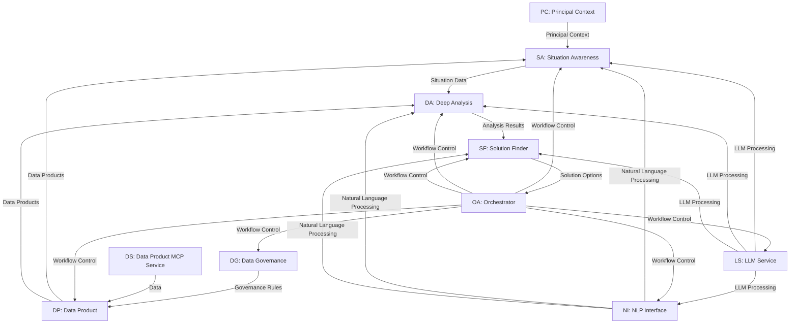
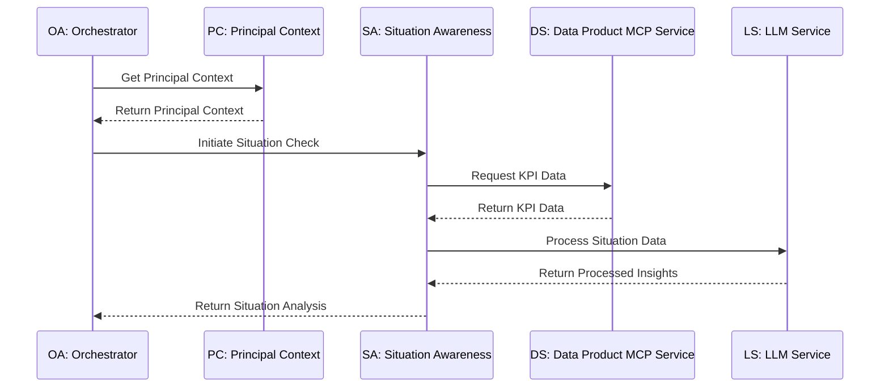
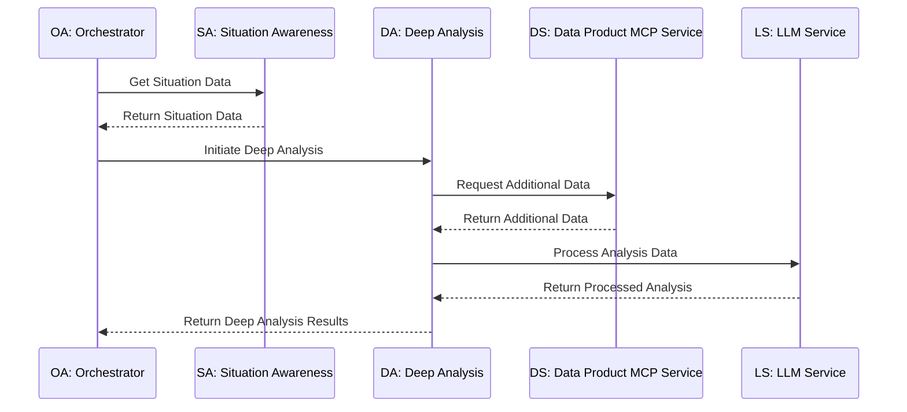
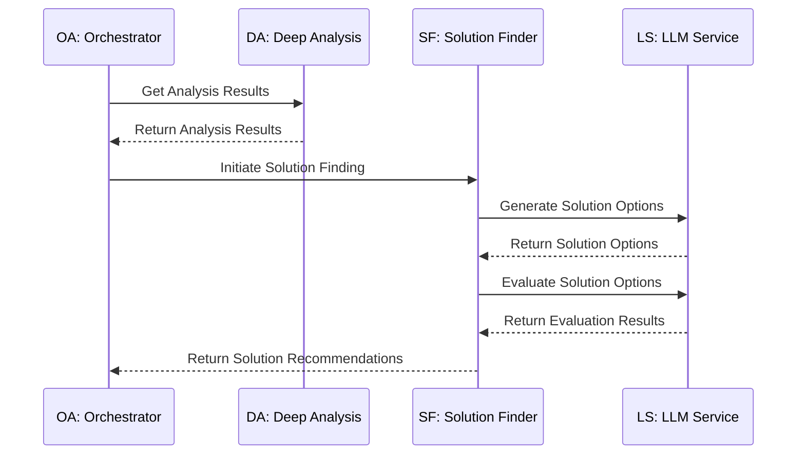
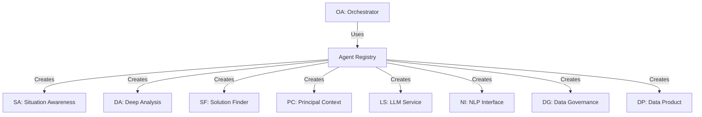

# Agent9 Core Workflow Diagram

## Overview

This document provides a visual representation of the core workflows in the Agent9 platform, showing how different agents interact with each other and the flow of data between them.

## Core Workflow: Automated Situation Awareness to Solution Finding



## Detailed Agent Interactions

### 1. Situation Awareness Workflow



### 2. Deep Analysis Workflow



### 3. Solution Finding Workflow



## Data Flow Diagram

```mermaid
flowchart TD
    PR[Principal Profile] -->|contract-driven filters| OA[Orchestrator]
    OA -->|business process| DG[Data Governance Agent]
    DG -->|data product + filters| DP[Data Product Agent]
    DP -->|read contract| CT[Contract (with KPIs)]
    CT -->|KPIs & diag. questions| SA[Situation Awareness Agent]
    SA -->|for each KPI & question| NLP[NLP Interface Agent]
    NLP --> DP
    DP --> SA
    SA --> OA
    OA --> SC[Situation/Attention Card]
    LS -->|AI Processing| SF
    
    %% Data inputs
    KD[KPI Data] -->|Input| DS
    HD[Historical Data] -->|Input| DS
    DK[Domain Knowledge] -->|Input| LS
```

## Registry Integration

All agents in the Agent9 platform integrate with the Agent Registry, which provides a centralized mechanism for agent discovery, instantiation, and protocol enforcement.



## Implementation Notes

1. All agent interactions must follow the A2A protocol, using Pydantic models for input/output validation.
2. The Orchestrator Agent is responsible for workflow control and agent coordination.
3. All agents must be instantiated via the Agent Registry using the `create_from_registry` factory method.
4. Error handling and logging should be implemented using the shared logging utility.
5. Context fields (`principal_context`, `situation_context`, `business_context`, `extra`) must be properly propagated between agents.

## References

- [Orchestrator Agent PRD](../prd/agents/a9_orchestrator_agent_prd.md)
- [Situation Awareness Agent PRD](../prd/agents/a9_situation_awareness_agent_prd.md)
- [Deep Analysis Agent PRD](../prd/agents/a9_deep_analysis_agent_prd.md)
- [Solution Finder Agent PRD](../prd/agents/a9_solution_finder_agent_prd.md)
- [Principal Context Agent PRD](../prd/agents/a9_principal_context_agent_prd.md)
- [Data Product MCP Service PRD](../prd/services/a9_data_product_mcp_service_prd.md)
