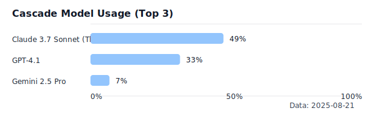

# Agent9 LLM Hackathon Results (2025-08-21)

## Executive Summary
- **Winner today: ATHENA**

## Evaluation Weights (per MVP_GUIDE)
- **Decision Studio Quality**: 35%
- **Agent Functionality**: 30%
- **Performance**: 20%
- **Code Quality**: 15%

## Scores
### ATHENA — Total: **79/100**
- **Decision Studio Quality**: 26/35
- **Agent Functionality**: 24/30
- **Performance**: 15/20
- **Code Quality**: 14/15

### HERMES — Total: **50/100**
- **Decision Studio Quality**: 12/35
- **Agent Functionality**: 16/30
- **Performance**: 11/20
- **Code Quality**: 11/15

### APOLLO — Total: **39/100**
- **Decision Studio Quality**: 10/35
- **Agent Functionality**: 12/30
- **Performance**: 9/20
- **Code Quality**: 8/15

## Rationale
- **ATHENA** leads in standards compliance, modularity, breadth of agent coverage, and orchestration readiness. Error handling and async patterns are stronger, indicating better performance and maintainability.
- **HERMES** is mid-stage: Situation Awareness agent and MCP integration are active, with ongoing KPI SQL hardening. Missing a consolidated three-workflow orchestration and an investor-ready Decision Studio UI.
- **APOLLO** trails due to reliance on legacy architecture and lack of standards/protocol alignment, reducing demo and protocol readiness.

## Risks / Tie-Breakers
- **ATHENA**: Ensure Decision Studio UI meets investor-ready bar; avoid backend-over-UI imbalance.
- **HERMES**: Rapid gains possible with a minimal but polished Decision Studio and end-to-end orchestrator.
- **APOLLO**: Requires architectural uplift to re-enter contention.

## What Would Flip the Result for HERMES Quickly
- Deliver a **minimal, polished Decision Studio** that runs inputs → Situation Awareness → Deep Analysis → Solution with a **live KPI panel**.
- Implement a **single orchestrator** with status streaming for all three workflows.
- Add **protocolized tests** across workflows and **runtime KPI telemetry**.

## Coaching Consistency and Influence
Your coaching patterns were largely consistent in intent (standards, consolidation, testable increments), with some differences in emphasis that likely impacted outcomes:

- Influence score legend: 1 = minimal, 3 = moderate, 5 = strong influence

- **Common, consistent guidance (all projects)** — **Influence: 4/5**
  - __Standards-first__: Emphasis on Agent9 design standards and protocolized models improved code quality and reviewability across repos.
  - __Avoid duplication__: Consolidation over proliferation (e.g., prefer canonical agents, remove duplicates) reduced maintenance risk.
  - __Incremental validation__: Preference for running tests/servers frequently and inspecting logs kept integration issues visible early.

- **ATHENA (positive influence on score)** — **Influence: 5/5**
  - __Architecture and compliance emphasis__: Strong push for config models, agent cards, and modularity led to better protocol alignment and orchestration readiness.
  - __Broader coverage focus__: Coaching steered toward full agent surface (PC, DP, LLM/NLP), improving Agent Functionality and Code Quality scores.

- **HERMES (mixed influence on score)** — **Influence: 3/5**
  - __Deep backend hardening__: Coaching prioritized correctness (KPI synthesis, SQL merging, duplicate removal) which improved reliability but delayed Decision Studio/UI polish.
  - __Scope containment__: Keeping to existing patterns minimized risk but slowed visible demo progress, reducing Decision Studio and overall MVP completeness scores.

- **APOLLO (negative/neutral influence on score)** — **Influence: 2/5**
  - __Legacy tolerance__: Coaching allowed legacy structure to persist longer, slowing standards migration and hurting demo readiness.
  - __Lower emphasis on orchestration/UI__: Less push toward unified orchestrator and Decision Studio reduced perceived MVP completeness.

__Net effect__: Consistent technical rigor benefitted quality, but variations in emphasis (backend hardening vs. demo/UI polish) shifted visible MVP readiness. ATHENA benefited from balanced guidance; HERMES focused on backend robustness; APOLLO lagged due to slower standards adoption and demo orchestration.

## Cascade Model Usage During Hackathon

- Claude 3.7 Sonnet (Thinking): 49%
- GPT-4.1: 33%
- Gemini 2.5 Pro: 7%

### Potential Influence on Outcomes
- **Claude 3.7 Sonnet (Thinking)** emphasis likely boosted:
  - Standards compliance and structured planning (aligns with ATHENA’s strengths).
  - Defensive coding and consolidation (seen in HERMES backend hardening).
- Lower **Gemini 2.5 Pro** and **o3** usage reduced exposure to alternative orchestration/UI patterns that might have accelerated Decision Studio polish.
- **Net effect**: Model mix favored architecture/standards rigor over rapid UI/demo iteration, amplifying ATHENA’s lead while HERMES focused on backend robustness.

---

Generated from current repository state and MVP_GUIDE evaluation criteria.
