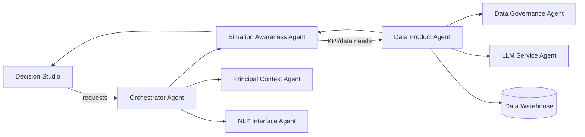

# Decision Studio: Vision and Hierarchical Situation Management

This document defines the product vision for Decision Studio, the hierarchical situation model, and the API contract between the UI and the Situation Awareness (SA) Agent, aligned with Agent9 architecture standards and the refactoring plan.

- Source agents: `src/agents/new/`
- Config models: `src/agents/agent_config_models.py`
- Agent cards: `src/agents/new/cards/`
- UI: `src/views/decision_studio_debug_ui.py`, `src/views/ui_orchestrator.py`

## Vision and Positioning

- Decision Studio is the principal-facing cockpit for reviewing and acting on AI-detected business situations.
- Agent9 is the autonomous enterprise analyst that continuously detects, explains, and prioritizes situations and routes them to the right owners.
- The UI exposes an auditable, orchestrator-driven workflow with one-click actions and transparent data lineage.

## Core Workflows

- Automated Situational Awareness
  - Entrypoint: `analyze_situation`
  - Output: Situation Inbox entries with severity, confidence, and recommendations
  - Follow-up: `notify_principal`
- Problem Deep Analysis
  - Entrypoint: `analyze_situation`
  - Output: deeper framing, comparisons (e.g., QoQ, vs Plan), investigative prompts
- Opportunity Deep Analysis
  - Entrypoint: `analyze_situation`
  - Output: positive anomalies and suggested “double down” actions

## Architecture Overview



- SQL is generated and executed only by the Data Product Agent (DP); SA never generates SQL.
- Principal Context (PC) resolves ownership/assignment from enterprise context.
- Data Governance (DG) resolves KPI definitions and dimension mappings.
 - Data Governance (DG) manages KPI thresholds and severity rules; SA/UI do not hardcode thresholds.
 - Principal Context (PC) proposes assignment candidates using the HR/identity provider when available (with fallback to `business_context.yaml`); the UI never computes candidates directly.

---

## Situation Model (Proposed)

The Situation object is the core API entity exchanged between SA and the UI via the Orchestrator. It supports hierarchical parent/child relationships so that enterprise-level signals can be routed to actionable lower levels (e.g., Region, BU, Product).

```yaml
Situation:
  id: string  # UUID
  parent_id: string|null  # UUID of parent situation if child
  kpi_id: string          # DG-managed KPI identifier
  kpi_name: string
  scope: string           # BusinessScope enum (ENTERPRISE, DIVISION, BUSINESS_UNIT, REGION, PRODUCT, CUSTOMER)
  scope_ref: string|null  # e.g., "North America", "BU-12", "SKU-123"
  timeframe:
    window: string        # e.g., "QTD", "MTD", "Last_90_Days"
    start: string|null    # ISO8601, optional
    end: string|null      # ISO8601, optional
  values:
    current_value: number
    target_value: number|null
    delta_abs: number|null
    delta_pct: number|null
  severity: string        # Severity enum (MINOR, MODERATE, MAJOR, CRITICAL)
  confidence: number      # 0.0 - 1.0
  status: string          # Status enum (OPEN, ACKNOWLEDGED, ASSIGNED, IN_PROGRESS, RESOLVED, SNOOZED)
  recommended_actions:
    - id: string
      label: string       # e.g., "Notify Owner", "Escalate", "Open Deep Analysis"
      type: string        # ActionType enum (NOTIFY, ASSIGN, ESCALATE, SNOOZE, OPEN_VIEW, EXPORT)
      params: object      # optional structured params
  assignee_id: string|null    # principal_id (from PC)
  assignment_candidates:      # proposed by PC; UI does not compute
    - principal_id: string
      display_name: string
      role: string|null
      score: number           # confidence/fit score 0.0-1.0
      rationale: string|null
      source: string          # e.g., "HR", "config"
  assignment_decision:        # HITL decision record (executive delegation)
    decided_assignee_id: string|null
    decided_by_principal_id: string|null
    decided_by_role: string|null
    decision_type: string     # ASSIGN | DELEGATE
    decided_at: string|null   # ISO8601
    rationale: string|null
  hitl_required: boolean      # if true, block auto-assign until approved
  provenance:
    orchestrator_txn_id: string
    dg_mapping_id: string|null
    dp_query_id: string|null
  lineage:
    - string             # free-form breadcrumbs
  dedupe_key: string     # stable key for deduping: kpi_id + timeframe + scope + scope_ref
  cooldown_until: string|null  # ISO8601, gates repeated alerts
  tags:
    - string
  created_at: string     # ISO8601
  updated_at: string     # ISO8601
```

### Enumerations (initial set for MVP)

```yaml
BusinessScope: [ENTERPRISE, DIVISION, BUSINESS_UNIT, REGION, PRODUCT, CUSTOMER]
Severity: [MINOR, MODERATE, MAJOR, CRITICAL]
Status: [OPEN, ACKNOWLEDGED, ASSIGNED, IN_PROGRESS, RESOLVED, SNOOZED]
ActionType: [NOTIFY, ASSIGN, DELEGATE, ESCALATE, SNOOZE, OPEN_VIEW, EXPORT]
```

### Notes
- Parent situations typically use a broader `scope` (e.g., ENTERPRISE) and children a more granular one (e.g., REGION or PRODUCT).
- `assignee_id` is resolved by Principal Context using enterprise context config (e.g., `src/config/enterprise/example/business_context.yaml`).
- Severity may be derived from KPI criticality, absolute/percent deltas, and quality/confidence signals.

---

## UI ↔ SA API Contract (via Orchestrator)

All calls are orchestrator-routed to SA and downstream agents, returning serializable dicts/JSON compatible with the UI. Method names align with Agent9 protocol entries and agent cards.

### 1) List situations

Request:
```json
{
  "principal_context": { "principal_id": "ceo_001" },
  "filters": {
    "status": ["OPEN", "ASSIGNED"],
    "severity_min": "MODERATE",
    "kpi_ids": ["gross_revenue"],
    "scopes": ["ENTERPRISE", "REGION"],
    "timeframe": { "window": "QTD" }
  },
  "pagination": { "page": 1, "page_size": 50 }
}
```

Response:
```json
{
  "items": [ { "situation": { /* Situation */ } } ],
  "page": 1,
  "page_size": 50,
  "total": 123
}
```

### 2) Get situation detail

Request:
```json
{ "situation_id": "a6f2...", "include_children": true, "include_candidates": true }
```

Response:
```json
{ "situation": { /* Situation with lineage, recommended_actions, children (if any), assignment_candidates */ } }
```

### 3) Analyze situation (run detectors)

Used by automated jobs or manual triggers.

Request:
```json
{
  "principal_context": { "principal_id": "cfo_001" },
  "kpis": ["gross_revenue", "operating_expense"],
  "timeframe": { "window": "QTD" },
  "options": { "emit_children": true, "top_n": 5 }
}
```

Response:
```json
{
  "situations": [ { /* parent */ }, { /* child */ } ]
}
```

### 4) Apply action

Request:
```json
{
  "situation_id": "a6f2...",
  "action": {
    "type": "ASSIGN",
    "params": { "assignee_id": "regional_mgr_23" }
  }
}
```

Response:
```json
{ "status": "OK", "situation": { /* updated */ } }
```

### 5) Recommended questions (optional helper)

Request:
```json
{ "principal_context": { "principal_id": "cfo_001" } }
```

Response:
```json
{ "questions": ["What are the top regions driving the variance?", "How does QoQ compare?"] }
```

### 6) Propose assignment candidates (SA↔PC via Orchestrator)

Request:
```json
{ "situation_id": "a6f2..." }
```

Response:
```json
{ "assignment_candidates": [ { "principal_id": "regional_mgr_23", "display_name": "J. Smith", "role": "Regional Manager", "score": 0.92, "source": "HR" } ] }
```

---

## Data Product: Grouped KPI Queries (supporting child situations)

To enable hierarchical children, SA requests grouped KPI aggregations from DP. DG resolves the dimension-to-column mapping.

Example contract:

Request (SA → DP):
```json
{
  "kpi_definition": { "id": "gross_revenue" },
  "timeframe": { "window": "QTD" },
  "filters": { "version": "Actual" },
  "group_by": ["Region"],
  "top_n": 5,
  "ordering": "DESC"  
}
```

Response (DP → SA):
```json
{
  "groups": [
    { "group_key": { "Region": "North America" }, "current_value": 123.4, "delta_abs": -10.2, "delta_pct": -7.6 },
    { "group_key": { "Region": "EMEA" }, "current_value": 115.1, "delta_abs": -8.9, "delta_pct": -6.9 }
  ]
}
```

---

## Ownership and Routing

- Ownership is resolved by Principal Context using enterprise identity/HR mappings when available (data-driven), with a configuration fallback (`src/config/enterprise/example/business_context.yaml`).
- The UI never computes assignment: it calls SA, which calls PC to return `assignment_candidates` attached to the Situation.
- HITL delegation is supported: executives can make an assignment/ delegation decision, which SA records via PC (`assignment_decision`).
- Actions supported: ASSIGN, DELEGATE, ESCALATE, SNOOZE, NOTIFY, OPEN_VIEW, EXPORT.

---

## Open Questions (for alignment)

1) First-level breakdowns to support in MVP
- Options: Region, Product, Business Unit, Customer
- Recommendation: start with Region and Product; add BU next as data permits

2) Ownership mapping for assignment
- Proposal: Region → Regional Manager; Product → Product Manager; BU → BU Leader
- Source of truth: `business_context.yaml` (registry provider in future)

3) Thresholds, severity & SLAs
- Thresholds and severity rules are managed by Data Governance (KPI Registry). SA/UI must not hardcode thresholds.
- SA applies DG-provided rules to DP results to derive severity; or DG can return a computed severity where implemented.
- SLA and cooldown policy remain configurable at SA-level (e.g., cooldown per `dedupe_key`, escalation windows). We should agree on initial SLA/cooldown values while keeping thresholds in DG.

---

## Compliance with Agent9 Standards

- Orchestrator-driven agent registration and protocol method calls
- SQL generation centralized in DP Agent; SA only orchestrates detection and packaging
- Agent code/config/cards kept in sync when implementations change
- Tests:
  - Component: SA emits parent/child situations given DP grouped results
  - Integration: SA→DP→DG→PC orchestration for assignment
  - Component/Integration: PC returns assignment candidates; SA records HITL assignment decisions
  - E2E: UI Inbox shows hierarchical situations; actions update state & audit

## Next Steps

- Confirm MVP scopes and ownership mappings
- Lock Situation model fields and add them to config models and agent cards
- Implement grouped KPI path in DP and hierarchical emission in SA
- Wire UI Inbox hierarchy and Action Panel
- Add tests for rollup, dedup, and escalation
