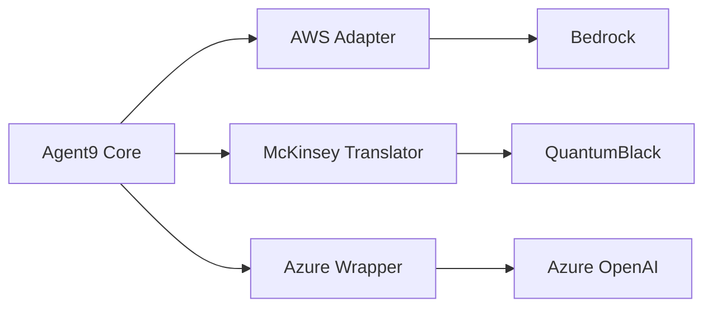

# Agent9 Competitive Watch

## Methodology Comparison

| **Capability**               | **Agent9**                          | **Consulting Firms**           | **Cloud Providers**       | **Pure-play AI**       |
|------------------------------|-------------------------------------|--------------------------------|---------------------------|------------------------|
| Problem Framing              | OODA+Cynefin hybrid                 | SCQA/Hypothesis-driven         | Anomaly detection         | Ad-hoc prompting       |
| Decision Analysis            | KT-inspired matrices                | Human judgment                 | Basic metric explanation  | Unstructured           |
| Multi-Agent Debate           | Protocol-governed                   | None                           | None                      | None                   |
| Audit Trails                 | Full protocol traces                | Slide decks                    | Limited query history     | None                   |
| KPI Automation               | BSC+OKR+PDCA integration            | Manual dashboards              | Alert rules               | No native integration  |

## Bridge Component Roadmap

1. **Q2 2026**: AWS Bedrock Adapter
   - Map Agent9 protocols to Bedrock APIs
   - Support Claude/LLaMA as debate participants

2. **Q3 2026**: McKinsey Framework Translator
   - Convert QuantumBlack outputs to OODA observations
   - Preserve IP via RAG masking

3. **Q4 2026**: Azure OpenAI Wrapper
   - Protocol-compliant prompt engineering
   - Governance layer over Copilot outputs

## Tracking Table

| Competitor       | Last Updated | Key Moves                          | Agent9 Countermeasures              |
|------------------|--------------|------------------------------------|--------------------------------------|
| McKinsey         | 2025-Q3      | Scaling AI co-pilots               | Branded agent marketplace launch     |
| AWS              | 2025-Q4      | Bedrock-QS integration             | Governance layer over Bedrock        |
| OpenAI           | 2025-Q4      | Larger context windows             | Protocol-aware chunking strategy     |
