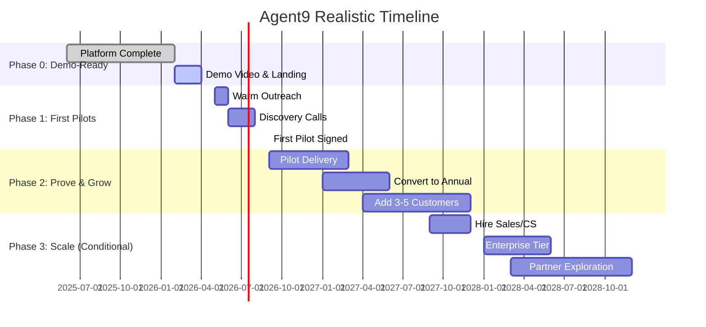

# Agent9 Adoption Realism & Timeline
**Last Updated:** February 13, 2026

## Actual Progress (As of Feb 2026)

### ✅ Completed
- Multi-agent orchestration framework (SA, Deep Analysis, Solution Finder)
- Decision Studio UI (React, functional)
- Registry Explorer (KPIs, principals, processes, data products, glossary)
- Principal-driven analysis (decision style → consulting persona framing)
- Database-agnostic backend (DuckDB, Supabase/Postgres, BigQuery)
- Audit trail and HITL checkpoints

### 🔄 In Progress (Feb-Apr 2026)
- Demo video production
- Landing page and pitch deck
- Warm network identification (20 contacts)

## Revised Timeline (Bootstrapped, Solo Founder)

### Realistic Milestones & Kill Criteria

| **Phase** | **Target Date** | **Success Criteria** | **Kill Criteria** |
|-----------|----------------|---------------------|-------------------|
| **Phase 0: Demo-Ready** | Apr 2026 | Demo video recorded, 20 warm contacts identified | N/A (sunk cost) |
| **Phase 1: First Pilot** | Sep 2026 | 1-2 signed pilots ($15K-$25K) | No signed pilots by Oct 2026 → pause/pivot |
| **Phase 2: Prove & Grow** | Dec 2027 | 5-8 customers, $200K-$320K ARR (base) | <3 customers by Jun 2027 → reassess |
| **Phase 3: Scale** | 2028+ | 10-20 customers, $600K-$1.2M ARR (base) | Negative unit economics after 10 customers |

## Customer Readiness Assumptions

### Must-Haves (Non-Negotiable)
1. **Existing data infrastructure** (ERP, BI, data warehouse)
2. **Analytics team** that can validate outputs
3. **Executive sponsor** with innovation budget
4. **$1M+ annual consulting spend** (pain is real)

### Nice-to-Haves (Can Work Around)
- Centralized business glossary (Agent9 can help build)
- KPI registry with lineage (Agent9 provides this)
- AI policy approved (can help draft)

## Moonlighting Constraints

- **15-20 hrs/week** available for Agent9 (nights/weekends)
- **No full-time sales capacity** until first hires
- **Founder-led demos only** (no SDR team)
- **Limited customer support hours** (async-first)

**Implication:** Customer acquisition will be slow but capital-efficient. Target customers must be self-service-friendly and patient with response times.