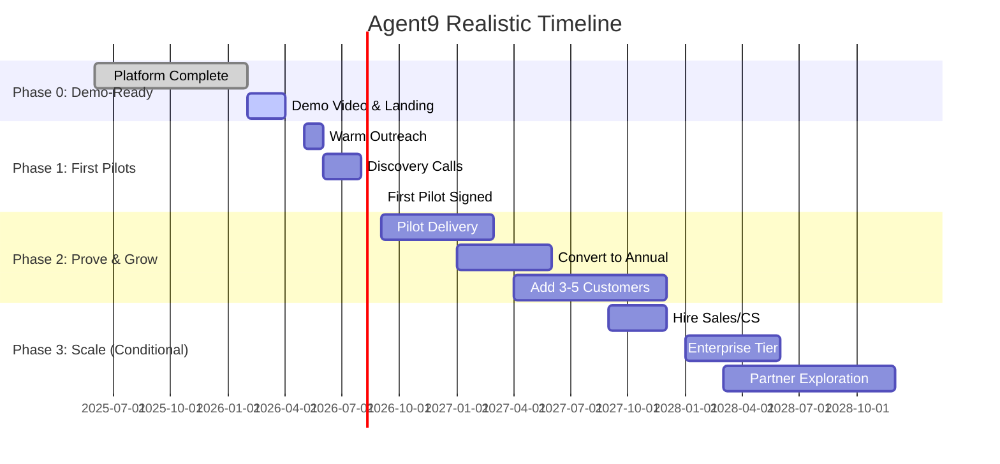

# Agent9 Adoption Realism & Timeline
**Last Updated:** March 2026

## Actual Progress (As of March 2026)

### ✅ Completed
- Multi-agent orchestration framework (SA, Deep Analysis, Solution Finder)
- Decision Studio UI (React, functional — production-quality)
- Registry Explorer (KPIs, principals, processes, data products, glossary)
- Principal-driven analysis (decision style → consulting persona framing)
- Database-agnostic backend (DuckDB, Supabase/Postgres, BigQuery)
- Audit trail and HITL checkpoints
- SA → DA → SF multi-call pipeline stable (stage1_only → hypothesis → cross_review → synthesis)
- Executive Decision Briefing: 19-page output, McKinsey/BCG/Bain progressive reveal
- 5-pillar value proposition defined and strategy docs updated

### 🔄 In Progress (Mar-Apr 2026) — Active Development Sprint
- Market Analysis Agent (Perplexity + Claude synthesis → market signals, competitor context)
- Positive KPI opportunity detection in SA → green opportunity cards in Decision Studio
- Value Assurance data model (AcceptedSolution + Supabase persistence)
- Demo video production (lubricants + bikes scenarios)
- Landing page and pitch deck
- Warm network identification (20 contacts — never-engaged mid-market CFOs + VP FP&A)

## Revised Timeline (Bootstrapped, Solo Founder)

```mermaid
gantt
    title Agent9 Realistic Timeline
    dateFormat  YYYY-MM
    section Phase 0: Demo-Ready
    Platform Complete      :done,    p0a, 2025-06, 2026-02
    Demo Video & Landing   :active,  p0b, 2026-02, 2026-04

    section Phase 1: First Pilots
    Warm Outreach          :         p1a, 2026-05, 2026-06
    Discovery Calls        :         p1b, 2026-06, 2026-08
    First Pilot Signed     :crit,    p1c, 2026-09, 2026-09

    section Phase 2: Prove & Grow
    Pilot Delivery         :         p2a, 2026-09, 2027-03
    Convert to Annual      :         p2b, 2027-01, 2027-06
    Add 3-5 Customers      :         p2c, 2027-04, 2027-12

    section Phase 3: Scale (Conditional)
    Hire Sales/CS          :         p3a, 2027-09, 2027-12
    Enterprise Tier        :         p3b, 2028-01, 2028-06
    Partner Exploration    :         p3c, 2028-03, 2028-12
```

### Realistic Milestones & Kill Criteria

| **Phase** | **Target Date** | **Success Criteria** | **Kill Criteria** |
|-----------|----------------|---------------------|-------------------|
| **Phase 0: Demo-Ready** | Apr 2026 | Demo video, MA Agent wired, opportunity detection live, 20 warm contacts | N/A (sunk cost) |
| **Phase 1: First Pilot** | Sep 2026 | 1-2 signed pilots ($15K-$25K) — prioritise never-engaged segment | No signed pilots by Oct 2026 → pause/pivot |
| **Phase 2: Prove & Grow** | Dec 2027 | 4-7 customers, $260K-$595K ARR (base — 5-pillar model) | <3 customers by Jun 2027 → reassess |
| **Phase 3: Scale** | 2028+ | 10-20 customers, $800K-$1.6M ARR (base); first partner pilot | Negative unit economics after 10 customers |

*ARR targets raised from v1 (was $200K-$320K base for Phase 2) to reflect 5-pillar multi-budget ACV uplift and never-engaged market as primary target.*

## Customer Readiness Assumptions

### Must-Haves (Non-Negotiable)
1. **Existing data infrastructure** (ERP, BI, data warehouse)
2. **Analytics capability** that can validate outputs (dedicated analyst or CFO-level data fluency)
3. **Executive sponsor** with innovation budget (or clear pain that justifies pilot spend)
4. **Real KPI pain** — either reactive (problem detection) or proactive (opportunity capture)

*Note: "$1M+ annual consulting spend" is no longer a must-have. The never-engaged mid-market ($50M-$500M companies that never hired MBB) is the primary target. Their pain is real even without consulting spend — they're making decisions with insufficient analysis, not with consultants they're trying to replace.*

### Nice-to-Haves (Can Work Around)
- Centralized business glossary (Agent9 can help build)
- KPI registry with lineage (Agent9 provides this)
- AI policy approved (can help draft)

## Moonlighting Constraints

- **15-20 hrs/week** available for Agent9 (nights/weekends)
- **No full-time sales capacity** until first hires
- **Founder-led demos only** (no SDR team)
- **Limited customer support hours** (async-first)

**Implication:** Customer acquisition will be slow but capital-efficient. Target customers must be self-service-friendly and patient with response times.